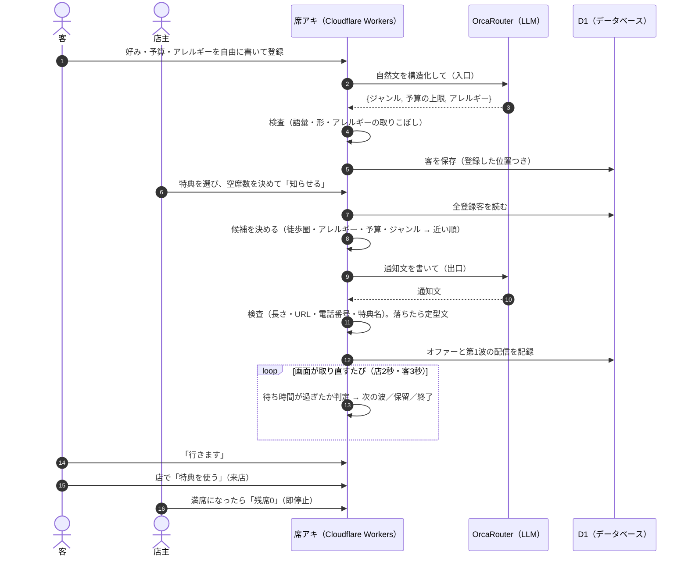
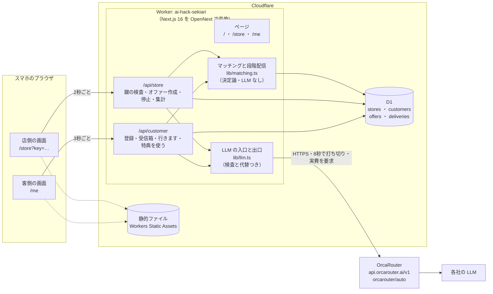
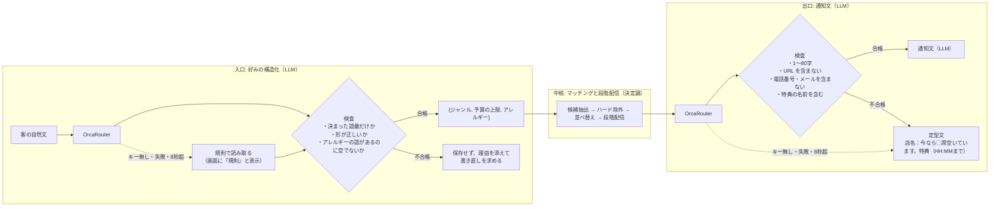
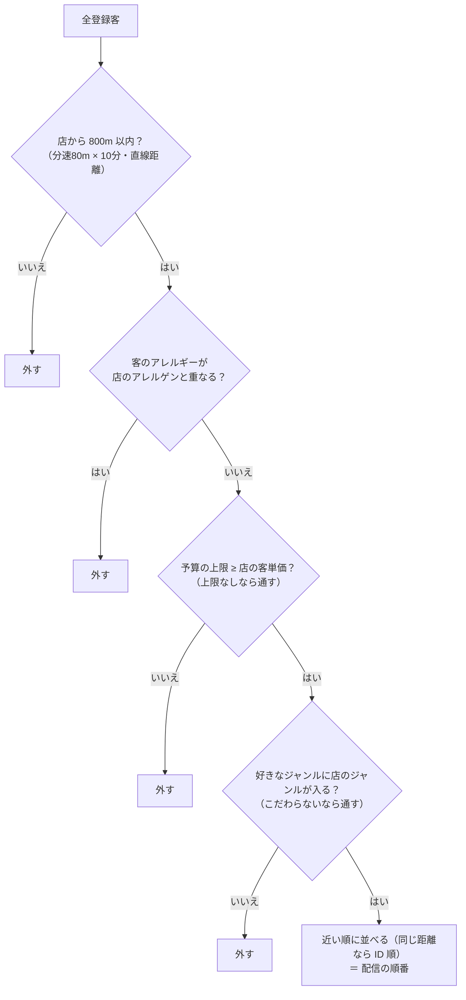
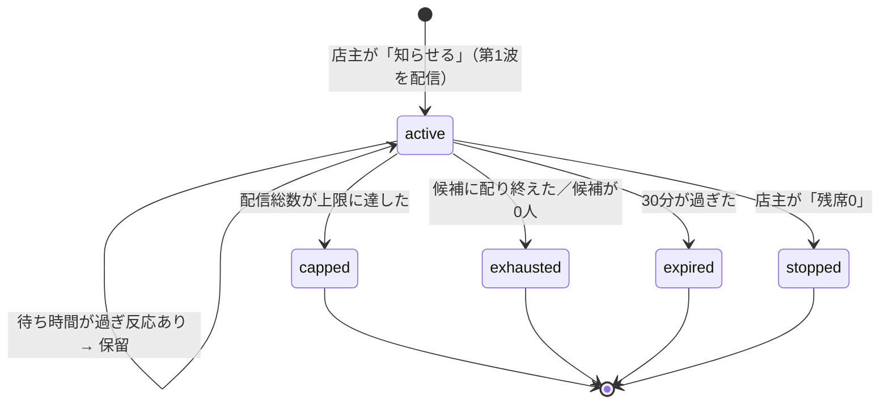
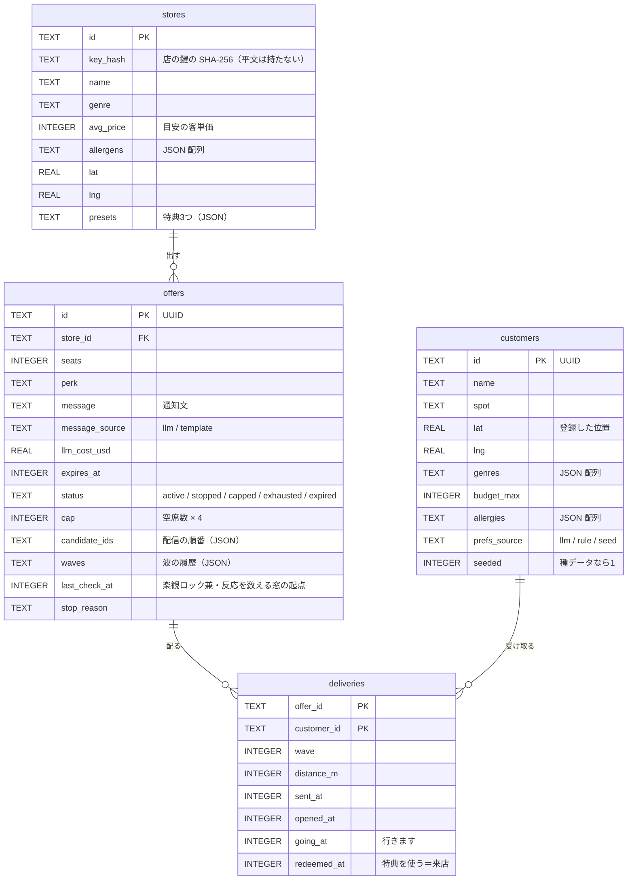

# 席アキ — 機能とアーキテクチャ

> **2026-09-19 16:00 時点のデモ**（`demo/`）を説明する文書。本番: https://ai-hack-sekiari.ai-shukyaku.workers.dev
> AI HACK 2026（テーマ「業務を自律化する AI エージェント」）に チームD として出すプロダクト。
> 仕様の正本は `docs/specs/main/`（聞き取りは承認済み・要件は監査待ち）。**デモが仕様に追いついていない点は `demo/DEBT.md` にある**（この文書の最後の節に要約した）。

## 1. 一言でいうと

**店の空席を、近くにいて好みの合うお客さんへ、特典つきで知らせるサービス。**
店主はスマホで特典と空席数を選んで送るだけ。そのあと「誰に・何人に・いつ広げて・いつ止めるか」は、システムが人手なしで決める。

- **誰の痛みか**: 空席が出た時間帯の飲食店の店主。席が空いたまま時間が過ぎていく。しかも店主は PC の前にいない
- **何が新しいか**: 通知を一斉に配らない。**近い人から小さな波で配り、反応が無ければ広げ、上限に達したら自分で止まる**。満席なのに通知が届く、という体験を作らない

## 2. 使い方の流れ

店主は1画面・3操作（特典を選ぶ → 空席を＋−で合わせる → 送る）。客は、好みを自由に書いて登録しておけば、近くの店から届く。



## 3. 機能

### 店側（スマホのブラウザ）

| 機能 | 中身 | 状態 |
| --- | --- | --- |
| 特典のプリセット3つ | 「ドリンク1杯無料」「お会計10%オフ」「唐揚げ1皿サービス」から1タップで選ぶ | ✅ |
| 空席のステッパー | ＋−だけで1〜20席。有効期限は30分に固定 | ✅ |
| 知らせる | 押すと候補の選定・通知文の生成・第1波の配信までが1回で走る | ✅ |
| 結果の1画面 | 配信数・開封数・「行きます」数・来店数、波の履歴、次の判定までの秒数、通知文と「LLM か定型文か」「1回の実費」、停止の理由 | ✅（2秒ごとに取り直す） |
| 残席0 | 押すとその場で配信を止め、以後の「特典を使う」を受け付けない | ✅ |
| 店を守る仕組み | ログイン画面の代わりに、店ごとの秘密の鍵を持つ要求だけ通す | ✅（鍵が URL に載る点は負債） |

### 客側（スマホのブラウザ）

| 機能 | 中身 | 状態 |
| --- | --- | --- |
| 自然文で登録 | 「がっつり系と居酒屋が好き。予算は4000円まで。甲殻類アレルギー」をそのまま書く | ✅ |
| 読み取った好みの表示 | ジャンル・予算の上限・アレルギーを見出しつきで表示し、LLM で読んだか規則で読んだかも出す | ✅ |
| 位置 | 5か所から選ぶか、ボタンで1回だけ現在地を取る（常時の追跡はしない） | ✅ |
| お知らせの受信 | 画面を開いている間、3秒ごとに取りに行き、新着をブラウザの通知で出す | ⚠️ Web プッシュは未実装 |
| 行きます／特典を使う | 「行きます」は段階配信の反応、「特典を使う」は来店として数える。どちらも同じ客は1回だけ | ✅ |

## 4. アーキテクチャ

### 全体図

1つの Worker が、画面（Next.js のページ）と API の両方を返す。データは D1、LLM は OrcaRouter を経由する。



| 層 | 使っているもの | 選んだ理由（デモ時点・AI判断） |
| --- | --- | --- |
| 画面と API | Next.js 16（App Router・Route Handlers） | 本人の指定（Next.js・Cloudflare・OrcaRouter の構成）。画面と API を1つのプロジェクトに置ける |
| 実行環境 | Cloudflare Workers（`@opennextjs/cloudflare` で変換） | 本人の指定。無料枠で公開でき、`*.workers.dev` の URL がすぐ出る |
| データ | Cloudflare D1（SQLite） | 無料枠（読み取り500万行/日・書き込み10万行/日）でデモの規模に足りる。PostGIS は無いので距離は自前で計算する |
| LLM | OrcaRouter（OpenAI 互換 API・`orcarouter/auto`） | 大会の必須条件。1回ごとの実費を応答で返せるので、コストを数字で見せられる |

> ⚠️ Cloudflare が今推す Next.js の載せ方は vinext（beta）で、OpenNext は「既存アプリの保守向け」に位置づけが変わっている（2026-08-25・調査役が公式文書で確認）。デモは実績のある OpenNext を使った。比較は設計の段で行う（負債 P2）。

### AI をどこに置いたか（最大の設計判断）

**LLM は入口と出口の2か所だけ。** 相手選びと配信の制御は、同じ入力なら毎回同じ結果を出す決定論の処理にした（本人発案）。数千人を数百ミリ秒で評価する処理を LLM に任せると、待ち時間と費用が合わないため。



- 通知文はオファーを作るときに1回だけ生成し、全員に同じ文を配る（配信のたびには呼ばない）
- どちらの経路で作ったか（LLM／規則・定型文）と、LLM の実費（`usage.cost_usd`）を画面に出す。実測は1回 **$0.00004〜0.00007**
- 承認の流れ（人が確認してから送る）は作らない（本人選択）。LLM の出力が怪しいときは、人に回すのではなく定型文へ倒す

## 5. マッチングと段階配信

### 候補の決め方



- 距離はハバーサインの公式（緯度経度から球面上の距離を出す式）で計算する。D1 には地理空間の検索が無いため
- 実測: 登録客82人を **0.6ms** で評価し、候補15人に絞った（手元の Node.js で計測。Workers の上では、I/O の間に時計が進まない仕様のため 0ms と出ることがある）

### 波の広げ方

| 決まり | 値（デモ） |
| --- | --- |
| 第1波の予定人数 | 10人 |
| 次の波の予定人数 | 前の波の予定の2倍（10 → 20 → 40 …） |
| 各波で実際に送る人数 | **予定人数・まだ送っていない候補の数・上限までの残り、の最小値** |
| 配信総数の上限 | 空席数 × 4 |
| 待ち時間 | 20秒（たたき台は180秒。デモ用に短くした・環境変数 `WAVE_WAIT_SECONDS`） |
| 反応 | 客が「行きます」を押すこと（本人選択） |
| 広げない条件 | 待ち時間の間に「行きます」があった／「行きます」の累計が空席数に届いた |
| 有効期限 | 30分 |

例: 空席3席なら上限は12人。第1波は10人、20秒後に「行きます」が無ければ第2波は **2人**（上限までの残り）で、そこで自動停止する（手元で確認済み）。

### オファーの状態



- `capped` と `exhausted` は「これ以上配らない」だけで、配った相手の「行きます」「特典を使う」は期限内なら受け付ける
- `stopped`（残席0）と `expired` では、特典を無効として扱う

### 波をいつ進めるか（tick）

段階配信の判定は `decide()` という**副作用の無い関数**にまとめ、データベースへの反映は別の関数（`tickOffer()`）が行う。判定だけを取り出してテストできる形にしてある（テストはまだ無い・負債 P4）。

- 店の画面（2秒ごと）と客の画面（3秒ごと）が API を呼ぶたびに、進行中のオファーを「今の時刻まで」進める。遅れて呼ばれても、過ぎた待ち時間の分だけ順に判定する
- **二重配信を防ぐ仕組み**: オファーの更新は「前回の判定時刻と波の一覧が、読んだときのままなら」だけ成功させる（楽観ロック）。先を越されたら読み直す。配信の記録は（オファー, 客）を主キーにして `INSERT OR IGNORE` で入れる
- ⚠️ **誰も画面を開いていないと波が進まない**（負債 F3）。Cron Triggers か Durable Objects の alarm で、画面と無関係に進める形へ直す

## 6. データモデル

フェーズ2（POS 連携）向けの項目（出どころ・作成者・来店予測の教師データ）は、本人の決定で持たない。



- 種データ（`migrations/0002_seed.sql`）: 渋谷の店1軒（炭火酒場 まる・居酒屋・えびとかにを使う）と、店の周り1.4km に散らばった登録客80人。決まった種の乱数で作るので、何度作っても同じ客が並ぶ
- 店の鍵は種データを作るときに乱数で作り、**平文は git の対象外のファイルにだけ**書く。データベースには SHA-256 だけを置く

## 7. API

| メソッドとパス | 使う側 | 中身 |
| --- | --- | --- |
| `GET /api/store?key=` | 店 | 鍵を検査し、直近のオファーを今の時刻まで進めてから、集計を返す |
| `POST /api/store` `{key, action:"create", seats, presetIndex}` | 店 | オファーを作る（候補の選定・通知文・第1波）。進行中のオファーがあれば断る |
| `POST /api/store` `{key, action:"stop", offerId}` | 店 | 残席0。自分の店のオファーだけ止められる |
| `POST /api/customer` `{action:"register", name, text, spot, lat, lng}` | 客 | 好みを構造化して登録。読み取れなければ 422 で書き直しを求める |
| `GET /api/customer?id=` | 客 | 進行中のオファーを進めてから、届いたお知らせを返す |
| `POST /api/customer` `{action:"open"/"going"/"redeem", id, offerId}` | 客 | 開封・行きます・特典を使う。終了したオファーの「特典を使う」は断る |

入力の検査: 空席数は1〜20の整数、特典は0〜2、名前は20字・好みは300字まで、位置は渋谷の周辺だけ、ID は UUID の形だけ受け付ける。

## 8. 大会の評価5項目との対応（AI判断・発表の材料）

| 評価項目 | このプロダクトで見せられるもの | まだ足りないもの |
| --- | --- | --- |
| セキュリティ | 店の鍵はハッシュで保存・鍵が違えば 401／LLM の出力を検査してから使う（URL・電話番号・語彙の外を落とす）／入力の長さと範囲の検査／秘密情報を git に入れない | 鍵が URL に載る／客の API に認証が無い／レート制限が無い／OrcaRouter の Guardrails を使っていない |
| コストパフォーマンス | LLM は登録時とオファー作成時の各1回だけ／1回 $0.00004〜0.00007（実測）／Cloudflare と OrcaRouter の無料枠で動く | 1オファーあたり・1来店あたりの費用の集計 |
| 信頼性・堅牢性 | LLM が無くても・失敗しても・遅くても止まらない（規則と定型文に倒れる・8秒で打ち切る）／楽観ロックと主キーで二重配信を防ぐ | 画面が閉じていると波が進まない／自動テストが無い |
| 自律性 | 店主が送ったあと、相手選び・波の拡大・上限での停止を人手なしで行う | 満席の検知は店主の「残席0」だけ（本人選択） |
| アイデア・独創性 | 一斉配信ではなく「近い人から小さな波で、反応が無ければ広げ、上限で止まる」／AI を入口と出口に限った設計 | — |

## 9. デモが仕様に追いついていない点（要約）

全件（18件）は `demo/DEBT.md`。大きいものだけ挙げる。

1. **/dev の品質ループを通っていない**（設計・タスク分割を飛ばした・実装の監査と受け入れ検査が無い・自動テストが無い）
2. **Web プッシュが無い**（客の画面を開いている間だけ通知が出る。iPhone の「ホーム画面に追加」の案内も無い）
3. **段階配信が画面の取り直しで進む**（Cron Triggers／Durable Objects の alarm へ）
4. **店の鍵が URL に載る**（本人の方針どおり、段階的にログイン画面＋Turnstile へ）
5. **ダークモード非対応**（明るい配色に固定）

## 10. 動かし方

```bash
cd demo
pnpm install
pnpm db:local                  # 手元の D1 にテーブルと種データを入れる
pnpm dev --port 3100           # http://localhost:3100/me と /store?key=<.store-key.local の中身>

# 本番（Cloudflare にログイン済みで）
pnpm db:remote                 # 本番の D1 にテーブルと種データを入れる
pnpm run deploy                # OpenNext でビルドして Workers に公開
pnpm wrangler secret put ORCAROUTER_API_KEY
```

- OrcaRouter のキーは `.env.local`（手元の Next.js 用）と `.dev.vars`（手元の Workers の模擬環境用）に `ORCAROUTER_API_KEY=...` と書く。どちらも git の対象外
- キーが無くても動く（規則による読み取りと定型文。画面にそう表示される）
