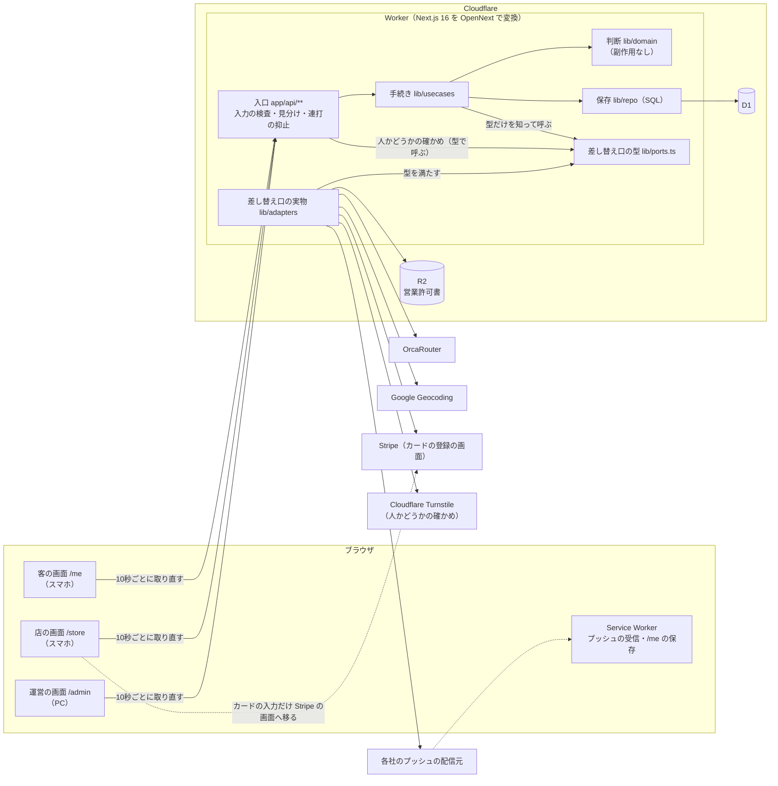

# 設計（v2）

> 2026-09-20 に設計者が書いた。入力は、承認済みの `intent.md`・`requirements.md`（34要件・368基準）と、`04_v2の注文.md` の17節（要件の段から持ち越されたもの）。
> **帰属の印**: 本人の決定を写した所には「本人発案」「本人選択」を付けた。それ以外の決めは、すべて設計者が置いたもので「AI判断」（後で覆されうる）。値を置いた所と、案を比べて選んだ所には、その場に印を付けた。
> **事実の確度**: 設計者はこの段で外部の文書を開けない（検索の道具が無い）。Cloudflare・Google・Stripe・端末の制約についての記述は、確度（確実／高確率／推測）を付け、「裏を取っていない事実」の表にまとめた。実装の最初のタスク（骨組み）で実物に当てて確かめる。
> 要件の文そのものは、この段では書き換えていない。17節で持ち越された要件の文の直しを設計がどう扱うかは「持ち越しの扱い」の節に書いた。
> **第1周の監査のあとの直し（同日）**: `04_v2の注文.md` の18節（本人の回答と、進行役が実施した内容）を受けて直した。どこをどう直したかは「第1周のあとの本人の回答の扱い」の節にまとめた。
> **第2周の監査のあとの直し（同日）**: 第2周の指摘4件と反論役の見落とし3件、`04_v2の注文.md` の19節（本人の回答）を受けて直した。どこをどう直したかは「第2周のあとの直しと、本人の回答の扱い」の節にまとめた。
> **第3周の監査のあとの直し（同日）**: 第3周の指摘1件（結果の画面で受け取りが断られたときの表示が無い）と反論役の見落とし1件（期限切れの表示からの受け取り直しにも同じ欠落がある）を、**1つの仕組み「受け取りの断り」で塞いだ**（直し方は本人選択・AI提示）。どこをどう直したかは「第3周のあとの直し」の節にまとめた。同じ周の指摘のうち、構成図と依存の向きの表の矛盾（反論役が証拠で退けた）と、TS と SQL の二重実装（記録だけ）は直していない。
> **第4周のあとの追記（2026-09-21）**: 指摘の直しではなく、**本人の決定による追記**。`04_v2の注文.md` の23節（審査基準と OrcaRouter 活用度の見直し・本人選択／選択肢は AI提示）の A〜C と、20節（構成図に `lib/ports.ts` の箱を足す・本人選択。第3周の直しで漏れていた）を入れた。要件は1文字も変えていない。どこに何を足したかは末尾の「第4周のあとの追記」の節にまとめ、タスク分割の段への申し送りもそこに書いた。
> **第5周のあとの直し（2026-09-21）**: `04_v2の注文.md` の24節（本人選択・AI提示）で本人が直すと決めた3つ——①部品・画面・`lib/client` が `lib/domain` の判断関数を import することを止める lint と構造の検査が無い（監査役 F2）②毎タスクのゲートが受け入れ検査の全部を走らせ、未実装のぶんが最後のタスクまで落ち続ける（反論役の見落とし a）③VAPID の公開鍵と Turnstile のサイトキーの置き場所とブラウザまでの経路が無い（反論役の見落とし b）——を直した。同じ周に進行役の指示で、OrcaRouter の管理画面の**実物の設定**（23節: Named Router `ai-sekitori`・Guardrails `ai-sekitori`・鍵 `AIHACK`。本人が作成）にも揃えた。どこをどう直したかは末尾の「第5周のあとの直し」の節。要件は変えていない。
> **第6周のあとの直し（2026-09-21）**: `04_v2の注文.md` の25節（本人選択・AI提示）で本人が直すと決めた2つ——①「入力の誤りを示す」18基準の**画面の側**がどこにも無い（反論役の見落とし a。店の公開中の操作の断り〔監査役 F1〕はこれに吸収）②「何時まで」の解釈では基準 19.9（今以前の時刻）の状態が作れず、店の意図と逆向きの案内が出る（反論役の見落とし b）——を直した。①は**1つの一般の規則「入力の断り」と1つの部品**（「画面と入口」の「入力の誤りの出し方」）、②は `domain/until.ts` の解釈の変更（「店の画面」の「何時まで」の項）。どこをどう直したかは末尾の「第6周のあとの直し」の節。要件は変えていない。第5周で直した3件（`lib/domain` の境界・`describeTask`・公開値の経路）は第6周で通過したので、その形は崩していない。

## 概要

客・店・運営の三者の画面と API を、**1つの Next.js のアプリ**として新しいフォルダ `web/` に書き、Cloudflare Workers に載せる。データは D1（SQLite）、営業許可書のファイルは R2（非公開のバケット）、AI は OrcaRouter の1か所だけ。

作りの芯は3つ（どれも AI判断）:

1. **判断は全部、副作用の無い関数（`web/lib/domain/`）に置く。** 絞り込み・点数・AI の出力の検査・確保の状態・残りの数・客の画面でまず何を出すか・店の一覧にどの行を出すか。画面の部品は、サーバーが返した「表示の種類」をそのまま描くだけで、自分では判断しない
2. **期限と終わりは保存せず、時刻から導く。** 確保の期限切れ・オファーの「何時まで」・期限切れの行が消える20分・完了済みの行が消える24時間は、読むたびに「今の時刻」と比べて決める。定期の処理は置かない。残りの数も保存せず、募集する組数と確保の行から導く（数え方は「データと状態」の節）
3. **外のサービスは、1つにつき1ファイルの差し替え口（`web/lib/adapters/`）だけが触る。** AI・地図・プッシュ・カード・ファイル置き場・人かどうかの確かめ（Turnstile）・ログの出口。自動テストはこの口を偽物に差し替えて走る



図の読み方（20節・本人選択）: 手続き `lib/usecases` と入口の `defineRoute` は**差し替え口の型 `lib/ports.ts` だけ**を指し、差し替え口の実物 `lib/adapters` は**その型を満たす**。手続きから実物への直接の線は無い（実物は入口で組み立てた Deps として手続きに渡る。依存の向きの表と同じ向き）。選ばなかった案: 手続きから実物への矢印を破線にして「注入」と添える（20節）。入口 `R` からの線も同じ形に揃えたのは AI判断（`defineRoute` が `HumanCheck` を呼ぶのも型を通してで、実物を知らない）。

### この構成が意図と要件の「やらないこと」に触れていないこと

段階配信・オファーを届けるための通知・店や運営への通知・システムからのメール・入口の AI・Workers AI・客のログイン・請求・POS 連携の部品は、構成のどこにも無い。Web プッシュは、確保が店か運営に取り消された2つの場面だけで送る（本人選択）。Stripe で使うのはカードの登録だけで、請求の API は呼ばない（構造の検査で見張る・基準 13.10）。

## 技術構成

| 層 | 使うもの | 帰属と理由 |
| --- | --- | --- |
| 画面と API | Next.js 16（App Router・Route Handlers）・React 19・TypeScript | Next.js・Cloudflare・OrcaRouter の組み合わせは本人発案（意図の基準37）。版は `demo/` と `sprint/` で動いている組み合わせに揃える（AI判断） |
| 実行環境 | Cloudflare Workers（`@opennextjs/cloudflare` で変換） | AI判断。`demo/` と `sprint/` が同じ載せ方で公開できている（確実・`sprint/package.json`）。選ばなかった案は下の表 |
| データ | Cloudflare D1。**v2 用に新しいデータベースを作る**（名前の案 `ai-hack-v2`） | AI判断。今の D1 には v1 と速成版のテーブルが同居している（`docs/HANDOFF.md`）。Worker も新しい名前（案 `ai-hack-v2`）にして、速成版の公開先を上書きしない |
| ファイル | Cloudflare R2（非公開のバケット・Worker の束縛から読む） | AI判断。営業許可書は10MB まで（基準 13.3）で、D1 の1行には入らない（高確率） |
| AI | OrcaRouter（OpenAI 互換の API）。**呼ぶモデルは、本人が管理画面で作った Named Router `ai-sekitori`**（呼び方 `orcarouter/ai-sekitori`・2026-09-21 02:00ごろ・本人が作成・23節）——許可モデルは `openai/gpt-4o-mini`・`google/gemini-2.5-flash` の2本（明示列挙・2ベンダー）・戦略 バランス・フォールバックモデル `anthropic/claude-haiku-4.5`。要求の本文にも**別ベンダーの受け皿を1本**（`models`＋`route: "fallback"`・受け皿は同じ `anthropic/claude-haiku-4.5`）。**Hacker（無料）プランで作れた**（未確認事項は解消・23節） | **OrcaRouter を使うことは本人選択・大会の必須条件**。**Named Router・受け皿・応答ヘッダーの記録・モデル別の表の「3点セット」は本人選択・2026-09-21・23節**（AI提示。選ばなかった案: 素の `orcarouter/auto` のまま——キックオフ資料 7〜9ページの「観察してから固定する」「候補を絞る・受け皿を1本・必要な時だけ上げる」に反する）。**候補と受け皿のモデルの選定は本人選択**（管理画面で作成・23節）。呼び方と実費の受け取り方は `sprint/lib/llm.ts` で動いている形（確実）。中身は下の「OrcaRouter の使い方」 |
| 地図 | Google Maps の Geocoding API（サーバーから呼ぶ） | Google Maps の API を使うことは本人発案。どの API かは AI判断 |
| カード | Stripe の Checkout（setup モード）。**テスト用の鍵で提出する** | 方式（Checkout の setup モード）は AI判断。**テスト用の鍵で提出してよい、は本人選択**（2026-09-20・18節。設計者の問いへの答え）。カードの番号は Stripe の画面に入り、自分のサーバーを通らない（高確率） |
| ボットの抑止 | Cloudflare Turnstile。フォームの部品が出した値を、サーバーが Cloudflare に確かめる | **有効にすることは本人発案**（2026-09-20・18節。設計者の案「提出版に入れない」を却下）。**置く入口（客の登録・店の登録・ログインの3つ）と、確かめが取れないときも断ることは本人選択**（同日・19節。AI提示の3案から）。選ばなかった案は下の「比べた案」の表 |
| プッシュ | Web Push（VAPID）。**中身を載せないプッシュ**を送り、文面は Service Worker がサーバーから取る | AI判断。選ばなかった案は下の表 |
| 入力の検査 | zod（入口と、画面が受け取る応答の両方） | AI判断。負債「入力の検査が手書き」「応答の形を検査していない」への答え |
| 見た目 | Tailwind CSS v4。色は最初から CSS の変数（役割の名前）でだけ指す | AI判断。明暗の両対応（基準 32.3・最終日）が、変数の値を足すだけで済むようにする |
| テスト | Vitest。画面の部品は Testing Library と jsdom。D1 と R2 は wrangler の `getPlatformProxy`（手元の模擬環境）で本物の SQL を走らせる | AI判断。同時の受け取りと残りの下限（基準 8.7・18.11・20.22）は SQL の文そのものが検査の対象なので、偽物の保存では確かめられない |
| パッケージ管理 | pnpm。**リポジトリの直下を pnpm のワークスペースの根にし、`web/` をその1員にする** | AI判断。受け入れ検査は `tests/acceptance/v2/`（`web/` の外・設計者の持ち場）に置くと決まっている。そこから `vitest` と `react` を解決でき、しかも React が1つだけになる置き方がこれ |

### ゲートの3つのコマンド

リポジトリの直下で実行する前提（進行役が本人に確かめてから `dev.config.json` へ写す）。

| 種類 | コマンド（配列） |
| --- | --- |
| 型検査 | `["pnpm","exec","tsc","--noEmit","-p","tsconfig.json"]` |
| lint | `["pnpm","--dir","web","exec","eslint","."]` |
| テスト | `["pnpm","exec","vitest","run"]` |

- 直下の `tsconfig.json` は `web/**` と `tests/**` の両方を型検査の対象にする（`demo/`・`sprint/`・生成物は除く）。`web/tsconfig.json` は Next.js のビルド用に別に持つ
- 直下の `vitest.config.ts` は、`web/**/*.test.{ts,tsx}`（実行者が足す単体テスト）と `tests/acceptance/v2/**/*.test.{ts,tsx}`（受け入れ検査）の両方を走らせる。画面の部品の検査は、ファイルの先頭の `// @vitest-environment jsdom` で jsdom に切り替える。**受け入れ検査は、着手済みのタスクのぶんだけが走る**（下の「受け入れ検査をタスクごとに走らせる」）
- テストの準備（`tests/acceptance/v2/_setup.ts`・設計者がタスク分割の段で書く）は、`fetch` を「外へ出たら落とす」関数に差し替える（基準 31.3）
- lint には、フォルダの境界（下の「ファイル構成の計画」の向き）を `no-restricted-imports` で入れる。**フォルダの粒度に加えて、`lib/schemas` と `lib/domain` の2つはファイルの粒度で絞る**（部品・画面・`lib/client` が値として読めるのは `schemas/limits.ts` と `domain/texts.ts` だけ。「依存の向き」の注）
- **lint は今のまま `web/` の中だけに掛ける**（本人選択・2026-09-20・18節）。第1周の監査が「受け入れ検査のフォルダ `tests/acceptance/v2/` が lint の対象に無い」と指摘したが、本人が今のままでよいと決めた。理由: lint に載せた役目は `web/` の中の依存の向きの強制だけで、`tests/` には強制する境界が無い（型検査とテストは `tests/` も見ている）。選ばなかった案: 直下にも eslint の設定を置いて `tests/` にも掛ける

### 受け入れ検査をタスクごとに走らせる（第5周のあとの直し・受け入れ検査の書き方の決め）

**問題**（反論役の見落とし a・24節で本人が直すと決めた）: 受け入れ検査はタスク表の承認のときに全部揃い、そのあとは足せず変えられない（`gate-code.mjs` の改ざん検知）。一方、ゲートのテストのコマンドは `vitest run` で全部を走らせるので、そのままでは**未実装のタスクぶんの検査が最後のタスクまで落ち続け、どのタスクのゲートも通らない**。

**決め**（AI判断。進行役が示した案「実行者が書ける `web/acceptance-done.json` に自分のタスク番号を足し、無ければ飛ばす」は採らず、次の形にした）:

- **受け入れ検査の1つ1つのブロックは、それを実現するタスクの番号を名乗る。走るかどうかは、そのタスクが着手済みかで決まる。** 着手済みかどうかは、進行役が `record.mjs start` で作る着手の記録 **`.dev/runs/v2/task-<番号>.json` が在るか**で見る（着手の記録は /dev の道具が作るもので、`.dev/**` は設計者も実行者も書けない場所・確実〔`lib/config.mjs` の `INFRA_DENY`〕）
- 作りは `tests/acceptance/v2/_tasks.ts`（設計者がタスク分割の段で書く）の1つの関数 **`describeTask(タスク番号, 名前, 本体)`** ＝ `describe.skipIf(着手していない)(…)`（`skipIf` は Vitest に在る・高確率。無ければ `describe.skip` と `describe` を条件で選ぶだけ）。飛ばしたブロックは Vitest の出力に skipped として数が出るので、飛ばしたことは隠れない。受け入れ検査のファイルの最上位のブロックは**全部これを通す**（素の `describe` を最上位に置かない）。1つのファイルに、違うタスクのブロックが並んでよい（`structure.test.ts` の行や `r33-metrics.test.ts` の「第4周の追記」の部分は、本体と別のタスクを名乗る）
- **着手の記録のフォルダ `.dev/runs/v2/` そのものが無いときは、全部走らせる**（`.dev/` は git の対象外なので、README を見て動かす他のメンバーの手元〔基準 34.7〕や提出の前の確かめ〔段3〕では、飛ばす理由が無い）
- タスクの番号は `tasks.md` の番号と同じ文字列（数字だけ。`1` や `1.2`。/dev の `assertTaskId` の決まり・確実）。第4周の申し送りで `A-1`〜`A-4` と呼んだ3点セットのタスクも、タスク表では数字の番号になる

**なぜこの形か**（進行役の案との比べ）:

| 観点 | 着手の記録で決める（採った） | 実行者が `web/acceptance-done.json` に番号を足す（進行役の案・採らなかった） |
| --- | --- | --- |
| 検査を飛ばす操作を誰が持つか | 誰も持たない。着手の記録は進行役が道具で作り、どの役割も手で書けない | 実行者が持つ。番号を足さなければ、そのタスクの検査は走らないままゲートが通る |
| 監査役が見るもの | 増えない。**ゲートを掛けるタスクの着手の記録は必ず在る**（`gate-code.mjs` 65行目は記録が無いと不合格にする・確実）ので、そのタスクのブロックは構造として必ず走る | 「番号を足しただけで検査を通していない」を差分で見る手間が毎タスク増える |
| 実装の側に増えるもの | 0（`web/` に印のファイルを持たない） | `web/acceptance-done.json` を1つ持ち、実行者がタスクごとに書く |
| /dev の道具への依存 | `.dev/runs/<仕様>/task-<番号>.json` という置き場と名前に依る。変わったら「全部走る」側に倒れて赤になる（黙って飛ばす側には倒れない） | 依らない |

- 前に通ったタスクのブロックも走り続けるので、あとのタスクが前のタスクの振る舞いを壊せば赤になる（進行役の案と同じ）
- **基準 31.2 の「1つのコマンドで全部走る」の読み**: ゲートの間は「着手済みのタスクの全部」、全タスクが着手されたあと（提出の前の確かめ）と着手の記録が無い手元では「文字どおり全部」。検査の割り当ての 31.2 の行に書いた
- 最上位のブロックが全部 `describeTask` を通っていることは、構造の検査（「要件に基準が無い、設計の決めの検査」の表）で見る
- 選ばなかったもう1つの案: 直下の `vitest.config.ts` の `include` を絞る（`vitest.config.ts` は実行者が書ける場所なので、飛ばす操作を実行者が持つことになる。判定は設計者の持ち場 `tests/acceptance/v2/_tasks.ts` に置く）

### 比べた案と、決めたこと

決めた日はすべて 2026-09-20。発案は、行の中に別の印（本人発案・本人選択）が無いかぎり設計者（AI判断）。

| 決めたこと | 根拠と確度 | 選ばなかった案と理由 |
| --- | --- | --- |
| 載せ方は OpenNext | `demo/` と `sprint/` が同じ版で公開できている（確実） | vinext（Cloudflare が今推す載せ方・beta。`docs/architecture.md` の注記）。提出まで2日で、beta の不具合を引いたときの戻り道が無い。`app/` は素の App Router で書くので、後から載せ方だけ替えられる |
| 期限と終わりは時刻から導く。定期の処理は置かない | チーム案の「クエリ時に判定する」と同じ考え（AI 生成物・未検証だが、SQL の条件で書けることは自明）。v1 の負債「誰も画面を開いていないと進まない」は起きない——読む側がいつ読んでも、期限の時刻を境に結果が変わるため（基準 11.2） | Cron Triggers で毎分切り替える（OpenNext の Worker に定期の入口を足す作りが増え、最大1分のずれが出る）／Durable Objects の alarm（部品が1つ増える） |
| 残りの数は保存せず導く | 数え方は「データと状態」の節。カウンタと確保の行が食い違う余地が無い。店が取り消したぶんも、募集する組数を動かさずに表せる（意図の申し送りへの答え） | `remaining` の列を持って増減する（期限切れで戻す「その時」が無いので、読むたびに清算する処理が要る。清算を忘れた経路が1つあるだけで数が狂う） |
| 状態の変化は10秒ごとの取り直しで映す（値は AI判断） | 基準 9.9・20.4 の30秒は上限。10秒なら、取り直しが1回失敗しても30秒に収まる。画面が隠れている間は止め、戻った時に1回取り直す（基準 9.8） | Server-Sent Events・WebSocket・Durable Objects（常時つなぐ部品が増える。1日数十組の規模に合わない） |
| 取り直しは自前の小さなフック（`usePolling`） | 偽の時計で段1 の検査が書ける。通信の失敗を捕まえて端末に残した内容へ倒す所（基準 9.10・9.11）を同じ場所に置ける | SWR（Next.js での慣習。依存が1つ増え、通信の失敗と401の切り分けを外から差し込む形になる） |
| 客の識別子は、サーバーが Set-Cookie する Cookie（`HttpOnly`・`Secure`・`SameSite=Lax`・400日。日数は AI判断）に置く | 画面のコードから読めないので、画面に出ることも URL に載ることも構造として起きない（基準 2.6・2.8）。Safari はスクリプトから書いた保存領域を7日で消すことがあり（高確率）、S1 の9歩目「翌週」に登録が消える恐れがある。サーバーが置いた Cookie はその対象外（高確率） | localStorage に置いて要求のヘッダーで送る（上の7日の恐れ。XSS で読める） |
| 店と運営のログインは自前の最小のセッション（Cookie とD1 の `sessions`） | 100行ほどで済む。パスワードは Web Crypto の PBKDF2-SHA256 と店ごとの塩で、元に戻せない形にする（基準 14.4）。Web Crypto を呼ぶのは差し替え口 `Hasher` の実物（`adapters/webcrypto.ts`）だけで、保存する値の形を組む・解く・比べるのは副作用の無い `domain/password.ts`（「依存の向き」の節の注）。繰り返しの回数は値と一緒に保存し、実測で決める（Workers の上限は100,000・高確率） | Auth.js・better-auth（D1 と OpenNext の組み合わせの相性を2日で確かめきれない）／署名つきトークンだけでサーバーに状態を持たない形（仮のパスワードを発行した時に、開いているセッションを切れない） |
| **ボットの抑止（Turnstile）を有効にする**（本人発案・18節。設計者の前の案「提出版に入れない」を却下）。**ログインなしで叩ける3つの入口——客の登録・店の登録・ログイン——の3つとも置き、確かめが取れないとき（部品が読み込めない・3秒返らない）も断る**（本人選択・19節。AI提示の3案から。第2周で反論役が挙げた見落とし「部品が読み込めない端末の客は、最初の登録で先へ進めない」を受けたうえで、守りの強さを選んだ）。**確かめの部品が読み込めない端末の客が登録できないことは、承知のうえの穴**（同・19節）。提出版から入れる、という時期は、19節の「今の設計のまま」に含まれると読んだ（この読みは AI判断） | 時期: 本人が18節で却下したのが「提出版に入れない」案なので、提出版と読んだ。入口を3つに絞る理由: ほかの入口は Cookie かセッションが無いと通らず、その Cookie とセッションを配るのがこの3つ。客の登録を守れば、取得（AI の実費が掛かる）を叩くための識別子を機械で量産できない——連打の抑止（要件30）が【最終日】で提出版に無いぶんを、ここで補う。作りは、差し替え口 `HumanCheck` と `adapters/turnstile.ts` の1ファイル・フォームの部品1つ・`defineRoute` の指定1つ。確かめが「人でない」を返したときも、確かめそのものが取れないとき（失敗・3秒返らない。値は AI判断）も、断る。確かめの値は1回しか使えない（高確率）ので、フォームは送るたびに新しい値を取る | **提出版に入れない（設計者の前の案・本人が却下）**: 要件に基準が無いことと、管理画面で鍵を作る本人の手が要ることが理由だった／最終日の枠（連打の抑止と同じ）で入れる（提出版が、ログインなしの入口を機械から守る手を1つも持たないまま出る）／取得と通報にも置く（探すたびに確かめが走り、客の待ちが増える。Cookie を配る所で止めれば足りる）／**19節で本人が選ばなかった2案**: 店の登録とログインの2つだけに置き、取れなければ断る（AI の推奨だった。客の最初の1歩は塞がないが、客の識別子を機械で量産できる）・3つとも置くが、客の登録だけは取れなければ通す（守りが効いているかどうかが、外のサービスの調子で黙って変わる） |
| プッシュは中身を載せない | 中身を載せるには RFC 8291 の暗号化（約100行）が要り、配信元ごとの相性で詰まると提出の直前に直せない。載せなければ VAPID の署名（Web Crypto の ECDSA P-256・高確率）だけで送れ、客のデータがプッシュに乗ることが構造として無い（基準 22.5）。文面は Service Worker が `/api/customer/push-message` から取り、場面ごとの決まった文を出す（基準 22.4） | `web-push` ライブラリ（Node の暗号と通信に依っていて、Workers で動くか未検証）／自前で暗号化して中身を載せる（上の理由）。購読の情報は鍵ごと丸ごと保存しておくので、後から中身を載せる形へ替えられる |
| カードは Stripe の Checkout（setup モード）。戻ってきた時にサーバーが Stripe へ結果を確かめる | 自分の画面にカードの入力欄を持たない。確かめは、店が戻った時と、書類の画面を開いた時に行う（基準 13.9） | Stripe Elements を自分の画面に埋める（画面側の依存が2つ増える）／Webhook で結果を受ける（署名の検査と入口が増える。戻った時の確かめで足りる） |
| テストの D1 は `getPlatformProxy` | Node の Vitest のまま、本物の SQLite の振る舞いで検査できる（高確率）。部品の検査（jsdom）と同じ1つの設定で走る | `@cloudflare/vitest-pool-workers`（Workers のテストの慣習だが、Worker の中で走るので jsdom の検査と設定が2つに割れる）／better-sqlite3 に D1 の形をかぶせる（ネイティブのビルドが要り、D1 と振る舞いがずれうる） |
| v1 と速成版からは、距離の式と OrcaRouter の呼び方だけを**書き写して**借りる（import しない） | どちらも `sprint/lib/` で動いている。v2 は別のフォルダに1から書く（本人発案・基準 34.5） | 速成版を土台に直す（認証が URL の鍵・検査が手書きで、要件とずれた所を探す方が高くつく） |
| **構造化出力（`response_format: json_schema`）は今は入れない**（本人選択・2026-09-21・23節。AI の推奨どおり） | AI の出力は今のまま文字列の JSON として受け、`domain/selection` の検査（基準 7.3・7.4）で守る。3点セットの実測で検査落ち（基準 7.3・7.4）が目立ったら足す | 今入れる（Anthropic 系は非対応で候補の列挙と組にする必要があり、締切前の変更として重い・23節） |

### OrcaRouter の使い方（第4周の追記・3点セット）

決めたことは本人選択（2026-09-21・23節・AI提示）。列の名前・表の置き場所・README の手順の順は設計者が置いた（AI判断）。公式文書の根拠は23節に出典つきで載っている（Response Headers・Model Fallbacks・Named Routers・Guardrails。確実）。要件はどれも変えていない——**基準 33.1 の記録に列を足す・基準 7.6 の6秒の中で受け皿へ逃がす・基準 33.4 の運営の画面に表を足す・基準 4.13 の README の手順を広げる**、の4つで全部が要件の中に収まる。**管理画面の作業（Named Router・Guardrails・スコープ付きの鍵）は 2026-09-21 に本人が3つとも終えた**（23節の実物の設定。第5周の直しの追加で、設計書の「案」「未確認」を実物に揃えた）。

**① 呼ぶモデル（Named Router）——実物**

- **本人が管理画面で作った Named Router `ai-sekitori`**（2026-09-21 02:00ごろ・本人・23節）。呼び方は `orcarouter/ai-sekitori`。設定: 許可モデル `openai/gpt-4o-mini`・`google/gemini-2.5-flash`（明示列挙・2ベンダー・**本人選択**）／戦略 バランス／キャッシュ対応 ON（1往復の取得には効かない・害なし）／無料モデル優先 OFF／フロンティアエスカレーション オフ／フォールバックモデル `anthropic/claude-haiku-4.5`（候補に入れていない別ベンダー）
- **Hacker（無料）プランで作れた**（前の版の未確認事項は解消・23節）。前の版の「作れないときの落とし方（`auto` のまま `models` で絞る）」は不要になったので消した
- コードの側は `adapters/orcarouter.ts` の `model` の値が1つ変わるだけ。値は `adapters/env.ts` が読む設定 `ORCAROUTER_MODEL`（提出版の値は `orcarouter/ai-sekitori`。コードの既定は `orcarouter/auto`——手元で試すとき・README の⑤で比べるときに、コードを変えずに切り替えるため・AI判断。秘密ではないので `web/wrangler.jsonc` の `vars` に書く）
- ⚠️ **モデルの識別子の綴りはカタログの実物**（`/v1/models`・公開・確実）: `anthropic/claude-haiku-4.5` は**ドット**。設計者の前の案 `claude-haiku-4-5` は誤りだった（23節）

**② 受け皿（fallback）**

- 要求の本文に `models`（順に試す配列・最大5本・公式）と `route: "fallback"` を入れる。`models` は `[orcarouter/ai-sekitori, anthropic/claude-haiku-4.5]` の2本（AI判断。Named Router を `models` の先頭に置けるかは「裏を取っていない事実」の表——だめなら候補の2本 `openai/gpt-4o-mini`・`google/gemini-2.5-flash` を直接並べて受け皿を末尾に置く。Named Router 自身にもフォールバックモデルが同じ `anthropic/claude-haiku-4.5` で付いているので、どちらの形でも受け皿は同じ1本）
- 受け皿は、候補に入れていない**別ベンダー**の `anthropic/claude-haiku-4.5`（**本人選択**・管理画面で設定・23節。**無料モデルは受け皿にできない**・公式）。同じベンダーの障害で候補が全滅しても受け皿だけ生きる形にするための「別ベンダー」
- **発火するのは上流の 5xx・429・通信断だけで、遅いだけの上流には発火しない**（公式・確実）。だから**基準 7.6 の6秒の打ち切り（`AbortSignal.timeout`＋差し替えできる時計）はそのまま**。6秒は受け皿の試行を含めた全体の時間（AI判断）——一次が5秒かけて 5xx を返せば受け皿には1秒しか残らず、そのまま6秒で点数順に倒れる。受け皿は「速く失敗した上流」に効く仕組みで、「遅い上流」には効かない、と割り切る
- Guardrails に弾かれたとき（HTTP 400 `guardrail_blocked`）は 4xx なので受け皿は発火せず（公式の発火の条件から・高確率）、「AI の呼び出しが失敗した」（基準 7.6）の道で点数順に倒れる（下の「秘密情報と個人データの扱い」の3段）

**③ 記録に3列足す（基準 33.1 の実費・所要時間・成功失敗の記録に並べる）**

`adapters/orcarouter.ts` は `fetch` の応答（`sprint/lib/llm.ts` と同じ形・確実）からヘッダーを読み、`AiSelector` の返り値（`lib/ports.ts` の型）に3つの項目を足す。手続き `usecases/fetchOffers` はそれを `repo/logs` の `ai_calls` に書く。**ヘッダーが無いときは空（NULL）で残す**（受け皿の段の列は、無ければ空のまま。0に補わない——「一次が答えた」と「分からない」を混ぜないため・AI判断）。

| 応答ヘッダー（公式） | `ai_calls` の列（名前は AI判断） | 何が分かるか |
| --- | --- | --- |
| `X-Orca-Resolved-Model` | `resolved_model`（文字列） | 実際に答えたモデル。Named Router がどれに振ったか |
| `X-Orca-Request-Id` | `request_id`（文字列） | 後から OrcaRouter の管理画面の実費と突き合わせる鍵 |
| `X-Orca-Fallback-Level` | `fallback_level`（整数） | 0 なら一次が答えた、1 以上なら受け皿が答えた |

**④ 運営の画面（`/admin/metrics`・基準 33.4 の置き場所）に「モデル別の表」**

- 置き場所は今の数字の画面の下（AI判断）。入口は今の `GET /api/admin/metrics` の応答に `byModel` の配列を足す（入口を増やさない・AI判断）。集計は `usecases/adminMetrics` が `ai_calls` と `fetch_logs`・`selections` から出す
- 行は `resolved_model` ごと（空は「不明」の1行にまとめる）。列: **件数・平均実費・平均所要時間・検査に落ちた率（基準 7.3・7.4 の検査に落ちた呼び出し ÷ 成功した呼び出し）・点数順に倒れた率（その呼び出しを含む取得のうち倒れた取得〔基準 7.9〕÷ 件数）**。表の上に**受け皿が答えた件数**（`fallback_level` ≥ 1 の数）と割合を1行出す
- 「検査に落ちた」を数えられるように、`ai_calls` に `validation_failed`（0/1・AI判断）も持つ——呼び出しは成功したが出力が基準 7.3・7.4 に落ちた、は「失敗」でも「倒れなかった」でもないため。基準 33.1 の「成功か失敗か」は今のまま `succeeded` の列で、`validation_failed` はその横に並ぶ

**⑤ README の「提出前の確かめ」（基準 4.13 の10回の手順）を広げる——記事に貼る数字を出す手順**

順は AI判断。先に固定するものを固定してから回す（途中で条件が変わると、比べた数字にならない）:

1. **固定する**: 同じ場所（住所の文字）・同じ人数・同じ好み（ジャンルと予算）を決め、種データの店（公開中のオファーを持つ店を10件以上）を流し込む。取得の間、店の側の操作はしない
2. **記録の起点を取る**: 運営の数字の画面を開き、モデル別の表の件数を控える（回す前の値。あとで引く）
3. **`orcarouter/auto` で10回**: `ORCAROUTER_MODEL=orcarouter/auto` で公開し、1の条件で取得を10回。各回の所要時間が8秒以内であることを見る（基準 4.13 の確かめはここで済む）
4. **Named Router で10回**: `ORCAROUTER_MODEL=orcarouter/ai-sekitori` で公開し直し、同じ条件で10回
5. **表を読む**: 運営の数字の画面のモデル別の表から、モデルごとの件数・平均実費・平均所要時間・検査落ち率・倒れた率と、受け皿が答えた件数を控える。3と4の差が記事の数字
6. **突き合わせる**: 控えた `request_id` を1〜2件、OrcaRouter の管理画面の実費の記録と付き合わせ、記録の実費が合っていることを確かめる（記事の数字の裏取り）
7. **戻す**: `ORCAROUTER_MODEL` を提出版の値 `orcarouter/ai-sekitori` に戻して公開し直す

鍵 `AIHACK` の予算上限は $1/日（23節の C）なので、20回の取得がその中に収まることを、3の途中で管理画面の実費を1回見て確かめる（超えそうなら回数を減らして、記事にはその回数を書く・AI判断）。

**撤退しやすさ**: Named Router をやめる・候補を替えるのは管理画面（コード0）。受け皿と3列と表をやめるのは `adapters/orcarouter.ts`・`ai_calls` の3列（列は残しても害が無い）・`usecases/adminMetrics` と `components/admin/Metrics` の表の1か所ずつ。**v2 本体（34要件）の検査はどれもこの追記に依らない**——だからタスク分割では本体の後ろの独立したタスクにでき、間に合わなければ落とせる（23節）

### 秘密情報と個人データの扱い

- **鍵の置き場**: `ORCAROUTER_API_KEY`・`GOOGLE_MAPS_API_KEY`・`STRIPE_SECRET_KEY`・`VAPID_PRIVATE_KEY`・`TURNSTILE_SECRET_KEY` は Worker の秘密（`wrangler secret put`）。手元は `web/.dev.vars`（git の対象外。次の項）。リポジトリには値の無い `web/.dev.vars.example` だけを置く。ブラウザへ渡るのは VAPID の公開鍵・Turnstile のサイトキー（公開してよい値）・運営の連絡先のメールアドレス（基準 14.17）だけ
- **公開してよい2つの値（VAPID の公開鍵・Turnstile のサイトキー）の置き場所と、画面までの経路**（第5周のあとの直し。反論役の見落とし b・24節で本人が直すと決めた）:
  - **置き場所**: `web/wrangler.jsonc` の `vars`——名前は `VAPID_PUBLIC_KEY`・`TURNSTILE_SITE_KEY`（名前は AI判断）。本人がメモした値を、実行者が骨組みのタスクで書く（**22節**——節は本人発案、「公開してよい値は本人がメモし、骨組みのタスクで `web/wrangler.jsonc` に書く」は進行役の手順書の決め。ここはそれに揃えた）。`vars` は git が追跡するファイルに載るが、この2つは公開してよい値なので「リポジトリには入れない」と両立する（メールアドレスと違うのはここ）。手元の実行でも同じ `vars` が読まれる（高確率。「裏を取っていない事実」の表）。`web/.dev.vars.example` には載せない（秘密ではないので）
  - **読む場所**: `adapters/env.ts` だけ（束縛と秘密を読むただ1つの場所、のまま）。画面と部品と `lib/client` は `adapters/env.ts` を読めない（依存の向きの表）ので、名前の文字列も持たない
  - **画面までの経路は入口1本**: `GET /api/config/public`（登録の入口＝無記名・読むだけ）が `{ turnstileSiteKey, vapidPublicKey }` を返す。**運営の連絡先のメールアドレス（基準 14.17・【最終日】）もこの入口の `contactEmail` として返す**——前の版の `GET /api/auth/contact` は、この入口に吸収して置かない（公開してよい値を返す入口を1本にする・AI判断。3つとも「`adapters/env.ts` が読み、画面が入口から受け取る」で同じ経路なので、分ける理由が無い）。応答に載せてよい項目はこの3つだけで、応答のスキーマ（`schemas/config.ts`）がそれを閉じる
  - **画面の側**: `client/api.ts` の `getPublicConfig()` が1回取って、ページの生きている間はメモリに持つ（取り直さない・AI判断）。3つのフォーム（客の登録・店の登録・ログイン）は取れた `turnstileSiteKey` を部品 `components/ui/HumanCheck` に渡す。取れる前・取れなかったときは部品を描かず、送るボタンは押せるままにして、押せば入口が確かめの値なしで断り、同じ決まった文が出る（「画面と入口」の Turnstile の注と同じ振る舞い。経路が1つ増えても断り方は増えない）。`client/push.ts` は購読を作るとき（`pushManager.subscribe` の `applicationServerKey`）に `vapidPublicKey` を使う——はじめての受け取りの直後（基準 22.8）なので、登録のフォームより後で、取り直しの機会は十分ある
  - **選ばなかった案**: 組み込みのときに `NEXT_PUBLIC_*` として埋め込む（Next.js の慣習だが、値は `next build` のときの環境変数から取られ、Worker の `vars` は組み込みのときには無い〔高確率〕。だから `web/.env*` にも同じ値を置くことになり、置き場所が2つに割れる。しかも `.env`・`.env.*` は直下の `.gitignore` で対象外なので、22節の「`web/wrangler.jsonc` に書く」と両立しない）／画面の殻をサーバーで描いて値を埋め込む（「画面と入口」の「殻は静的で、データはすべて API から取る」に反し、`/me` を Service Worker が保存できなくなる）
  - **秘密が混ざらない見張り**: `web/wrangler.jsonc` の `vars` に在ってよい名前は `ORCAROUTER_MODEL`・`VAPID_PUBLIC_KEY`・`TURNSTILE_SITE_KEY` の3つだけで、名前に `SECRET`・`PRIVATE`・`API_KEY`・`PASSWORD`・`EMAIL` を含む項目が `vars` に無いことを、秘密情報の走査（基準 34.6 の行）に足した。Turnstile のサイトキーと秘密鍵は見た目の形が同じ（どちらも `0x4AAAAAAA…` で始まる・高確率）なので、値の形では見分けられず、**名前で見る**。入口 `GET /api/config/public` の応答に秘密の値が無いことは、「要件に基準が無い、設計の決めの検査」の表の行で見る
- **本番に置く OrcaRouter の鍵は、予算上限つきのスコープ付き API キー `AIHACK`**（本人選択・2026-09-21・23節の C。**管理画面で作成済み**〔03:20ごろ・本人〕・コード0）。実物の設定: 予算上限 **$1/日**・Guardrails `ai-sekitori` を紐付け・Firewall なし（AI に道具が無いので使わない）・MCP ゲートウェイ OFF。**有効期限は管理画面で設定できず未設定**——予算上限が漏洩時の最悪を止めているので必須ではなく、大会後に鍵を無効化して代える（AI提示・本人了承・23節）。public のリポジトリと公開デプロイなので、鍵が漏れたときの最悪が**1日1ドルで止まる**。もう1本の鍵 `kibakumen - initial token` は本番では使わない。手元の `web/.dev.vars` に置く鍵も `AIHACK` でよい（別の鍵を作ればなお良い）。選ばなかった案: 素の鍵（23節）。コードは鍵の種類を知らない——`ORCAROUTER_API_KEY` の値が変わるだけ。Worker の秘密へ入れるのは骨組みのタスク（22節の `scripts/v2-keys.sh put`）。前の版の設計者の案（期限は審査が終わる日まで・額は数ドル）は、実物に置き換えた
- **運営の連絡先のメールアドレス（基準 14.17・【最終日】）も、上の鍵と同じ置き方にする**（AI判断。第2周の見落としの指摘「置き場所が両立しない」への答え）: 名前は `ADMIN_CONTACT_EMAIL`。本番は `wrangler secret put`、手元は `web/.dev.vars`、`web/.dev.vars.example` には名前だけ。秘密だからではない（ログインの画面に出す値）——Worker の設定の変数（`vars`）の置き場である `web/wrangler.jsonc` は git が追跡するファイルで、そこへ書くと「リポジトリには入れない」と両立しないため。読むのは `adapters/env.ts` だけで、ログインの画面へは入口 `GET /api/config/public` の `contactEmail`【最終日】が返す（画面は `lib/adapters` を読めないため。第5周の直しで、前の版の `GET /api/auth/contact` は公開値の入口に吸収した——上の項）。`web/wrangler.jsonc` にメールアドレスの形の値が無いことは、秘密情報の走査（基準 34.6 の行）に足した。選ばなかった案: `vars` に置く（public のリポジトリに運営のメールアドレスが載る）
- **git の対象外にする手当て——誰がどのファイルに書くか**（第1周の監査の持ち越し）: 直下の `.gitignore` は、/dev のどの役割（設計者・実行者・図解役）も書けない場所にある。だから **v2 の計画は、直下の `.gitignore` に行を足す作業を含まない**。要る行は、今の実物にもう在る（2026-09-20 に設計者が実物を読んで確かめた・確実）——6行目 `.dev.vars` と7行目 `*.local`（この2行は同日に**本人が手で足した**・18節）、4〜5行目 `.env`・`.env.*`、3行目 `node_modules/`、10行目 `sprint/`。秘密の行（`.dev.vars`・`*.local`・`.env`・`.env.*`）は、先頭にも途中にも `/` が無い書き方なので、`web/` の下にも効く（確実・gitignore の書式）。これで `web/.dev.vars` は対象外になる。ビルドの生成物（`.next/`・`.open-next/`・`.wrangler/`）の行は直下に無いので、**実行者が骨組みのタスクで `web/.gitignore` に書く**（`web/.gitignore` は実行者が書ける場所・確実）。あとで直下に足りない行が見つかったら、実行者は書き換えずに報告し、本人の手に回す。選ばなかった案: 秘密の行も `web/.gitignore` で済ませる（本人が直下に足したので、同じ行を2か所に持つことになる）
- **R2 は束縛で読む**ので、R2 の API の鍵は要らない（負債 S7 で会話に貼られた R2 の秘密鍵は、使わないまま無効にする）
- **Google の鍵**は Geocoding API だけに使えるよう絞り、1日の上限を GCP の側で置く（Workers は出口の IP が決まらないので IP では絞れない・高確率）
- **運営のアカウント**は `web/scripts/seed-admin.mjs` が手元で入力を受けてハッシュ入りの SQL を作り、wrangler で流す。作った SQL は git の対象外——ファイル名を `seed-admin.sql.local` にして、直下の `.gitignore` の `*.local` の行に当てる（AI判断）（基準 14.8・34.6）
- **ログ**に、要求の本文・電話番号・呼び名・メールアドレス・客の識別子を出さない。出すのは出来事の名前と内部の番号だけ。**守らせ方**（AI判断。第1周の監査の指摘「この方針に検査の割り当てが無い」への答え）: ログの出口を差し替え口 `Logger` の1つにし、`console.*` を呼ぶのは `adapters/logger.ts` だけにする（`web/` のほかの場所は、lint の `no-console` と構造の検査で止める）。`Logger` が受け取る項目の型は、出来事の名前（決まった語）・内部の番号・所要時間・誤りの種類（決まった語）だけで、文字列を自由に渡せる項目を持たない。例外を捕まえた所（`defineRoute`）は、例外のメッセージも要求の本文も渡さず、誤りの種類だけを渡す。検査は「要件ごとの検査の割り当て」の終わりの「要件に基準が無い、設計の決めの検査」の表。Workers が自動で残す要求の記録には URL が入るが、客の識別子・客の電話番号・呼び名を URL に載せる入口は無い（全部 Cookie か要求の本文）。URL に載るのは運営の検索の語（店名・住所・店のメールアドレスの一部）だけで、運営が自分で打った語（承知のうえ・AI判断）
- **AI に渡す型**（`AiSelectInput`）には呼び名と電話番号の項目が無い。渡す文を組む関数はこの型しか受け取らない（基準 28.3）。店が書いた文（おすすめメニューなど）は AI にとって外から来た文なので、出力は検査（基準 7.3・7.4）を通ったものだけを使い、並びは AI の順ではなく点数順（基準 4.12）
- **AI まわりの守り——3段で書く**（第4周の追記。3段に書き分けて見せることは本人選択・2026-09-21・23節の B。選ばなかった案: 前の版の1文「Guardrails はコードの側では当てにしない」のまま——設計は正しいが、審査員や記事の読み手に何がどう守られているかが伝わらない）。中身はどれも前の版の設計から変えていない（設計が既に持っていた守りを、層ごとに名前を付けて並べ直したもの）:
  1. **AI の権限は最小**。AI は道具（tool）を1つも持たず、書き込みの権限も無く、出力として通るのは「渡した店の識別子の部分集合・5件以下・重複なし・理由60字以内」だけで（基準 7.3・7.4）、**並び順すら AI から取らない**（基準 4.12・点数順）。店が書いた文に命令を仕込んでも（プロンプト注入）、起きうる最悪は「選ぶ店が偏る」で、その下には点数順の倒し込み（基準 7.7・7.8）がある。**注入されても、押せるボタンが無い**
  2. **拡張時の唯一の入口**。AI を呼ぶのは `adapters/orcarouter.ts` だけ（基準 34.4・7.12）。将来 AI に道具を持たせるならここが唯一の入口で、そのときは OrcaRouter Firewall（道具の呼び出しを allow／deny／承認待ちで統制する。要点は `01_要件.md` の45〜50行）が出番になる。**今の v2 では AI が道具を持たないので Firewall は使わない**——使っていないものを使っていると書かない
  3. **Guardrails は多層防御の外側**。本人が OrcaRouter の管理画面で作った **`ai-sekitori`**（2026-09-21 02:30ごろ・本人・23節。コードは変わらない・公式）——ルール4本: ①PII 検出・入力・マスク〔email・phone・credit_card〕②正規表現・入力・ブロック〔英語の脱獄語句＋日本語「以前の指示を無視」「システムプロンプトを表示」系。テンプレートは英語だけなので日本語を足した・AI提示・本人が作成〕③正規表現・入力・ブロック〔Unicode タグ文字 U+E0000〜E007F の隠し文〕④最大長・入力・ブロック〔20,000字〕。スコープはアカウント全体・**アカウント既定**・原文ログ OFF・鍵 `AIHACK` にも紐付け済み。**プリセットの実体は正規表現の拒否リスト（決定論・追加費用なし）**——前の版の見立て「LLM judge」は誤りだった（23節）。spotlight（信頼できない文を区切ってデータとして扱わせる）は A の実測後の候補。弾かれると HTTP 400 `guardrail_blocked`・課金なし（公式）で、これは**基準 7.6 の「AI の呼び出しが失敗した」と同じ道**に入って点数順に倒れる＝**外側の層が落ちても、内側（1）だけで安全**。逆に、外側が無くても内側は同じに動くので、Guardrails を付け忘れても要件は満たす。検査は「要件に基準が無い、設計の決めの検査」の表の2行（`tools` が無いことの構造の検査・`guardrail_blocked` を通る振る舞いの検査）
- **営業許可書**は、種類を先頭のバイト列（PDF・JPEG・PNG）で確かめてから R2 に置く。読む入口は2つ（上げた店・運営）だけで、応答には `Cache-Control: private, no-store` と `X-Content-Type-Options: nosniff` を付ける（基準 13.5）
- **外からの書き込みの要求**は、`Origin` が自分のものであることを入口（`defineRoute`）で確かめる（Cookie で見分ける以上、他のサイトからの要求を断る必要がある）。「自分のもの」は、要求の URL のオリジンと同じ値のこと（設定の値を持たない。Worker に届く要求の URL が公開先のオリジンのままであることは高確率・骨組みのタスクで公開した版に当てて確かめる）。書き込み（POST・PUT・PATCH・DELETE）の要求に `Origin` が無いときも断る（AI判断。ブラウザは書き込みの要求に必ず `Origin` を付ける・高確率）。検査は「要件に基準が無い、設計の決めの検査」の表
- **速成版（`sprint/`）の平文の鍵**（第1周の監査の持ち越し）: **`sprint/` ごと git の追跡から外し、かつ、鍵を環境変数へ移す——の両方**（本人選択・2026-09-20・18節。AI提示の2案を両方採用）。**実施済み**（進行役・同日・コミット `5f659cd`。出典は18節）: `sprint/` の35ファイルを追跡から外し、直下の `.gitignore` に `sprint/` の行が入った（設計者が実物で確認・10行目）。手元の `sprint/` は、店の鍵と運営の鍵を環境変数から読む形になった（運営の鍵は既定値なし）。これで秘密情報の走査（基準 34.6）は、**git が追跡しているファイルの全部を、フォルダの除外なしで**走査でき、実装を1行も書かないうちから落ちる土台は無くなった。選ばなかった案: 走査の対象から `sprint/` を外す（検査の意味が薄まる）／処置を提出の直前まで待つ（それまで実装の段のゲートが回るたびに赤になる）
- **提出の前にやること**:
  1. **過去のコミットに古い鍵が残っている**（`sprint/scripts/seed.mjs` の店の鍵・`sprint/lib/db.ts` の運営の鍵の既定値・`sprint/migrations/0003_v2seed.sql` のハッシュ。出典は18節）。走査（基準 34.6）が見るのは今の木だけで、履歴は見ない。**提出の GitHub の public リポジトリには、履歴から速成版 `sprint/` だけを消して push する**（本人選択・2026-09-20・19節。AI提示の3案から）。選ばなかった案: 今の状態だけを新しい履歴で push する（AI の推奨だった）／履歴はそのままにして古い鍵を無効にする。**いつ・誰が・どの道具で書き換えるか、書き換えたあとの /dev の台帳（コミットの識別子を記録している）との整合は未決**（19節）——誰の手に割り当てるかは「本人の手が要るもの」の GitHub の項。**どう書き換えても、古い鍵が効く場所を先に無くす**——公開中の速成版の D1 に古い種データが入ったままなら（推測・未確認）、鍵を作り直して流し直すか、速成版の公開を止める
  2. （落とした項目）前の版はここに「`docs/HANDOFF.md` の47行目に古い鍵の文字列が残っているので、実行者が消す」と書いていた。**今の実物の47行目に鍵の文字列は無い**（2026-09-20 に設計者が実物を読んで確認・確実。在るのは「追跡から外した・環境変数へ移した・過去のコミットには残っている」という説明だけ）。設計書の前の版のあとに進行役が直した（コミット `25162f2`。出典は進行役の申し送り・設計者は git の履歴を見る道具が無く未検証）。実行者の作業は無い。同じ47行目の「履歴の扱いを本人が決める」は19節で決まったので、引き継ぎ書へ映すのは進行役が引き継ぎ書を更新するとき（v2 の実装の計画には入れない）

### 裏を取っていない事実（骨組みのタスクで確かめる）

| 事実 | 確度 | 外れたときの倒し方 |
| --- | --- | --- |
| D1 の `batch()` は1つのトランザクションで、1つの文は原子的に実行され、書き込みは直列 | 高確率 | 同時の受け取りの検査（基準 8.7）が落ちるので、その場で分かる。条件つきの1文に寄せてあるので、`batch()` に頼る所は運営が店を止める処理だけ |
| D1 の1行は約2MB まで／R2 は既定で非公開で、支払い方法を登録したアカウントで使える | 高確率 | R2 が使えなければ、`FileStore` の実装1ファイルを「D1 に分割して置く」形へ差し替える |
| Workers の無料プランは1要求あたり CPU 10ms で、パスワードのハッシュ（PBKDF2）が超える恐れがある | 高確率 | **有料プラン（月5ドル）へ上げる**（本人選択・2026-09-20・18節。本人は条件を付けずに上げてよいとした）。選ばなかった案: 骨組みのタスクで実測して、足りなければ上げる（設計者の前の案）。上げたあとも、繰り返しの回数は実測で決める（ログインの待ちを延ばしすぎないため。有料プランの CPU の上限は既定で30秒・高確率） |
| Turnstile は、Worker から確かめの API を呼べる／ふつうの利用者は何も押さずに通る（部品が自分で判定する）／確かめの値は1回しか使えない／手元と自動テストのための、必ず通るテスト用の鍵が配られている | 高確率 | 骨組みのタスクで実物に当てる。実機で何度も引っかかるなら、部品の種類（見えない形・押させる形）を Cloudflare の管理画面で替える（コードは変わらない）。それでも客の登録の妨げになるなら、客の登録から外すかを本人に上げる |
| ワークスペースの下でも OpenNext のビルドと公開が通る | 高確率 | 通らなければワークスペースをやめ、テスト用の依存を直下に別に入れて、`react` の解決先を `web/node_modules` へ向ける |
| iPhone の Web プッシュはホーム画面に追加した場合だけ届き、ホーム画面の側は Safari と Cookie を共有しない | 高確率 | 下の「画面と入口」の通知の案内に織り込み済み。実機で確かめる（基準 22.13） |
| 中身を載せないプッシュでも、Service Worker が通知を出せば iPhone と Android の両方で表示される | 高確率 | 実機で確かめる。だめなら中身を載せる形へ替える（差し替えるのは `lib/adapters/webpush.ts` と `public/sw.js`） |
| Google Geocoding API の料金と無料枠 | 推測（未確認） | 本人の GCP の画面で確かめる。1日の上限を置くので、外れても費用は膨らまない |
| `web/wrangler.jsonc` の `vars` は、手元の実行（OpenNext の preview／`wrangler dev`）でも公開先と同じに読まれる（第5周の直し。`VAPID_PUBLIC_KEY`・`TURNSTILE_SITE_KEY`・`ORCAROUTER_MODEL` の置き場所の前提） | 高確率 | 読まれなければ、手元だけ `web/.dev.vars` に同じ名前で置く（`.dev.vars` は `vars` を上書きする・高確率）。読む場所は `adapters/env.ts` のままで、コードは変わらない |
| Named Router の識別子 `orcarouter/ai-sekitori` を要求本文の `models` の配列の先頭に置いて、受け皿と組み合わせられる（第4周の追記。「Hacker プランで作れるか」と「モデルの識別子が一覧に在るか」の2つは 2026-09-21 に本人が管理画面で作って解消したので消した・23節） | 推測 | 3点セットのタスクで実物に当てる。先頭に置けなければ、候補の2本 `openai/gpt-4o-mini`・`google/gemini-2.5-flash` を直接並べて受け皿 `anthropic/claude-haiku-4.5` を末尾に置く（「OrcaRouter の使い方」の②）。**外れても v2 本体（34要件）は影響を受けない** |

## ファイル構成の計画（境界）

```
（リポジトリの直下）
├─ package.json / pnpm-workspace.yaml   ワークスペースの根。テスト・型検査の道具だけを持つ（packages は web の1つ）
├─ tsconfig.json / vitest.config.ts     ゲートの型検査とテストの設定（web/ と tests/ の両方を見る）
├─ README.md                            動かし方（基準 34.7）
├─ .gitignore                           読むだけ（/dev のどの役割も書けない。要る行は本人が足してある）
├─ demo/ ・ sprint/                      触らない（v1 と速成版。import もしない）。sprint/ は 2026-09-20 に git の追跡から外れ、手元にだけ在る
├─ tests/acceptance/v2/                 受け入れ検査（設計者の持ち場。タスク分割の段で書く）。_setup.ts（fetch を「外へ出たら落とす」に差し替え）・
│                                       _tasks.ts（describeTask——着手の記録 .dev/runs/v2/task-<番号>.json が無いタスクのブロックを飛ばす。「受け入れ検査をタスクごとに走らせる」）
└─ web/                                 v2 の本体（基準 34.5）
   ├─ app/
   │  ├─ page.tsx                        入口（「お店を探す」「お店の方はこちら」）
   │  ├─ me/page.tsx                     客の画面（1つの URL。表示の切り替えは components/customer）
   │  ├─ login/page.tsx                  店と運営のログイン（1つ。ログインのあと役割で振り分ける）
   │  ├─ store/…                         register・（ホーム）・profile・coupons・documents・results・password【最終日】
   │  ├─ admin/…                         （ホーム＝店の一覧）・stores/[id]・reports・metrics
   │  ├─ api/**/route.ts                 入口。defineRoute を呼ぶだけ（中身を書かない）
   │  ├─ manifest.ts ・ globals.css       ホーム画面に追加するための記述／色の変数
   ├─ components/customer・store・admin・ui   画面の部品。渡された「表示の種類」を描くだけ
   │                                     customer/RefusalNotice.tsx は、受け取りが断られたときの表示（理由の文＋次の一手）を描くただ1つの部品。
   │                                     ResultList と ExpiredView が使う（断りの表示を画面ごとに書かない）
   │                                     ui/InputRefusal.tsx は、入力の断り（形・範囲の誤りと、項目や操作に帰せる規則の断り）を描くただ1つの部品
   │                                     （項目の直下に出す FieldMessage と、押した操作の直下に出す FormMessage の2つの出し口）。全部のフォームが使う（第6周の直し）
   ├─ lib/
   │  ├─ domain/                         判断（副作用なし・時計も乱数も引数で受け取る）。receiveRefusal.ts が「受け取りが断られた理由（閉じた5種）」と「理由ごとの次の一手」のただ1つの置き場。
   │  │                                  inputRefusal.ts が「入力の断りの種類（kind）」と「項目ごとの理由（reason）」の閉じた語のただ1つの置き場（第6周の直し）。
   │  │                                  until.ts が「何時まで」の時刻を、公開した時刻を起点に、今以前／枠の内／枠の外の3つに分ける（第6周の直し）。
   │  │                                  texts.ts（決まった文）だけが、部品・画面・lib/client から値として読める（ほかは import type だけ。「依存の向き」の注）
   │  ├─ schemas/                        zod。limits.ts が形と範囲の数字のただ1つの置き場（数字の定数だけを持ち、何も import しない）。config.ts が公開値の入口の応答の形。
   │  │                                  error.ts が入力の断りの応答の形（全部の入口が共有・第6周の直し）
   │  ├─ repo/                           D1 の SQL。sqlFragments.ts が「公開中」「枠を押さえている確保」の条件のただ1つの置き場
   │  ├─ usecases/                       手続き（1つの操作＝1つの関数。Deps を引数で受ける）
   │  ├─ ports.ts                        差し替え口の型（AiSelector・Geocoder・PushSender・CardRegistrar・FileStore・HumanCheck・Logger・Clock・Rng・Hasher）
   │  ├─ adapters/                       orcarouter.ts・geocoding.ts・webpush.ts・stripe.ts・files.ts・turnstile.ts・webcrypto.ts（Rng と Hasher の実物。乱数・SHA-256・PBKDF2 のために `crypto` を呼ぶ場所）・logger.ts（console を呼ぶただ1つの場所）・env.ts（束縛と秘密を読むただ1つの場所）
   │  ├─ http/                           defineRoute.ts（入力の検査・見分け・Origin・人かどうかの確かめ・連打の抑止。zod の落ちを「入力の断り」の応答の形へ直すただ1つの場所）・guards.ts・cookies.ts
   │  └─ client/                         api.ts（画面が fetch を呼ぶただ1つの場所。応答を zod で検査し、断りは例外にせず型のついた値で返す。getPublicConfig() が公開値を1回取ってメモリに持つ）・usePolling.ts・reservationCache.ts・geolocation.ts・push.ts
   ├─ public/sw.js                       Service Worker（プッシュの受信と、/me の保存）
   ├─ migrations/0001_init.sql           テーブル
   ├─ scripts/                           seed-admin.mjs・gen-vapid.mjs
   └─ wrangler.jsonc・open-next.config.ts・next.config.ts・eslint.config.mjs・.dev.vars.example・.gitignore（ビルドの生成物の行。実行者が書く）
```

### 依存の向き（lint で強制する）

| フォルダ | 読んでよいもの | 読んではいけないもの |
| --- | --- | --- |
| `lib/domain` | 自分だけ | ほかの全部（D1 の型も、`Date.now()` も、`crypto` も直接は使わない） |
| `lib/schemas` | `lib/domain` の定数（ジャンルの一覧など、判断の側が持つ定数。入力の形と範囲の数字の正本は `schemas/limits.ts`） | — |
| `lib/repo` | `lib/domain`・`lib/schemas` | `lib/usecases`・`lib/adapters`・`app`・`components` |
| `lib/usecases` | `lib/domain`・`lib/schemas`・`lib/repo`・`lib/ports.ts` | `lib/adapters`（実物を知らない）・`next/*`・`app`・`components` |
| `lib/adapters` | `lib/ports.ts`・`lib/schemas` | `lib/usecases`・`lib/repo` |
| `lib/http`・`app/api` | 上の全部 | `components` |
| `lib/client` | `lib/schemas`（値も読む。`client/api.ts` が応答を zod で検査するため）・`lib/domain` は**型（`import type`）と、`domain/texts.ts` の値だけ** | `lib/repo`・`lib/usecases`・`lib/adapters`・`lib/http`・`lib/domain` の `texts.ts` 以外のファイル（値として） |
| `components`・`app` の画面 | `lib/schemas` は**型（`import type`）と、`schemas/limits.ts` の値だけ**・`lib/domain` は**型（`import type`）と、`domain/texts.ts` の値だけ**・`lib/client` | `lib/repo`・`lib/usecases`・`lib/adapters`・`lib/http`・`lib/schemas` の zod の定義（値として）・`lib/domain` の `texts.ts` 以外のファイル（値として） |

- **部品が `schemas/limits.ts` の値を読んでよい理由**（AI判断。第2周の指摘「部品は型しか読めないのに、入力欄の属性は実行時の値」への答え）: 入力欄の属性（最大の字数・数の上下）に使う数字を、部品の側に書き写さないため。`limits.ts` は数字の定数だけを持ち何も import しないので、部品が読んでも判断は部品の側へ移らない。lint の `no-restricted-imports` には、部品と画面から `lib/schemas` への値の import を `limits` だけ許す形で入れる（ほかは `import type` だけ）
- **部品・画面・`lib/client` が `lib/domain` から値として読めるのは `domain/texts.ts` だけ**（AI判断。第5周の指摘 F2「`lib/schemas` には `limits.ts` だけという lint の指定があるのに、`lib/domain` には無い」への答え）。`lib/domain` には判断の関数（`filter`・`score`・`selection`・`customerHome`・`storeHome`・`reservation`・`remaining`・`until`・`receiveRefusal` など）が同じフォルダに並んでおり、フォルダの粒度の許可のままでは、部品がそれを import して自分で判断する形を lint も検査も止められなかった。`texts.ts` は決まった文の定数だけを持ち、何も import しない（`limits.ts` と同じ性質）ので、読んでも判断は部品の側へ移らない。**lint**: `web/eslint.config.mjs` の `no-restricted-imports` に、`components/**`・`app/**`・`lib/client/**` から `lib/domain` への値の import を `domain/texts` だけ許す指定を1本足す（`lib/schemas` の指定と同じ形。`import type` は対象外——型は実行時に何も運ばない）。**構造の検査**: 「要件に基準が無い、設計の決めの検査」の表に1行。**`RefusalNotice` の形を変えた**: 前の版は部品が `domain/receiveRefusal.nextStep` を呼んで次の一手を決めていた（第4周で反論役が「判断の実体は domain に在り、部品は呼ぶだけ」として認めた形）。この直しで、その呼び出しは**手続き `usecases/receiveOffer` に移し、次の一手は断りの応答に `nextStep` として載せる**（「入口の一覧」の応答の形の注）。部品は受け取った `nextStep` を `domain/texts` の文にして描くだけになる。選ばなかった案: `RefusalNotice.tsx` だけを lint と検査の例外として列挙し、`nextStep` を「純粋な表示の分岐」として残す（例外を1つ置くと、次に同じ形の関数が出たときに例外が2つ、3つと増える。`nextStep` は理由と新しいホームの両方から決めるもので、その両方をサーバーが同じ応答で持っているのだから、サーバーで決めて応答に載せる方が「概要」の芯の1〔部品は返された表示の種類を描くだけ〕に文字どおり合う）
- **`crypto` を呼ぶのは `lib/adapters` だけ**（AI判断。第2周の指摘「domain は `crypto` を使えないのに、乱数とハッシュの実現場所が domain になっている」への答え）。乱数は差し替え口 `Rng`、ハッシュ（客の識別子とセッションの SHA-256・パスワードの PBKDF2-SHA256）は差し替え口 `Hasher` で、実物はどちらも `adapters/webcrypto.ts`。VAPID の署名は `adapters/webpush.ts`。**`lib/domain` は渡された値を使う関数だけを持つ**——`domain/token.ts` は `Rng` がくれた16バイトを base64url の22字に直す所と形の確かめ、`domain/password.ts` は保存する値（方式・繰り返しの回数・塩・ハッシュを1つの文字列にしたもの）を組む・解く所と、ハッシュどうしの比べ、`domain/code.ts` は `Rng` の値から8桁を作る所。`Rng` と `Hasher` を呼ぶのは `lib/usecases`（登録・ログイン・仮のパスワード）と `lib/http/guards`（Cookie の値を SHA-256 にして探す）で、どちらも引数の Deps から受け取る。`lib/adapters` の外（`lib/domain`・`lib/usecases`・`lib/repo`・`lib/http`・`lib/client`・`components`・`app`）では、lint の `no-restricted-globals`（`crypto`）と `no-restricted-imports`（`node:crypto`）で止める。手元でだけ走る `web/scripts/` はこの境界の外。`Rng` と `Hasher` は外のサービスではないので、受け入れ検査でも実物を使う（Node にも Web Crypto が在る・確実）。偽物に差し替えるのは、コードの引き直し（基準 8.3）のように値を決め打ちしたい検査だけ。選ばなかった案: 依存の向きの表に「`domain/token` と `domain/password` だけは `crypto` を使ってよい」という例外を置く（「判断は副作用の無い関数」という芯に穴が空き、偽の乱数での検査が書けなくなる）

### どの判断をどこに置くか（1つの責務は1か所）

| 判断 | 置き場 | 参照する側 |
| --- | --- | --- |
| 受け取れる状態（公開中で残りが1以上） | TS は `domain/offer.ts`、SQL は `repo/sqlFragments.ts` | 絞り込み・受け取り・受け取り直し（要件5・8・11）。**TS と SQL の2つの書き方が同じ答えを出すこと**を、場合を並べた表で突き合わせる検査を置く |
| 確保の今の状態（確保中か期限切れか、など）と、できる操作 | `domain/reservation.ts` の `effectiveState`・`canComplete`・`canCancelByStore`・`canCancelByCustomer` | 客の画面・店の一覧・完了済み・取り消し（要件9・10・11・20・21） |
| 残りの数 | `repo/sqlFragments.ts`（SQL）と `domain/remaining.ts`（同じ式の TS。突き合わせの検査つき） | 要件18・19・23 |
| 絞り込み・点数・徒歩の分数 | `domain/filter.ts`・`domain/score.ts`・`domain/geo.ts` | 取得（要件4〜6） |
| AI の出力の検査と、点数順への倒し方 | `domain/selection.ts` | 取得（要件7） |
| 客の画面でまず何を出すか | `domain/customerHome.ts` | `/api/customer/home`。部品はこの結果を描くだけ。受け取りと受け取り直しの応答にも同じ結果を載せる（下の行） |
| **受け取りが断られた理由（閉じた5種）と、理由ごとの次の一手** | 理由の種類と、断りの理由を場合分けする関数・次の一手を決める関数は `domain/receiveRefusal.ts`。人が読む文は `domain/texts.ts`（理由の識別子は機械が読むもの、文は人が読むものとして**分けて持つ**。画面が文字列を解析しない。根拠: RFC 9457 Problem Details の設計——`type` は機械・`title`/`detail` は人。AI提示） | `usecases/receiveOffer`（受け取り・受け取り直しの両方）が理由と**次の一手（`nextStep`・第5周の直しで応答に載せる形にした）**を返し、**断りを描く部品はただ1つ `components/customer/RefusalNotice`**（受け取った理由と次の一手を `domain/texts` の文にして描くだけ）。結果の一覧（`ResultList`）と期限切れの表示（`ExpiredView`）の両方がそれを使う（本人選択・2026-09-20。「画面と入口」の客の画面の注） |
| 公開してよい設定の値（Turnstile のサイトキー・VAPID の公開鍵・【最終日】運営の連絡先） | `adapters/env.ts` が読み、入口 `GET /api/config/public` が返す（第5周の直し） | `client/api.ts` の `getPublicConfig()`。3つのフォームの `HumanCheck`・`client/push`・【最終日】ログインの画面 |
| 店のホームに何を出すか（承認の状況・足りないもの・公開のフォームの初めの値・一覧の行と、行ごとに押せるボタン） | `domain/storeHome.ts` | `/api/store/home` |
| 「何時まで」の入力（時刻）を、**公開した時刻を起点に最初に当たる時点**へ直し、今以前／枠の内（公開から12時間）／枠の外の3つに分ける（第6周の直し。前の版の「今より後のいちばん近い時刻」では今以前が作れず、基準 19.9 が起きなかった） | `domain/until.ts` | 公開と公開中の変更（要件17・19）。公開のときは起点＝今 |
| **入力の断りの種類（閉じた語 `kind`）と、項目ごとの理由（閉じた語 `reason`）**（第6周の直し） | 語の一覧は `domain/inputRefusal.ts`。文は `domain/texts.ts`（理由ごとの雛形と項目ごとの補足。数字は部品が `schemas/limits.ts` から渡す）。zod の落ちを語へ直すのは `http/defineRoute.ts`、規則の断りを語で返すのは各 `usecases/*` | 全部のフォーム。描くのは `components/ui/InputRefusal` だけ（「画面と入口」の「入力の誤りの出し方」） |
| プッシュと画面の決まった文 | `domain/texts.ts` | サーバーと部品の両方 |
| 形と範囲の数字 | `schemas/limits.ts` | 全部の入口と、部品の入力欄の属性 |

### 入口（API）の一覧

すべて `defineRoute({ 見分け, 入力のスキーマ, 応答のスキーマ, 手続き })` の形で書く。見分けは4種類——**登録の入口**（無記名）／**客の入口**（Cookie の客の識別子）／**店の入口**（セッションで役割が店）／**運営の入口**（セッションで役割が運営）。

| 見分け | 入口 |
| --- | --- |
| 登録の入口 | `POST /api/register/customer`・`POST /api/register/store`・`POST /api/auth/login`・`POST /api/auth/logout`・**`GET /api/config/public`**（公開してよい設定の値を返すだけ——`turnstileSiteKey`・`vapidPublicKey`・【最終日】`contactEmail`〔基準 14.17〕。第5周の直し。前の版の【最終日】`GET /api/auth/contact` はこれに吸収した。「秘密情報と個人データの扱い」の公開値の項）。**`POST` の4つのうち `logout` を除く3つは、人かどうかの確かめ（Turnstile）つき**——`defineRoute` の指定1つで入り、入力の検査のあと・手続きの前に確かめる。通らなければ、D1 に何も書かずに断る |
| 客の入口 | `GET /api/customer/home`（表示の種類と確保。取り直しもこれ）・`POST /api/customer/fetch`（取得）・`POST /api/customer/reservations`（受け取り・受け取り直し。**応答の形は下の注**）・`POST /api/customer/reservations/[id]/cancel`・`POST /api/customer/reservations/[id]/party`・`GET /api/customer/recent`（最近行った店）・`POST /api/customer/reports`・`POST /api/customer/push-subscription`・`GET /api/customer/push-message`・【最終日】`PATCH /api/customer/profile`・`DELETE /api/customer`・`GET /api/customer/history` |
| 店の入口 | `GET /api/store/home`・`GET`/`PUT /api/store/profile`・`GET`/`POST /api/store/coupons`・`PUT`/`DELETE /api/store/coupons/[id]`・`GET`/`POST /api/store/license`・`POST /api/store/card/setup`・`POST /api/store/card/confirm`・`POST /api/store/offers`（公開）・`POST /api/store/offers/current/stop`・`…/add`・`…/reduce`・`…/party-max`・`…/until`・`POST /api/store/reservations/[id]/complete`・`POST /api/store/reservations/[id]/cancel`・`GET /api/store/results`・【最終日】`POST /api/store/password` |
| 運営の入口 | `GET /api/admin/stores`（絞り込み・検索・集計）・`GET /api/admin/stores/[id]`・`GET /api/admin/stores/[id]/license`・`POST /api/admin/stores/[id]/approve`・`…/ban`・`…/restore`・`GET /api/admin/reports`・`GET /api/admin/metrics`・【最終日】`POST /api/admin/stores/[id]/temp-password` |

確保の期限を延ばす入口・完了済みを戻す入口・終わったオファーを再開する入口・運営のアカウントを作る入口・承認を断る入口は**無い**（基準 11.4・20.10・17.15・14.8・25.3。入口の一覧そのものを構造の検査で見る）。

**受け取り・受け取り直し（`POST /api/customer/reservations`）の応答の形**（第3周の直し。断りの応答に理由と新しい状態を載せることは本人選択・2026-09-20。形の細部は AI判断）:

- 入力は、受け取りならオファーの番号と人数、受け取り直しなら元の確保の番号（人数は元の確保から取る。基準 11.10）。どちらも同じ手続き `usecases/receiveOffer` に入り、同じ WHERE つきの1つの INSERT（受け取れる状態／人数が「何名まで」以下／その客に確保中の確保が無い）を通る
- **通ったとき**: `{ ok: true, reservation, home }`。`home` は `GET /api/customer/home` と同じ形（`domain/customerHome` の結果。確保中の表示になっている）
- **断られたとき**: 状態 409 で `{ ok: false, refusal: { kind, partyMax?, nextStep }, home }`。`kind` は `domain/receiveRefusal.ts` の閉じた5種のどれか、`partyMax` は「何名まで」が下がっていたときだけ、その時点の値。**`nextStep` は次の一手の識別子**（第5周の直しで応答に載せた。閉じた4種・名前は AI判断: `search_again`〔探し直す〕・`search_again_with_party`〔◯名で探し直す。`partyMax` の値を使う〕・`back_to_reservation`〔確保中の表示へ戻る〕・`retry_same_party`〔同じ人数で受け取り直す〕）で、手続きが `domain/receiveRefusal.nextStep(kind, home)` で決める。**`home` はその時点の客のホームの状態**（同じ形）で、画面はこれで自分を作り直す（往復は1回のまま。理由と新しい状態と次の一手を1つの応答で返す）。断りの文も次の一手の文も載せない——画面は `kind` と `nextStep` を `domain/texts.ts` で文に直す（画面が文字列を解析しない・部品は判断しない）
- 理由の場合分けは、INSERT が0行だったあとに手続きがオファー・残り・その客の確保中の確保を読み直し、`domain/receiveRefusal.classify` に渡して決める（AI判断。読み直しの間に状態がさらに動きうるので、理由は「断った直後の見立て」であって、確保を作らなかった事実そのものは INSERT の WHERE が保証する）。読み直しても5種のどれにも当たらないとき（同時の操作で、読み直した時点ではもう受け取れる状態に戻っていた場合など）は「満席になった」として返す（AI判断・最も起こりやすい理由に倒す）
- 客の入口のほかの断り（取り消し・人数の変更が断られたとき）の応答の形は変えない（基準 10.3・10.7 は今の状態を返す形のまま）

**入力の断りの応答の形——全部の入口で1つ**（第6周の直し。反論役の見落とし a・25節で本人が直すと決めた。形の細部は AI判断）:

- 入力の検査（zod）に落ちたとき、または手続きが**項目や操作に帰せる規則**で断ったとき、応答は状態 400（形・範囲の誤り）か 409（今の状態との衝突）で、本文は `{ ok: false, error: { kind, fields?: [{ name, reason }] } }`。`kind` は `domain/inputRefusal.ts` の閉じた語、`fields[].name` は入力のスキーマの項目名（`nickname`・`phone`・`until` など）、`fields[].reason` は同じファイルの閉じた語。**人が読む文は載せない**（受け取りの断りと同じ考え——機械が読む識別子と人が読む文を分ける。画面が `domain/texts` で文に直す）
- `kind` の語（AI判断・本人が覆せる）: `invalid_input`（形・範囲。`fields` 必須）／`party_over_max`（10.7・人数を増やして「何名まで」を超えた。文は前の版のまま）／`email_taken`（12.2・`fields` は `email`）／`limit_reached`（15.7 のおすすめメニュー6件目・16.2 のクーポン4つ目）／`coupon_in_use`（16.5）／`address_unresolved`（15.10・`fields` は `address`）／`profile_incomplete`（17.11・`fields` に足りない項目）／`offer_exists`（17.9）／`offer_ended`（19.12）／`until_in_past`（19.9）／`until_over_window`（19.13。最長の時刻は応答に載せない——`storeHome` が公開中のカードの項目として `latestUntil`〔公開から12時間〕を返しており、画面はその値を文に使う・AI判断）／`approval_missing`（25.2・`fields` に足りないもの）／`file_unsupported`・`file_too_large`（13.3・`fields` は `file`）／`card_setup_failed`（13.9）／`login_failed`（14.2）／`place_unresolved`（3.4〜3.6・`fields` は `place`）／`report_not_allowed`（26.18・26.19・その店へは通報できない）／`human_check_failed`（Turnstile・`d02` の断り）／【最終日】`rate_limited`（30.1〜30.4）。**画面の側だけで作る語が2つ**: `location_required`（3.7・現在地が取れなかった。`client/geolocation` が返す）と `network`（通信の失敗。`client/api` が包む）——どちらも `domain/inputRefusal.ts` の一覧に在り、`lib/client` は型として読む
- `reason` の語（AI判断）: `required`・`too_short`・`too_long`・`out_of_range`・`not_integer`・`bad_format`・`not_allowed`・`too_many`・`min_over_max`（15.8 の最低が最高より上）・`over_capacity`（19.2）・`over_remaining`（19.5）・`in_past`・`over_window`（17.6 の「何時まで」）
- **zod の落ちを語へ直すのは `http/defineRoute.ts` の1か所**（`too_small` → `too_short`／`out_of_range`、`too_big` → `too_long`／`out_of_range`、`invalid_type` → `required`／`not_integer`、`invalid_string` → `bad_format`、`invalid_enum_value` → `not_allowed`。型が文字列か数かで分ける）。手続きが規則で断るときは、同じ形を `domain/inputRefusal` の語で直接返す（`usecases/changeOffer` が `until_in_past` を返す、など）
- **この形を通らない断りは2つだけ**（境界を明記する）: ①受け取り・受け取り直しの断り（上の `refusal`＋`home`。画面を作り直す必要があり、次の一手を持つので別の形のまま。描くのは `RefusalNotice`）②確保への操作の断り（基準 10.3・20.19・21.5 など。今の状態を返し、行の中に今の状態の文を出して一覧を取り直す形のまま）。それ以外の断りは全部この形で、描くのは `components/ui/InputRefusal` だけ（「画面と入口」の「入力の誤りの出し方」）
- 選ばなかった案: 受け取りの断りの `refusal` の封筒に統合する（第6周で通過した構造の検査「`refusal.kind` を読むのは `RefusalNotice` だけ」を崩し、`home` を持つ応答と持たない応答が同じ名前になる）／文をサーバーで組んで載せる（画面が文字列を出すだけになり簡単だが、`domain/texts` の置き場が2つに割れ、明暗や文言の直しが入口ごとに散る）

## データと状態

### テーブル

| テーブル | 主な列 | 補足 |
| --- | --- | --- |
| `accounts` | id・email（大文字小文字を区別しない一意）・password_hash・role（store／admin）・store_id・must_change_password・failed_count・locked_until | 店と運営を1つの表に置くので、1つのメールアドレスが指すアカウントは常に1つ（基準 12.2）。後ろの3列は【最終日】 |
| `sessions` | token_hash・account_id・expires_at | Cookie には乱数の値、表にはその SHA-256 だけ。期間は14日（AI判断） |
| `stores` | id・name・address・lat・lng・url・genres・menus・budget_min・budget_max・status（pending／approved／banned）・license_key・license_mime・card_registered_at・stripe_customer_id・card_setup_session_id | カードの番号・有効期限・セキュリティコードの列は無い（基準 13.7） |
| `coupons` | id・store_id・name・note・created_at | 並びは作った順（基準 4.8） |
| `offers` | id・store_id・capacity（募集する組数）・initial_capacity（公開のとき入れた値）・party_max・published_at・until_at・coupon_ids・ended_at・end_reason（stopped／banned） | 「何時まで」で終わったことは保存しない（時刻から導く）。`ended_at` に書くのは店が止めた時と運営が店を止めた時だけ |
| `customers` | id（内部の番号）・token_hash・nickname・phone・genres・budget_max・deleted_at | 下の「客の識別子」を見る |
| `reservations` | id・offer_id・store_id・customer_id・fetch_id・party・code（全期間で一意）・created_at・expires_at・status・status_at・holds_slot・completed_after_expiry・coupons_json | `coupons_json` は受け取った時点のクーポンの名前と特記事項の写し（基準 16.6・9.1） |
| `push_subscriptions` | customer_id（一意）・subscription_json | 客1人に1つ（端末1台＝客1人のため） |
| `fetch_logs`・`fetch_items`・`selections`・`reservation_events`・`ai_calls` | 要件27・33 の項目どおり。**`ai_calls` は、基準 33.1 の実費（`cost_usd`）・所要時間（`duration_ms`）・成功か失敗か（`succeeded`）に並べて、`resolved_model`・`request_id`・`fallback_level`（応答ヘッダーから。無ければ NULL）と `validation_failed`（出力が基準 7.3・7.4 に落ちたか）を持つ**（第4周の追記。3列は本人選択・23節、列の名前と `validation_failed` は AI判断。「OrcaRouter の使い方」の③④） | **追加だけ**。`lib/repo/logs.ts` には insert の関数しか置かず、この5つの表に対する UPDATE と DELETE の文がリポジトリに無いことを構造の検査で見る（基準 27.7） |
| `reports` | id・store_id・customer_id・reason・at | — |
| `rate_counters`【最終日】 | key・window_start・count | 固定の窓で数える。Cloudflare の連打の抑止の束縛は窓が60秒までなので（高確率）、1時間の窓（基準 30.2）には使えない |

### 客の識別子（要件2）

- 登録のとき、乱数の16バイト（128ビット）を base64url の22字にした値を作り、Cookie に置く（基準 2.2）。D1 に置くのはその SHA-256（`token_hash`）だけ。乱数は差し替え口 `Rng`、SHA-256 は差し替え口 `Hasher` から受け取り（実物は `adapters/webcrypto.ts` の `crypto.getRandomValues` と `crypto.subtle.digest`）、22字に直すのは `domain/token.ts`。呼ぶのは手続き `usecases/registerCustomer`（「依存の向き」の節の注）
- **記録（要件27）と通報が客を指すのは、Cookie の値そのものではなく、それと1対1の内部の番号（`customers.id`）**（AI判断）。要件の語「客の識別子」を記録の側では内部の番号で満たす読み。記録や D1 が漏れても、その値で客になりすますことはできない。登録を消したとき（基準 28.8）は `token_hash` を消すので、その Cookie はもう通らない。内部の番号と記録は残る（基準 28.10・本人選択）
- **承知のうえの穴**（AI判断）: iPhone でホーム画面に追加した側は Safari と Cookie を共有しないので、別の端末として扱われ、登録し直しになる

### 確保の状態と、残りの数え方

保存する `status` は5つ——`active`・`completed`・`customer_cancelled`・`store_cancelled`・`admin_cancelled`。要件の6つの状態のうち**「期限切れ」だけは保存せず、`status='active'` で期限を過ぎているもの、と時刻から導く**（`effectiveState(row, now)`）。

| 出来事 | 前の状態 | 後の状態 | 条件（1つの SQL の文の WHERE に全部入れる） | 残りへの効き方 | プッシュ |
| --- | --- | --- | --- | --- | --- |
| 受け取り | — | 確保中 | オファーが受け取れる状態／人数が「何名まで」以下／その客に確保中の確保が無い | 1減る | — |
| 店が完了済みにする | 確保中 | 完了済み | 店が止められていない | 変わらない | — |
| 店が期限切れの確保を完了済みにする | 期限切れ（期限から20分以内・その客が新しい確保を作っていない） | 完了済み | 店が止められていない | その時の残りが1以上なら1減る。0なら0のまま（本人選択） | — |
| 客が取り消す | 確保中 | 客が取り消した | — | 1戻る | — |
| 期限が来る | 確保中 | 期限切れ | 今が期限以後（書き込みは起きない） | 1戻る | — |
| 店が取り消す | 確保中 | 店が取り消した | — | 戻らない。募集する組数も変わらない（本人発案） | 送る |
| 運営が店を止める | 確保中 | 運営に取り消された | — | 1戻る（オファーは同時に終わる） | 送る |

表に無い組み合わせの要求は、**状態も残りも変えずに断り、今の状態を返す**（基準 10.3・20.19・21.5・21.6）。状態を変える操作はどれも「前の状態を WHERE に入れた1つの UPDATE」で、変わった行が0なら断る。D1 は書き込みを直列に扱う（高確率）ので、同時に来た出来事は1つずつ順に扱われ、後の出来事は先の出来事を反映した状態に当たる（基準 20.22）。

**残り ＝ 募集する組数（`capacity`）− 枠を押さえている確保の数。** 枠を押さえているのは次の3つ:

1. 確保中（`status='active'` で、今が期限より前）
2. 完了済みで `holds_slot=1`。確保中から完了済みにしたものは常に1。期限切れから完了済みにしたものは、押した時点の残りが1以上なら1、0なら0（1つの UPDATE の中の CASE で決めるので、同時の受け取りと競っても残りは0を下回らない・基準 18.11）
3. 店が取り消したもの（常に枠を押さえたまま）

これで、**店が決めた募集する組数は、店が「追加で出す」「残りの募集を減らす」を押したとき以外は動かない**（意図の申し送りへの答え）。店が確保を取り消しても組数は変わらず、残りも戻らない。期限切れの確保を残り0で完了済みにしても、組数も残りも動かない。「残りの募集を減らす」と「追加で出す」は `capacity` を同じ数だけ増減する1つの UPDATE で、減らす側は「減らしたあとの残りが0以上」を WHERE に入れる。

**期限切れの記録**（基準 27.4）: 期限切れは書き込みを伴わないので、状態の変化の記録は、客の画面・店のホーム・運営の数字の画面の手続きの先頭で、まだ記録の無い期限切れを `INSERT OR IGNORE` で足す（時刻は読んだ時ではなく**期限の時刻**）。誰も読まない間は記録が遅れて付くが、中身は変わらない（AI判断・承知のうえの形）。

### オファーの状態

「公開中」＝ `ended_at` が空で、今が `until_at` より前。未承認と止められている店は公開できず（基準 17.10）、運営が店を止めると `ended_at` が書かれる（基準 25.7）ので、承認の条件は別に持たない（要件の用語の節と同じ）。1つの店に公開中は1つ（基準 17.9）は、公開の INSERT の WHERE に「その店に公開中のオファーが無い」を入れて守る。

### 時間の割り振り

要件の値（取得の全体8秒・AI 6秒・地図3秒・現在地5秒）は変えない。全体8秒の内訳の見込みは、D1 の読み書きと記録で0.5秒・AI で最大6秒・往復で1秒（AI判断・見込み）。骨組みのあと、公開した版で実測して `/admin/metrics` に出る所要時間で見直す（基準 4.13・33.2）。AI と地図の打ち切りは `AbortSignal.timeout` と、差し替えできる時計の両方で書く（段1 で確かめるため）。

## 画面と入口

どの画面も、開いた時にまず自分の「ホーム」の入口を1回呼び、返ってきた表示の種類を描く。画面の殻は静的で、データはすべて API から取る（Worker の CPU を使わず、`/me` を Service Worker が保存できる）。

### 入口のページ（`/`）

「お店を探す」→ `/me`。「お店の方はこちら」→ `/login`。運営は `/login` を直接開く（リンクは置かない）。

### 入力の誤りの出し方（一般の規則・第6周の直し）

**問題**（反論役の見落とし a・25節で本人が直すと決めた）: 「入力の誤りを示す」と書かれた受け入れ基準は要件全体に18件（1.2・1.3・1.7・3.3・3.11・10.5・12.3・12.4・12.5・14.15・15.2・15.4・15.8・16.3・17.6・19.2・19.5・26.3）あるのに、前の版の検査の割り当ては全部が手続き・入口・純粋の段（「項目名が返る」「落ちる」）で止まり、**画面のどこに何が出るかがどこにも無かった**。店の公開中の操作の断り（監査役 F1）も同じ穴の1事例。客側の受け取りの断り（`RefusalNotice`）には応答の形・文・次の一手・部品・画面の検査が揃っていたので、**同じ粒度の規則を1つ置き、18基準と規則の断りの全部をそれに載せる**（店の3操作に文言を足す形は採らない——残り17件との非対称が新しく生まれる）。

**規則「入力の断り」**（AI判断・本人が覆せる）:

1. **応答の形は1つ**: `{ ok: false, error: { kind, fields?: [{ name, reason }] } }`（「入口の一覧」の注）。`client/api.ts` は応答を `schemas/error.ts` で検査し、**断りを例外にせず、型のついた値として呼び出し元へ返す**（例外にするのは通信の失敗と応答の形の崩れだけ。通信の失敗は `kind: "network"` の同じ形に包んで返す・AI判断——フォームの側の分岐を1つにするため）
2. **描く部品は1つ `components/ui/InputRefusal.tsx`**。出し口は2つ——**`FieldMessage`**（`name` を受け取り、`error.fields` にその項目が在るときだけ、その入力欄の直下に文を出す）と **`FormMessage`**（`error.fields` が無い、またはこのフォームに無い項目だけの断りを、押した操作のボタンの直下に出す）。どちらも `error.kind`・`error.fields[].reason` を `domain/texts` の文にして描くだけで、自分では判断しない（「概要」の芯の1）
3. **その場に留まり、入れた内容は消えない**。画面は移らず、フォームの状態はそのまま。送るボタンは押せるまま（押しても何も起きない形にしない。Turnstile の注と同じ）。文は次に送るまで残る（入力を変えただけでは消さない。その場で再検査する仕組みは置かない・AI判断——判断を部品に持ち込まないため）
4. **文は `domain/texts.ts` の雛形**: 理由ごとの雛形（`required`「{項目}を入れてください」／`too_short`・`too_long`「{項目}は{min}〜{max}字で入れてください」／`out_of_range`「{項目}は{min}〜{max}の数で入れてください」／`not_integer`「{項目}は整数で入れてください」／`bad_format`「{項目}は{補足}で入れてください」〔補足は項目ごと: 電話番号「数字10桁か11桁」・メールアドレス「@ を1つ含む形」・URL「http か https で始まる形」〕／`not_allowed`「{項目}は選択肢から選んでください」）と、`kind` ごとの文（下の表）。**数字（min・max）は部品が `schemas/limits.ts` から渡し、今の残りや最長の時刻のような値は、フォームが画面に既に出している値（カードの残り・`storeHome` が返す最長の時刻 `latestUntil`）を渡す**ので、`texts.ts` は何も import しないまま（第5周で通過した境界のまま）。利用者を責める語（「不正」「誤り」「無効」）は使わない（受け取りの断りと同じ・NN/g の指針）
5. **画面は送る前に自分で検査しない**。入力欄の属性（`maxLength`・`min`・`max`・`inputMode`）は `schemas/limits.ts` から出して打ち間違いを減らすが、それは補助であって、断りの正本は入口の検査（基準 29.2）。属性が止められない誤り（電話番号の桁・URL の形・数の範囲を超える貼り付け）は、送って返った `error` で出る。選ばなかった案: 画面の側でも zod のスキーマを走らせて送る前に出す（同じ検査が2か所で走り、部品が `lib/schemas` の zod の定義を値として読むことになる——「依存の向き」の表に反する）
6. **同じ規則を通る入口は、同じ部品を通す**。フォームの部品ごとに断りの表示を書かない。部品が1つしか無いことと、`error.kind`・`error.fields` を読むのがこの部品だけであることは構造の検査で見る（「要件に基準が無い、設計の決めの検査」の表）

**どの基準がどこに出るか**（`fields[].name` はスキーマの項目名・AI判断）:

| 基準 | フォーム（部品） | 項目名と理由、または `kind` | 出る場所と文 |
| --- | --- | --- | --- |
| 1.2・1.3・1.7 | 客の登録 `components/customer/RegisterForm` | `nickname` too_short／too_long・`phone` bad_format・`budgetMax` out_of_range／not_integer | それぞれの欄の直下（`FieldMessage`）。登録の入力のまま、4項目は残る |
| 3.3・3.11 | 取得 `FetchForm` | `place` too_long・`party` required／out_of_range／not_integer | 場所の欄・人数の欄の直下。取得は走らない（基準 3.3・3.11 の手続きの側） |
| 3.4・3.5・3.6・3.7 | 取得 `FetchForm` | `kind: place_unresolved`（`fields` は `place`・文「場所が分かりませんでした。入れ直すか、現在地を使ってください」）・`kind: location_required`（3.7・現在地が取れなかった・文「場所を文字で入れてください」。これは入口を呼ぶ前に `client/geolocation` が同じ形で返す） | 場所の欄の直下（S3 の1・2歩目の文はこの規則で出る） |
| 10.5・10.7 | 確保中の表示 `ReservationView` の「人数を変える」 | `party` out_of_range／not_integer（10.5）・`kind: party_over_max`（10.7・文は「この店では受け入れられません。確保を取り消して探し直せます」のまま） | 人数の欄の直下（10.5）／操作の直下（10.7。次の一手「確保を取り消す」は表示に既に在る・基準 10.8） |
| 12.2・12.3・12.4・12.5 | 店の登録 `components/store/RegisterForm` | `email` bad_format・`kind: email_taken`（`fields` は `email`・文「このメールアドレスは登録済みです」）・`password` too_short／too_long・`name` too_short／too_long | それぞれの欄の直下 |
| 14.2 | ログイン `app/login` の `LoginForm` | `kind: login_failed`（`fields` 無し・文「メールアドレスかパスワードが違います」。どちらが違うかは言わない・基準 14.2） | 「ログイン」ボタンの直下。入れたメールアドレスは残る |
| 14.15【最終日】 | パスワードの変更 `components/store/PasswordForm` | `password` too_short／too_long | 欄の直下 |
| 15.2・15.4・15.7・15.8・15.10 | 店の情報 `ProfileForm` | `name`・`address` too_short／too_long・`url` bad_format・`budgetMin`・`budgetMax` out_of_range／not_integer・`budgetMin` min_over_max（文「最低は最高以下にしてください」）・`menus` too_many（15.7・文「おすすめメニューは5件までです」）・`kind: address_unresolved`（15.10・`fields` は `address`・文「住所が場所に直せませんでした。入れ直すか、しばらくしてやり直してください」） | それぞれの欄の直下。おすすめメニューの6件目は、足す操作の直下 |
| 16.2・16.3・16.5 | クーポン `CouponEditor` | `name` too_short／too_long・`note` too_long・`kind: limit_reached`（16.2・文「クーポンは3つまでです」）・`kind: coupon_in_use`（16.5・文「公開中のオファーが見せているクーポンは変えられません」） | 欄の直下／「作る」「削除」の直下 |
| 17.6・17.9・17.11 | 公開のフォーム `PublishForm` | `capacity`・`partyMax` out_of_range／not_integer・`until` in_past（文「今より後の時刻にしてください」）／over_window（文「今から12時間以内の時刻にしてください」）・`kind: offer_exists`（17.9・文「今のオファーが終わってから公開できます」）・`kind: profile_incomplete`（17.11・`fields` に足りない項目・文「店名・住所・ジャンル・予算の幅を先に入れてください」と店の情報へのリンク） | 欄の直下／「公開する」の直下 |
| 19.2・19.5・19.9・19.12・19.13（と「何名まで」の範囲の外・基準 29.2） | **公開中のカード `OfferPanel` の4つの操作**（監査役 F1 の事例） | 「追加で出す」`count` out_of_range／over_capacity（19.2・文「足したあとの残りは20までです（今の残り {remaining}）」）／「残りの募集を減らす」`count` out_of_range（1未満）／over_remaining（19.5・文「減らせるのは残りの {remaining} までです」）／「何名までを変える」`partyMax` out_of_range／「何時までを変える」`kind: until_in_past`（19.9・文「{input} は今より前の時刻です。今すぐ終わらせるには「公開を止める」を押してください」）・`kind: until_over_window`（19.13・文「{input} は枠の外です（最長 {max} まで）。それより先まで出すには、公開を止めて新しく公開し直してください」）／どの操作でも `kind: offer_ended`（19.12・文「このオファーは終わっています」） | その操作の数・時刻の欄の直下／その操作のボタンの直下。カードのほかの項目と「向かっている客」は残る。**`offer_ended` のときだけ**、文を出したあとホームを取り直す（カードが公開のフォームに変わる。断りの文は取り直しで消える・AI判断） |
| 25.2 | 店の詳細 `components/admin/StoreDetail` | `kind: approval_missing`（`fields` に `license`・`card`・文「営業許可書とカードの登録が揃うと承認できます」） | 「承認する」の直下（ボタンは足りないものがあると押せないが、古い画面から押した要求はこの形で断られる） |
| 26.3 | 通報 `ReportForm` | `reason` required／too_long | 欄の直下。書いた理由は残る |
| 13.3・13.9 | 書類 `components/store/DocumentsPanel` | `kind: file_unsupported`・`file_too_large`（`fields` は `file`・文「PDF・JPEG・PNG のファイルを10MB までで選んでください」）・`kind: card_setup_failed`（文「カードの登録ができませんでした。やり直してください」） | ファイルの欄の直下／「カードを登録する」の直下 |
| Turnstile（`d02`） | 客の登録・店の登録・ログイン | `kind: human_check_failed`（文は Turnstile の注のとおり） | 送るボタンの直下（前の版の「入れた内容を消さずに出す」を、この規則の1事例にした） |
| 30.1〜30.4【最終日】 | 取得・登録・通報・ログイン | `kind: rate_limited`（文「しばらく待ってからお試しください」） | 押した操作の直下 |

**店の公開中の操作について**（監査役 F1 の中身）: 4つの操作は、カードの中の小さなフォーム（数か時刻の欄1つ＋ボタン1つ）で、断られたときは上の表のとおり、その欄の直下か、そのボタンの直下に文が出る。客側の受け取りの断りと違って画面を作り直す必要が無い（カードの値は10秒ごとの取り直しで新しくなる）ので、`FieldMessage`・`FormMessage` で足りる。「何時まで」の欄の横には、公開した時刻と延ばせる最長の時刻（公開から12時間）を出す（「{published} 公開・最長 {max} まで」・AI判断。19.13 の文と同じ値で、打つ前に枠が分かる）。

### 客の画面（`/me`・スマホ）

1つの URL の中で表示を切り替える。切り替えは URL の `#` で持つ（`/me#search` など。戻るボタンが効く。客の識別子は載らない）。

**開いた時にまず何を出すか**（17節で設計の段に回された優先の順。`domain/customerHome.ts`）——上から順に当てて、最初に当たったものを出す:

| 順 | 条件 | 出す表示 |
| --- | --- | --- |
| 1 | 識別子が無い、または受け付けられない（401） | 登録の入力（基準 1.10・1.11） |
| 2 | 確保中の確保がある | **確保中の表示**（基準 9.1） |
| 3 | いちばん新しい確保が期限切れで、期限から20分以内 | **期限切れの表示（コードつき）**。コード・店名・人数と「店に着いているなら、この画面を店の人に見せてください」。受け取れる状態なら「同じ人数で受け取り直す」、そうでなければ「探し直す」（基準 11.5〜11.9） |
| 4 | いちばん新しい確保が、店に取り消された／運営に取り消された／期限から20分を過ぎた期限切れで、**その変化から3時間以内、かつ、そのあと1回も取得を押していない** | **取り消しの表示**（理由の文と「探し直す」。基準 9.6・9.7） |
| 5 | いちばん新しい確保が完了済みで、**完了済みから3時間以内**、かつ次の確保を作っていない | **完了済みの表示**（店名・通報ボタン・「最近行った店」の入口） |
| 6 | 上のどれでもない | **取得の画面** |

- 優先の順の4を3時間で切るのは AI判断（要件は長さを決めていない。3時間を過ぎて開いた客には、取り消しの表示の「探し直す」の行き先である取得の画面を、はじめから出す）
- 「来店を終えた直後」の幅は**3時間**（AI判断）。食事の間と店を出た直後に開いた客には完了済みの表示（通報の入口）が出て、翌日以降に開いた客は探しに来ているので取得の画面が出る。3時間を過ぎても、次の確保を作るまでは、取得の画面の上に「前回: ◯◯（完了済み）を開く」の1行が出て、完了済みの表示を開ける（基準 9.4）
- 4の「取得を押していない」は取得の記録（要件27）から分かるので、新しい状態を持たない。探し直して0件だった客が開き直しても、取り消しの表示には戻らない

| 表示 | 出るもの | ここから行ける先 |
| --- | --- | --- |
| 登録の入力 | 呼び名・電話番号・ジャンルのチェック12個・予算の上限（任意）。自由記述とアレルギーの欄は無い。人かどうかの確かめの部品（下の注。客が打つ欄は4つのまま） | 登録 → 取得の画面 |
| 取得の画面 | 場所の欄（いつも出ている。空なら現在地。「駅名や住所」）・人数・その回のジャンルと予算（登録の値が入っている）・「今入れる店を探す」 | 結果／最近行った店／【最終日】登録の確認と消去・過去の受け取り |
| 結果 | 店ごとのカード: 店名・徒歩◯分・予算の幅・理由1文・◯名まで・クーポンの名前と特記事項（無ければ空）・ホームページを開く・**「この店に行く（20分間 席を確保）」**。クーポンを選ぶ操作は無い。0件のときは、人数を減らす・場所を変える・時間を置く、の次の手。**押した瞬間に受け取れなかったとき（基準 8.6）は、そのカードの中に、受け取れなかった理由の文と次の一手が1つ出て（`RefusalNotice`・下の注）、画面は応答に載った新しい状態で自分を作り直す**（一覧は取り直さない。カードの「◯名まで」は応答の値に直る） | 確保中の表示／取得の画面へ戻る（断られたときの次の一手からも取得の画面へ。人数を下げれば取れるときは、その人数を入れた取得の画面へ） |
| 確保中の表示 | **コード（大きく）**・店名・住所・人数・期限の時刻・クーポン・ホームページ・「人数を変える」・通報ボタン・「ほかの店を探す」・いちばん下に「確保を取り消す」 | 取得の画面（「ほかの店を探す」からは確保を持ったまま。「確保を取り消す」のあとも）→ 結果（確保を持ったままの間は、受け取りは選べない。下の注）／最近行った店 |
| 期限切れ・取り消し・完了済みの表示 | 上の優先の順の表のとおり。**期限切れの表示から「同じ人数で受け取り直す」を押して断られたときは、結果のカードと同じ断りの部品（`RefusalNotice`）が操作の場所に出て、表示は応答に載った新しい状態で自分を作り直す**（下の注） | 取得の画面／受け取り直し |
| 最近行った店 | 完了済みから7日以内の行（店名・日時・通報ボタン）。コード・住所・URL は出さない | 通報の入力（理由は必須・500字まで） |
| 通知の説明（はじめての受け取りの直後に1回だけ） | 「確保が、お店か運営の都合で取り消されたときだけ通知します」「端末によっては届きません。届かなくても、この画面を開けば分かります」→「通知を受け取る」／「受け取らない」 | 確保中の表示 |

- **人かどうかの確かめ（Turnstile）**（有効にすることは本人発案・18節。3つの入口に置くことと、取れないときも断ることは本人選択・19節。文と部品の振る舞いは AI判断）: 客の登録・店の登録・ログインの3つのフォームに、確かめの部品が入る。**部品に渡すサイトキーは、フォームが `client/api.ts` の `getPublicConfig()`（入口 `GET /api/config/public`）から受け取る**（第5周の直し。「秘密情報と個人データの扱い」の公開値の項。取れる前・取れなかったときは部品を描かず、送るボタンは押せるままにする——押せば下と同じ断りが出る）。ふつうは何も押さずに通る（高確率）。通らなかったとき・部品が読み込めなかったときは、入れた内容を消さずに「人による操作かを確かめられませんでした。ページを読み込み直して、もう一度お試しください」と出す。送るボタンは押せるままにしておく（押しても何も起きない、という形にせず、断られた理由が必ず出るようにする）。**出し方は「入力の誤りの出し方」の一般の規則の1事例**（`kind: human_check_failed`・送るボタンの直下の `FormMessage`・第6周の直し）
- **承知のうえの穴**（本人選択・19節）: 確かめの部品が読み込めない端末（部品の読み込みを止める拡張・回線）では、読み込み直しても同じ断りが返り、**客は登録を終えられない**——利用シーン S1 の2歩目で先へ進めない。店の登録とログインも同じ。サーバーが「取れないときも断る」のは、守りが外のサービスの調子で黙って外れないようにするためで、本人はこの穴を承知のうえで守りの強さを選んだ。検査（`d02`）が見るのは、断られた理由が出て入れた内容が残る所までで、その端末で登録を終えられることは見ない
- 確保中の確保を持ったまま「ほかの店を探す」から取得した結果では、受け取りのボタンは選べない形で出て、「今の確保を取り消すと受け取れます」と確保中の表示へ戻る入口が出る（基準 8.10）
- 人数を増やして「何名まで」を超えたときは、人数は変わらず、「この店では受け入れられません。確保を取り消して探し直せます」と出る（基準 10.7・10.8）
- **受け取りが断られたとき（基準 8.6・8.8。第3周の直し）**——上の 10.7・10.8 と対になる形。結果のカードの「この店に行く」も、期限切れの表示の「同じ人数で受け取り直す」も、同じ入口（`POST /api/customer/reservations`）の同じ規則を通るので、**断られたときの表示も同じ1つの部品 `components/customer/RefusalNotice` を通す**（本人選択・2026-09-20。この2か所に同じ欠落が出た原因が「画面ごとに書いた」ことなので、入口が増えても同じ断りが自動で出る形にする）。作りは5つ:
  1. **結果の一覧は取り直して新鮮に保とうとしない**（今の設計のまま。一覧は10秒ごとの取り直しの対象外で、期限切れの表示も最大10秒は古い）。古い画面から押せることを前提に、断り方を設計する。書き込みの側（`repo/sqlFragments.ts` の WHERE つきの1文）は既に正しく、触らない。根拠: 座席の在庫を扱う予約システムの定石——一覧は助言で、押した瞬間の書き込みだけが本物（AI提示）
  2. **断りは型のついた理由を連れて返る**（本人選択・場面ごとに5種）。`domain/receiveRefusal.ts` の閉じた種類（名前は AI判断）: `sold_out`（満席になった＝残りが0）・`offer_ended`（公開が終わった／店が止めた）・`party_over_max`（「何名まで」が下がって人数が超えた。その時点の値つき）・`has_active_reservation`（すでに確保中の確保を持っている。基準 8.8・8.10 と揃える）・`store_banned`（店が運営に停止された）。文は `domain/texts.ts`（AI判断）: 「この店は今、満席になりました」／「この店の受け付けは終わりました」／「この店は今、◯名までになりました」／「今の確保があります」／「このお店は運営により停止されました」。利用者を責める語（「不正」「誤り」）は使わない
  3. **理由ごとに次の一手が1つくっつく**（`domain/receiveRefusal.nextStep`。対応は AI判断。**呼ぶのは手続き `usecases/receiveOffer` で、結果は応答の `refusal.nextStep` に載る**——第5周の直し。前の版は部品が呼んでいた）: 満席になった・公開が終わった・店が停止→「探し直す」（取得の画面へ。入れた条件はそのまま）／「何名まで」が下がった→「◯名で探し直す」（取得の画面へ、人数をその値にして。人数を減らせば取れる客を、探し直しの振り出しへ送らない）／すでに確保を持っている→「確保中の表示へ戻る」。根拠: Nielsen Norman Group のエラーメッセージの指針——問題を述べるだけでは足りず回復の手立てを添える・利用者を責めない・**問題の起きた場所の近くに出す**（AI提示）。だから結果ではカードの中、期限切れの表示では押した操作の場所に出し、全体の帯や別の画面へ飛ばさない
  4. **断りの応答が新しい状態を連れてきて、その場で画面を作り直す**（本人選択）。応答の `home`（「入口の一覧」の注）を `CustomerApp` がそのまま受け取り、優先の順の表のとおりに表示を作り直す。ホームが取得の画面のままなら結果の一覧は残り、押したカードだけが「受け取れない」に変わって中に断りが出る。ホームが確保中の表示（すでに確保を持っていた）・取り消しの表示・完了済みの表示なら、その表示に切り替わる（新しい表示そのものが答えなので、断りの部品は重ねない）。**「誰かに先を越された（作り直す）」と「あなたの確保が失効した（同じ人数でもう一度提示する）」を混ぜない**——期限切れの表示が描くときの分岐（受け取れる状態かつ人数が「何名まで」以下なら「同じ人数で受け取り直す」、そうでなければ「探し直す」）を、`nextStep` は理由と新しい `home` の両方から決める。断られた直後の `home` が「もう一度受け取り直せる」と言うなら（同時に別の客が取り消した、など）、次の一手は理由の対応表より優先して「同じ人数で受け取り直す」になる。取れるのに取れないと言うと、利用者は不具合と読む（AI提示）
  5. **同じ規則を通る入口は、同じ断りの部品を通す**。`RefusalNotice` は `refusal`（`kind`・`partyMax`・`nextStep`）を受け取って、`domain/texts` の文（理由の文と次の一手のボタンの文）にして描くだけ（自分では判断しない。「概要」の芯の1。**`lib/domain` から値として読むのは `domain/texts` だけ**——第5周の直しで、`nextStep` の決定を手続きへ移した）。`ResultList` はカードの受け取りボタンの場所に、`ExpiredView` は「同じ人数で受け取り直す」の場所に置く。受け取りの断りを描く部品がこの1つしか無いことは構造の検査で見る（「要件に基準が無い、設計の決めの検査」の表。入力の断りは別の1部品 `components/ui/InputRefusal`——境界は「入口の一覧」の注・第6周の直し）。**この手本は既に設計の中にある**——上の 10.7・10.8 の「この店では受け入れられません。確保を取り消して探し直せます」は、文＋次の一手＋部品の検査が揃っている。それと対になる形で、8.6 にも文（2）・次の一手（3）・部品の検査（検査の割り当ての表の 8.6 の行と 11.5〜11.9 の行）を揃えた
- **通知の説明の出し分け**（基準 22.10 の端末ごとの案内・AI判断）: プッシュの仕組みが無いブラウザ（iPhone の Safari でホーム画面に追加していない場合など）では、許可を求めるボタンを出さず、「このブラウザには通知が届きません。iPhone は、ホーム画面に追加して開いた場合だけ届きます（追加した側では登録をやり直します）」とだけ伝える。答えたかどうかは端末に覚え、二度は聞かない（基準 22.11）。「通知を受け取る」を押したとき `client/push.ts` が購読を作る——そのとき要る VAPID の公開鍵は `getPublicConfig()`（入口 `GET /api/config/public`）から受け取る（第5周の直し。取れなかったときは購読を作らず、確保中の表示へ戻る。通知は無くても開けば分かる〔基準 22.9〕ので、断りの文は出さない・AI判断）
- **電波が切れたとき**: ホームの取り直しが成功するたびに、確保中の表示の内容を localStorage に残す。取り直しが通信の失敗に終わったら、残した内容と「最新の状態を確かめられていません」を出す（401 とは区別する）。`/me` の殻と部品のファイルは Service Worker が保存するので、機内モードで開き直しても同じ表示が出る（基準 9.10〜9.12）
- プッシュを開くと `/me` が開き、優先の順の4で取り消しの表示が出る（基準 22.12）

### 店の画面（`/store`・スマホ）

`/login` の「はじめての方: 店を登録する」→ `/store/register`（店名・メールアドレス・パスワード）→ そのままログインした状態で店のホームへ（AI判断。登録の直後にもう一度ログインさせない）。`/login` と `/store/register` のフォームには、人かどうかの確かめの部品が入る（客の画面の注と同じ振る舞い）。

**店のホーム（`/store`）** は上から順に:

1. **承認の状況の帯**。未承認:「運営の承認を待っています。承認されるまでオファーは公開できません」と、足りないもののチェックリスト（営業許可書・カード・店の情報〔店名・住所・ジャンル・予算の幅〕。それぞれの画面へのリンクつき。クーポンは任意）。止められている:「運営に止められているため公開できません」
2. **公開中のオファーが無いとき**（承認済みのときだけ）: 公開のフォーム。クーポンのチェック（0個なら「クーポンを見せないオファーとして公開されます」）・募集する組数・何名まで（2名・4名・6名のボタンと数の入力）・何時まで（時刻）・「公開する」。前回の値が入っている。始まりの欄と曜日の欄は無い
3. **公開中のとき**: オファーのカード（募集する組数・残り・何名まで・何時まで・見せているクーポン）と、操作4つ——「追加で出す」「残りの募集を減らす」（数を入れる）・「何名までを変える」・「何時までを変える」——と、離して置いた「公開を止める」。クーポンのチェックを変える操作と、残りを直接打つ欄は無い。**4つの操作が断られたときは、その欄の直下かそのボタンの直下に文が出て、カードとフォームの内容は残る**（「入力の誤りの出し方」の一般の規則の表の 19 の行・第6周の直し）。「何時まで」の欄の横に「{published} 公開・最長 {max} まで」
4. **向かっている客**（オファーが終わったあとも、出す行がある間は出る）: 期限の近い順。行ごとに呼び名・電話番号（押すと電話が掛かる）・人数・コード・期限。確保中の行に「完了済み」「取り消す」、期限切れの行（20分）に「期限切れ」の印と「完了済み」、店が取り消した行（20分）に印と電話番号、完了済みの行（24時間）に印。「完了済み」は呼び名・人数・コードを出して確かめてから、「取り消す」は「お客さんに通知が送られます」と確かめてから。断られたときは、その確保の今の状態（例:「お客さんが取り消していました」）を出して一覧を取り直す
5. 下のナビ: ホーム／店の情報／クーポン／書類（営業許可書とカード）／実績

**「何時まで」の入力と解釈（第6周の直し）**: 入力は時刻だけ（例 `02:00`）で変えない。解釈を変えた——**公開した時刻（分の頭に切り下げる）を起点に、その時刻以後で最初にその時分に当たる時点**へ直し（`domain/until.ts`）、3つに分ける:

| 直した時点 | 扱い | 公開のとき（起点＝今・要件17） | 公開中の変更（要件19） |
| --- | --- | --- | --- |
| 今以前 | 変えない | 17.6（`until` in_past・「今より後の時刻にしてください」） | **19.9**（`until_in_past`・「今より前の時刻です。今すぐ終わらせるには「公開を止める」を押してください」） |
| 今より後で、公開から12時間以内 | 通る | 17.5 | 19.8（延ばすも早めるも） |
| 公開から12時間より先 | 変えない | 17.6（`until` over_window・最長の時刻つき） | 19.13（`until_over_window`・「枠の外です（最長 {max} まで）。それより先まで出すには、公開を止めて新しく公開し直してください」） |

時刻の解釈は日本時間で固定する（AI判断。場所は日本の中だけ・基準 3.6。`domain/until` は時差を定数で受け取る）。

**問題**（反論役の見落とし b・25節で本人が直すと決めた）: 前の版は「今より後で、公開した時刻から12時間以内に当たる、いちばん近いその時刻」へ直していたので、時刻だけを打つ形では**今以前の時点が作れず、基準 19.9 が起きなかった**。店が『もう終わりにしたい』つもりで過ぎた時刻（今 17:00 で 16:00）を打つと、翌日の 16:00 と読まれて枠の外になり、19.13 の文（それより先まで出すには公開し直してください）が出る——店の意図と逆向きの案内だった。検査の割り当ても、作れない状態を手続きで見る形だった。

**新しい解釈で 19.9 が起きること**（S5 の12歩目の裏側。公開 15:00・今 16:40・枠は翌 03:00 まで）: `16:00` → 今日の 16:00 は起点以後で最初の時点、今以前 → **19.9**（店の意図「もう終わり」に合った案内）／`18:00` → 通る（12歩目そのもの）／`04:00` → 翌日の 04:00 は枠の外 → 19.13／`15:00` → 今日の 15:00（起点そのもの）は今以前 → 19.9。**承知のうえの穴**（AI判断）: 公開した時刻より前の時分（例 `14:00`）は翌日の 14:00 と読まれて枠の外になるので、店が「もう過ぎた」つもりでも 19.13 の文になる。時刻だけの入力では「今日の 14:00」と「翌日の 14:00」を見分けられないためで、文に最長の時刻を入れ、欄の横に公開した時刻と最長の時刻を出して、誤読を減らす。

| 比べた案 | 19.9 が起きるか | 店の手数と分かりやすさ | 判断 |
| --- | --- | --- | --- |
| **①解釈を「公開した時刻を起点に最初に当たる時点」に変える（時刻だけの入力のまま）** | 起きる（公開から今までの時分を打つと今以前） | 欄は1つのまま。上の承知のうえの穴が残る | **採る**（AI判断） |
| ②日付つきの入力（`datetime-local`） | 起きる | スマホで日付の欄が増え、S5 の12歩目「18時まで」で日付を確かめる手が増える。深夜2時は日付を翌日にする必要があり、打ち間違いの余地が増える | 採らない |
| ③「延ばす」「早める」を別の操作にする | 起きる（「早める」で今以前を打てる） | 操作が5つになり、「延ばす」に今の終わりより前の時刻を打ったときの断りが1つ増える。基準 19.8 は1つの操作で延ばすも早めるもできると読める | 採らない |
| ④前の版のまま＋「今すぐ終わらせる」のボタンを別に置く | 起きない（19.9 の状態が作れない） | — | 採らない（要件は承認済みで、19.9 の文を出す入力が要る） |

### 運営の画面（`/admin`・PC）

- **ホーム**: いちばん上に「オファー公開数」と未承認の店の数。その下に店の一覧（店名・住所・メールアドレス・承認の状況）と、絞り込み（オファー公開中・承認済み・未承認・止められている）と検索の欄。重ねて使える
- **店の詳細（`/admin/stores/[id]`）**: 店の情報・おすすめメニュー・予算の幅・営業許可書を開くリンク・カードが登録済みかどうか・メールアドレス（`mailto:` のリンク。理由は運営が自分のメールで伝える）・「承認する」（許可書かカードが無ければ押せず、足りないものが出る）・「止める」（確かめつき）・「承認済みに戻す」・【最終日】「仮のパスワードを発行する」。承認を断るボタンは無い
- **通報（`/admin/reports`）**: 新しい順。行から店の詳細へ移れる。客の呼び名と電話番号は出ない
- **数字（`/admin/metrics`）**: AI の1回あたりの実費・取得の所要時間・点数順に倒れた割合・確保のうち自動で取り消された割合。**その下に「モデル別の表」**（第4周の追記・本人選択・23節。置き場所は AI判断）: 実際に答えたモデル（`resolved_model`）ごとに、件数・平均実費・平均所要時間・検査に落ちた率・点数順に倒れた率。表の上に、受け皿が答えた件数と割合（`fallback_level` ≥ 1 の数）を1行。中身の決め方は「OrcaRouter の使い方」の④

### 利用シーンを画面の上で歩く

`intent.md` の利用シーンの1歩ごとに、誰がどの画面で何を押すかを当てた。【変化】は意図に書かれた状況の変化。

**客がはじめて使い、途中で友人の気が変わる（S1）**

| 歩 | 誰が・どの画面で・何を |
| --- | --- |
| 1 | 客が `/` の「お店を探す」→ `/me` |
| 2 | 優先の順1で登録の入力が出る。4項目を入れて「登録」。Cookie に識別子が置かれ、取得の画面へ（人かどうかの確かめの部品が読み込めない端末の客は、ここで断られて先へ進めない——承知のうえの穴・本人選択・19節） |
| 3・4 | 取得の画面で人数2、場所は空のまま「今入れる店を探す」。現在地の許可 → 結果のカードが最大5件 |
| 5 | 焼肉店のカードの「この店に行く（20分間 席を確保）」→ 確保中の表示（コードと期限の時刻）。その上に通知の説明が1回だけ出る →「通知を受け取る」 |
| 6【変化: 気が変わる】 | 確保中の表示のいちばん下の「確保を取り消す」→ 取得の画面へ戻る。店の残りは1戻る |
| 7 | 取得の画面でジャンルを「和食」に変え（その回だけ）、人数2を入れて探す → 和食の店を受け取る |
| 8 | 客が確保中の表示を見せる。店の人が店のホームの「向かっている客」で同じコードの行の「完了済み」→ 確かめ → 押す。客の画面は10秒以内に完了済みの表示へ変わる |
| 9 | 翌週 `/me` を開く。Cookie が残っているので登録は聞かれず、優先の順6で取得の画面（上に「前回: ◯◯（完了済み）を開く」）。そのまま受け取れる |

**客の人数が増え、遅れて期限が切れる（S2）**

| 歩 | 誰が・どの画面で・何を |
| --- | --- |
| 1 | 確保中の表示を持って歩いている |
| 2【変化: 人数が変わる】 | 確保中の表示の「人数を変える」で4 → 通る。店の一覧の人数も10秒以内に4へ |
| 3 | 5にすると「この店では受け入れられません。確保を取り消して探し直せます」。人数は変わらない →「確保を取り消す」→ 取得の画面で5人 |
| 4【変化: 遅れる】 | プッシュは来ない。`/me` を開くと優先の順3で期限切れの表示 |
| 5 | 受け取れる状態なら「同じ人数で受け取り直す」（新しいコード）。そうでなければ「探し直す」→ 取得の画面。**押した瞬間に別の客が先に取っていたら（S5 の11歩目の裏側）**、操作の場所に「この店は今、満席になりました」と「探し直す」が出て、表示は応答の新しい状態で作り直される（第3周の直し） |
| 6【変化: 期限ぎりぎりで着く】 | 客は期限切れの表示（コード・店名・人数と、店の人に見せる案内）を見せる。店の人は一覧の「期限切れ」の行の「完了済み」→ 確かめ → 押す。残りは1減る。客の画面は完了済みへ |
| 7 | 席が無ければ店の人は押さずに断る。客は同じ表示の「探し直す」→ 取得の画面 |
| 8【変化: 行かない】 | 誰も何もしない。期限の時刻を境に、残りは1戻ったものとして数えられる（定期の処理は無い） |
| 9【変化: 店に取り消される】 | プッシュ「席の確保が取り消されました」→ 開くと `/me` が優先の順4で取り消しの表示（「お店が席を用意できなくなりました」と「探し直す」）→ 取得の画面 |
| 10 | 通知なしの客は、`/me` を開いた時に同じ取り消しの表示。店からの電話は、店の一覧に20分残る電話番号から |

**客が位置情報を許可せず、1件も見つからない（S3）**

| 歩 | 誰が・どの画面で・何を |
| --- | --- |
| 1 | 取得の画面で探すと現在地が取れず、「場所を文字で入れてください」と出て、いつも出ている場所の欄に目印が付く |
| 2 | 「あのへん」→「場所が分かりませんでした。入れ直すか、現在地を使ってください」。「渋谷」と打ち直す |
| 3 | 6人で0件 →「見つかりませんでした。人数を減らすと見つかるかもしれません」と、場所を変える・時間を置く |
| 4【変化: 人数を割る】 | 人数3で探し直して受け取る。もう1組は友人が自分のスマホで `/me` から登録して受け取る |
| 5【変化: 使うのをやめる】【最終日】 | 取得の画面の「登録の確認と消去」→「登録を消す」。確保中の確保があるとき、または**期限から20分以内の期限切れの確保があるとき**は消せず、理由が出る（後者は17節の持ち越し）。消すと Cookie と端末に残した内容が消え、登録の入力へ戻る |

**店が登録して、承認を待つ（S4）**

| 歩 | 誰が・どの画面で・何を |
| --- | --- |
| 1 | 店が `/` →「お店の方はこちら」→ `/login` →「はじめての方: 店を登録する」→ `/store/register` → 店のホーム |
| 2【変化: 手元に PDF が無い】 | ホームのチェックリストの「営業許可書」→ 書類の画面でファイルを選ぶ。写真（JPEG・PNG）はそのまま通る（本人選択）。ほかの種類と10MB 超は理由つきで断られる |
| 3 | 同じ書類の画面の「カードを登録する」→ Stripe の画面 → 戻ると「登録済み」。失敗なら「やり直してください」 |
| 4 | 「店の情報」で住所・URL・ジャンル（1〜3個）・おすすめメニュー（5件まで）・予算の幅。住所が場所に直せなければ保存されず、入れ直しを求められる |
| 5 | 「クーポン」で3つまで |
| 6 | ホームの帯に「運営の承認を待っています」。チェックリストは全部済み。公開のフォームは出ない |
| 7 | 翌日ホームを開くと帯が消え、公開のフォームが出ている |

**店が空いたときにオファーを公開し、客を受け付ける（S5）**

| 歩 | 誰が・どの画面で・何を |
| --- | --- |
| 1 | 店のホームを開く（セッションは14日。切れていれば `/login` へ送られ、ログインのあとホームへ戻る） |
| 2・3 | 公開のフォームでクーポン2つにチェック・組数3・4名まで・17:00 →「公開する」。あとは触らない |
| 4 | 「向かっている客」に行が増える（10秒以内）。オファーのカードの残りが2に |
| 5 | 客の画面のコードと行を見比べ、「完了済み」→ 確かめ → 押す |
| 6【変化: 店の状況が変わる】 | 「残りの募集を減らす」に1 → 残り0。向かっている3人組の行はそのまま |
| 7【変化: 確保した客を入れられない】 | その行の「取り消す」→「お客さんに通知が送られます」の確かめ → 押す。行は「店が取り消した」の印で電話番号とともに20分残るので、番号を押して電話する。残りは0のまま、募集する組数も変わらない |
| 8【変化: 空いたが、小さい席だけ】 | 「何名までを変える」で2 |
| 9 | 「追加で出す」に2 |
| 10【変化: 客が来ない】 | 何もしない。期限を境に行が「期限切れ」になり、残りが1戻る |
| 11【変化: 期限が切れたあとに着く】 | 「期限切れ」の行に「完了済み」がある。席が無いので押さずに断る（席があれば押す） |
| 12【変化: さばけたが、まだ空いている】 | 「追加で出す」に1、「何時までを変える」で18:00 |
| 12の裏側【変化: 店の入力の誤り・第6周の直し】 | 「追加で出す」に 0 →「追加で出す数は1〜20の数で入れてください」が数の欄の直下に出て（範囲の外・基準 29.2）、カードも「向かっている客」も残る。残りが5のときに18を足そうとすれば「足したあとの残りは20までです（今の残り 5）」（基準 19.2）。「何時までを変える」に 16:00（今 16:40）→「16:00 は今より前の時刻です。今すぐ終わらせるには「公開を止める」を押してください」（基準 19.9）。04:00 →「04:00 は枠の外です（最長 03:00 まで）。それより先まで出すには、公開を止めて新しく公開し直してください」（基準 19.13）。18:00 と打ち直すと通る。この間、欄の横には「15:00 公開・最長 03:00 まで」が出ている |
| 13【変化: 受け入れる人数を増やしたい】 | 「何名までを変える」で6 |
| 14【変化: 確保した客がいるまま下げる】 | 「何名までを変える」で2 →「追加で出す」に1。5人組の行は人数5のまま。客が4に変えても通る |
| 15 | 18:00 を境にカードが消え、公開のフォームに戻る。向かっている客の行は残る |
| 16 | 下のナビの「実績」 |
| 17 | 翌週、公開のフォームに前回の値（チェック・組数は公開のとき入れた値・2名まで）。「何時まで」は空欄。4名までと22:00 を入れて公開 |

**運営が店を承認し、通報を受けて緊急のときに止める（S6）**

| 歩 | 誰が・どの画面で・何を |
| --- | --- |
| 1 | 運営が `/login` → 運営のホーム。集計に未承認の数。「未承認」で絞り込む |
| 2 | 店の行 → 店の詳細。営業許可書を開く。カードは登録済みかどうかだけ |
| 3 | 「承認する」 |
| 4【変化: 許可書が読めない】 | 承認せず、詳細のメールアドレスのリンクから自分のメールで理由を伝える |
| 5【変化: 緊急】 | 客が `/me` を開く。3時間以内なら完了済みの表示の通報ボタン。それを過ぎていれば取得の画面の「最近行った店」→ その店の行の通報ボタン。理由を書いて送る（空では送れない）→「送りました」 |
| 6 | 運営が「通報」を開くと新しい順に出ている |
| 7 | 通報の行 → 店の詳細 →「止める」→「公開中のオファーが終わり、向かっている客の確保が取り消されます」の確かめ → 押す |
| 8 | 向かっている客にプッシュ。開くと取り消しの表示（「運営がこのお店を停止したため、確保は取り消されました」と「探し直す」） |
| 9 | 詳細のメールアドレスのリンクから、止めた理由を自分のメールで伝える |

## 持ち越しの扱い（`04_v2の注文.md` の17節）

要件の文は、この段では書き換えない。設計の側で次のように扱う。

| 持ち越されたもの | 設計での扱い |
| --- | --- |
| 残りの数（要件18）の目的の文「さばける数を超えて客が来ない」が、期限切れの確保を店の判断で完了済みにできる決め（本人選択）と食い違う | **設計は目的の文ではなく、基準 18.7・18.8・20.7 に従う。** 残りが0でも店の判断で完了済みにでき、そのとき残りも募集する組数も動かない（「データと状態」の節）。別の客が枠を受け取ったら元の客を完了済みにできなくする規則は足さない（17節の結論のとおり）。目的の文の直し（「店の判断に委ねる場面がある」と弱める）は、次に要件の文書を開く周回に回す——設計者はこの段では直さない |
| 期限切れから20分の猶予の間に客が登録を消すと、店頭で見せる画面を失う（登録の消去は【最終日】） | 登録を消せるかの判断（`domain/customer.ts` の `canDeleteRegistration`）に、**確保中の確保がある場合（基準 28.5）に加えて、期限から20分以内の期限切れの確保がある場合**も「消せない」として入れる。理由の文は「お店でこの画面を見せられる間は消せません」。検査は基準 28.5 の行に1つ場合を足す |
| 客の画面を開いたときにまず何が出るかの優先の順と、「来店を終えた直後」の幅 | 「画面と入口」の節の優先の順の表で決めた（確保中 ＞ 期限切れ20分 ＞ 取り消し ＞ 完了済みから3時間 ＞ 取得の画面）。幅の3時間は AI判断 |
| 仮のパスワードの発行は【最終日】 | そのまま。入口と列（`must_change_password`）は【最終日】の印つきで計画に入れた。提出版では、パスワードを忘れた店の回復手段は無い（承知のうえの穴） |
| 運営に止められた店の、期限切れの確保を持つ客には停止を伝えない | そのまま。止める処理が取り消すのは確保中の確保だけで、期限切れの客の画面を変える道は作らない。店の側は、止められている間「完了済み」のボタンが出ず、要求も断られる（基準 20.23〜20.25） |
| 店か運営に確保を取り消された客と、期限切れのままの客は、その店へ通報できない | そのまま。通報の手続きが、その客の確保中の確保の店か、7日以内に完了済みになった確保の店かをサーバーで確かめる（基準 26.18） |

## 第1周のあとの本人の回答の扱い（`04_v2の注文.md` の18節）

第1周の監査のあと、本人が 2026-09-20 に答えたもの。決めたこと・帰属・選ばなかった案の正本は18節で、ここは設計のどこに映したかの案内。

| 本人が決めたこと（帰属） | 設計のどこに映したか | まだ決まっていないこと |
| --- | --- | --- |
| 速成版 `sprint/` は git の追跡から外し、かつ鍵は環境変数へ移す（本人選択。進行役が実施済み） | 「秘密情報と個人データの扱い」の「速成版の平文の鍵」。秘密情報の走査（基準 34.6）はフォルダの除外なしで全部を見る | 過去のコミットに残る古い鍵の扱いは、19節で決まった（履歴から `sprint/` だけを消して push する・本人選択）。いつ・誰が・どの道具で、と台帳との整合は未決（次の節）。`docs/HANDOFF.md` の47行目の件は落とした（今の実物に鍵の文字列は無い。「提出の前にやること」の2） |
| 直下の `.gitignore` に `.dev.vars` と `*.local` の行を足した（本人の手作業） | 「秘密情報と個人データの扱い」の「git の対象外にする手当て」。v2 の計画は直下の `.gitignore` を書き換えない。ビルドの生成物の行だけ、実行者が `web/.gitignore` に書く | — |
| ゲートの lint は今のまま `web/` の中だけ（本人選択） | 「ゲートの3つのコマンド」の最後の行。コマンドは変えていない | — |
| カードの登録は Stripe のテスト用の鍵で提出してよい（本人選択） | 「技術構成」のカードの行 | — |
| Cloudflare Workers の有料プラン（月5ドル）に上げてよい（本人選択。設計者の前の案「実測してから」は選ばなかった案として残した） | 「裏を取っていない事実」の CPU の行・「本人の手が要るもの」 | — |
| Turnstile（ボットの抑止）は有効にする（本人発案。設計者の前の案「提出版に入れない」を却下） | 「比べた案」の表のボットの抑止の行・入口の一覧・客の画面の注・検査の割り当ての終わりの表 | 置く入口と、取れないときの扱いは19節で決まった（次の節）。18節の時点では本人が述べておらず、設計者の案（AI判断）「客の登録・店の登録・ログインの3つに、提出版から」を置いていた |

## 第2周のあとの直しと、本人の回答の扱い（`04_v2の注文.md` の19節）

第2周の監査と反論のあと、本人が 2026-09-20 に答えたもの（19節）と、本人が直すと決めた指摘。本人の決定・帰属・選ばなかった案の正本は19節で、ここは設計のどこに映したかの案内。

| 本人が決めたこと（帰属） | 設計のどこに映したか | まだ決まっていないこと |
| --- | --- | --- |
| Turnstile（ボットの抑止）は、客の登録・店の登録・ログインの3つとも置き、確かめが取れないときも断る。部品が読み込めない端末の客が登録できないことは、承知のうえの穴として明記する（本人選択・AI提示の3案から。選ばなかった案: 店の登録とログインの2つだけ〔AI の推奨〕／3つとも置くが客の登録だけは取れなければ通す） | 「技術構成」のボットの抑止の行・「比べた案」の表の行（帰属を AI判断から本人選択へ書き換え、選ばなかった2案を残した）・客の画面の注の「承知のうえの穴」・利用シーン S1 の2歩目・検査の割り当ての終わりの表（行の名前を、見ている範囲どおりに直した） | — |
| 提出の GitHub の public リポジトリには、履歴から速成版 `sprint/` だけを消して push する（本人選択・AI提示の3案から。選ばなかった案: 今の状態だけを新しい履歴で push する〔AI の推奨〕／履歴はそのままで古い鍵を無効にする） | 「秘密情報と個人データの扱い」の「提出の前にやること」の1・「本人の手が要るもの」の GitHub の項・基準 34.8 の行の実現する場所・検査の割り当ての終わりの表の「提出したリポジトリの履歴に速成版が無い」 | **いつ・誰が・どの道具で書き換えるか、書き換えたあとの /dev の台帳との整合**（未決・19節）。設計者の案は GitHub の項に書いた（AI判断） |

| 第2周の指摘（本人が直すと決めたもの） | どう直したか |
| --- | --- |
| 乱数とハッシュの置き場が、依存の向きの表と食い違う（判定記録の直さないといけない指摘） | 差し替え口 `Hasher` を足し、実物を `adapters/webcrypto.ts` に置いた。`lib/domain` は渡された値を使う関数だけ（「依存の向き」の節の注・基準 2.1・14.4 の行・検査の割り当ての終わりの表） |
| 部品は `lib/schemas` の型しか読めないのに、入力欄の属性には実行時の値が要る | 部品と画面は `schemas/limits.ts` の値だけ読んでよい、と依存の向きの表に明記した。`lib/client` は応答の検査のために値も読むので、行を分けた。数字の正本は前の版のとおり `schemas/limits.ts` の1つ（反論役が、正本が定まっていないという後半を退けている） |
| `Origin` の確かめに検査の割り当てが無い | 検査の割り当ての終わりの表に `d03-origin-check.test.ts` を足した |
| `docs/HANDOFF.md` の47行目の指示が実物と合わない | 実物を読み直し、実行者の作業を落とした（「提出の前にやること」の2） |
| 運営の連絡先のメールアドレスの置き場所が両立しない（反論役の見落とし） | Worker の秘密 `ADMIN_CONTACT_EMAIL` に置き、`web/wrangler.jsonc` に値が無いことを走査に足した（「秘密情報と個人データの扱い」） |
| GitHub の public リポジトリの作成と push が誰の手にも割り当てられていない（同） | 「本人の手が要るもの」に GitHub の項を足し、基準 34.8 の行の実現する場所を直した |
| 確かめの部品が読み込めない端末では客の登録が完了できない（同） | 本人が承知のうえの穴として選んだ（上の表の1行目） |

## 第3周のあとの直し

第3周の監査と反論のあと、本人が 2026-09-20 に直すと決めた2件。**同じ欠陥が2か所に出たものとして、1つの仕組み「受け取りの断り」で両方を塞いだ**（直し方は本人選択・AI提示の5つの部品）。決定の正本は判定記録 `audits/design-c3.verdict.json` と本人の指示で、ここは設計のどこに映したかの案内。

| 指摘（本人が直すと決めたもの） | どう直したか |
| --- | --- |
| 結果の画面で「この店に行く」を押して受け取れなかったとき（基準 8.6）、画面が何を出すかが無い（監査役・重さ medium） | 「画面と入口」の結果の行に、断られたときにカードの中に出るもの（理由の文・次の一手・応答の新しい状態で作り直すこと）を書いた。客の画面の注に、10.7・10.8 の注と対になる「受け取りが断られたとき」の注を足した（5つの部品）。「どの判断をどこに置くか」の表に「受け取りが断られた理由と次の一手」の行、ファイル構成に `domain/receiveRefusal.ts` と `components/customer/RefusalNotice.tsx`、入口の一覧に応答の形の注、検査の割り当ての 8.6 の行に手続きの場合分けと、新しい「8.6（画面）」の行 |
| 同じ欠落が、期限切れの表示からの「同じ人数で受け取り直す」にもある（反論役の見落とし。11.5〜11.9 の部品の検査にも無い） | 結果と別に書かず、**同じ部品 `RefusalNotice` を `ExpiredView` の操作の場所に置く**と決めた（客の画面の注の5）。期限切れの行・利用シーン S2 の5歩目・検査の割り当ての 11.5〜11.9 の行に、断られたときの表示と、新しい状態で作り直す規則（受け取り直せるなら「同じ人数で受け取り直す」を出し続ける）を足した。部品が1つしか無いことを構造の検査で見る（「要件に基準が無い、設計の決めの検査」の表） |

| 第3周の指摘のうち直していないもの | 理由 |
| --- | --- |
| 概要の構成図の `U --> AD` と、依存の向きの表が矛盾する（監査役 F1） | 反論役が証拠で退けた（図は実行時の呼び出しの流れ、表は lint が強制する静的 import の向き。別のものを指している）。判定記録で落とされたので、第3周では図も表も変えていない。**→ その後、本人が20節で「差し替え口の型 `lib/ports.ts` を図の箱として足して直す」と決め（本人選択・監査役が示した2案から）、第3周の直しで漏れたものを第4周の追記で入れた**（「概要」の図と図の読み方）。表は変えていない |
| 「受け取れる状態」と「残りの数」が TS と SQL の2か所にある（監査役 F2） | 判定記録で「記録だけ」になった。同時の操作の原子性のために承知のうえで残した二重実装で、突き合わせの検査（5.2・18 の行）は前の版のまま |

要件（`requirements.md`）はこの周でも1文字も変えていない。基準 8.6 は既に「確保を作らず受け取れない理由を示すこと」を求めており、この直しはその「示す」の中身を設計に置いたもの。

## 第4周のあとの追記（審査基準と OrcaRouter 活用度・`04_v2の注文.md` の23節と20節）

指摘の直しではなく、**本人の決定による追記**（2026-09-21）。本人の原文は23節「タスク分割に行く前に今一度、審査基準についての創意工夫があるかや今回は OrcaRouter を有効に使えているかを検討してもらいたい（略）プロダクトの工夫がブラックボックスではなく、明確に外部にアピールできるかというところが大切」→ AI の検討のあと「A＋B＋C を実装したい」。決定・帰属・選ばなかった案・公式文書の出典の正本は23節で、ここは設計のどこに映したかの案内。**要件（`requirements.md`）は1文字も変えていない**——追記はすべて既存の基準の中に収まる（基準 33.1 の記録に列を足す・基準 7.6 の6秒の中で受け皿へ逃がす・基準 33.4 の運営の画面に表を足す・基準 4.13 の README の手順を広げる・基準 34.4 の走査の対象を明確にする）。

| 本人が決めたこと（帰属・選ばなかった案） | 設計のどこに映したか |
| --- | --- |
| **A. OrcaRouter の3点セット**（本人選択・AI提示。選ばなかった案: 素の `orcarouter/auto` のまま——キックオフ資料 7〜9ページの「観察してから固定する」「候補を絞る・受け皿を1本・必要な時だけ上げる」に反する）: ①管理画面で Named Router（名前の案 `sekiaki-select`）・候補は JSON が効く安いモデル2〜3本・戦略 `balanced`・Default model 1本 ②`models`＋`route:"fallback"` で別ベンダーの受け皿を1本 ③応答ヘッダー `X-Orca-Resolved-Model`・`X-Orca-Request-Id`・`X-Orca-Fallback-Level` を記録に3列 ④運営の画面にモデル別の表 | 「技術構成」の AI の行／新しい節「OrcaRouter の使い方（第4周の追記・3点セット）」の①〜⑤（⑤は README の「提出前の確かめ」を、記事に貼る数字を出す手順へ広げたもの）／「データと状態」の `ai_calls` の行（3列＋`validation_failed`）／「運営の画面」の数字の項（モデル別の表）／「裏を取っていない事実」の表（Hacker プランで作れるか・`models` の先頭に置けるか・モデルの識別子）／検査の割り当ての 4.13・7.6・33.1・33.4・34.4 の行／「撤退しやすさ」／「本人の手が要るもの」の OrcaRouter の項。**→ 第5周の直しの追加で、実物の設定（Named Router `ai-sekitori`・Guardrails `ai-sekitori`・鍵 `AIHACK`。23節・本人が管理画面で作成）に揃えた**。「Hacker プランで作れるか」は解消し、落とし方の記述は消した |
| **B. セキュリティを文章化して見せる**（本人選択。選ばなかった案: 前の版の1文「Guardrails はコードの側では当てにしない」のまま——設計は正しいが表現が損） | 「秘密情報と個人データの扱い」の「AI まわりの守り——3段で書く」（AI の権限は最小／拡張時の唯一の入口は `adapters/orcarouter.ts` で道具を持たせるときは Firewall が出番・今は使わない／Guardrails は多層防御の外側）／「要件に基準が無い、設計の決めの検査」の表に2行（`tools` が無いことの構造の検査・`guardrail_blocked` を通る振る舞いの検査。**この2行は本体のタスクに入れる**）／「本人の手が要るもの」（管理画面の Guardrails——**第5周の直しの追加で「済」に**: `ai-sekitori`・ルール4本。プリセットの実体は正規表現の拒否リストで、前の版の「LLM judge」は誤りだった・23節）／「前の段の申し送りへの答え」の Guardrails の行 |
| **C. スコープ付き API キー**（本人選択。選ばなかった案: 素の鍵） | 「秘密情報と個人データの扱い」の鍵の置き場の項／「本人の手が要るもの」。**第5周の直しの追加で実物に**: 鍵 `AIHACK`・予算上限 $1/日・Guardrails 紐付け・有効期限は管理画面で設定できず未設定（大会後に無効化して代える・AI提示・本人了承・23節）。「済」にした |
| **D. 構造化出力（`response_format: json_schema`）は今は入れない**（本人選択・AI の推奨どおり。選ばなかった案: 今入れる——Anthropic 系は非対応で候補の列挙と組にする必要があり、締切前の変更として重い） | 「比べた案と、決めたこと」の表の末尾の行。A の実測で検査落ちが目立ったら足す |
| **20節: 構成図に `lib/ports.ts` の箱を足す**（本人選択・監査役が示した2案から。選ばなかった案: 手続きから差し替え口への矢印を破線にして「注入」と添える。第3周の直しで漏れた・進行役の申し送り） | 「概要」の構成図（箱 `PT`。手続きと入口は型を指し、実物は型を満たす）とその読み方／「第3周のあとの直し」の直していないものの表の1行目に経緯を追記。依存の向きの表は変えていない |

設計者が置いた細部（AI判断・本人が覆せる）: `ai_calls` の列の名前（`resolved_model`・`request_id`・`fallback_level`・`validation_failed`）／モデル別の表の置き場所（数字の画面の下）と入口（今の `GET /api/admin/metrics` に足す）／モデルの切り替えを設定 `ORCAROUTER_MODEL` で持つこと／README の手順の順（固定する→起点を取る→`auto` で10回→Named Router で10回→表を読む→突き合わせる→戻す）／ヘッダーが無いとき NULL で残すこと／6秒は受け皿の試行を含めた全体の時間と読むこと／B の2行の検査を本体のタスクに入れること／スコープ付きの鍵は骨組みで最初に公開する前に作ること。

### タスク分割の段への申し送り

- **A〜C は v2 本体（34要件）の後ろの独立したタスクにし、本体が通ったあとに積む。間に合わなければ落とせる**（23節・AI提示・本人が「実装したい」で受けた。締切 9/22 15:00・実装0行の時点での決定）。タスクの案（AI判断）: **A-1** `adapters/orcarouter.ts` に受け皿（`models`・`route`）と `ORCAROUTER_MODEL`、応答ヘッダーの読み取りと `AiSelector` の返り値の3項目 ＋ `ai_calls` の3列と `validation_failed`（マイグレーションは本体の `0001_init.sql` に最初から入れてよい——列があるだけなら本体の検査に影響しない・AI判断）／**A-2** `usecases/adminMetrics` のモデル別の集計と `components/admin/Metrics` の表／**A-3 は済み**（管理画面の Named Router `ai-sekitori`・Guardrails `ai-sekitori`・鍵 `AIHACK` は 2026-09-21 に本人が3つとも作った・23節。タスク表には載せない）／**A-4**（本人の担当）README の「提出前の確かめ」の手順で `auto` と Named Router を回し、記事に貼る数字を取る
- **A-1 の実装メモ**（23節・確実）: `ORCAROUTER_MODEL=orcarouter/ai-sekitori`（`web/wrangler.jsonc` の `vars`）・要求本文の `models` の受け皿は `anthropic/claude-haiku-4.5`（**ドット**）・候補は `openai/gpt-4o-mini`・`google/gemini-2.5-flash`
- **本体のタスクに入れるもの**（3点セットを落としても残す）: B の2行の検査（`tools` が無い構造の検査・`guardrail_blocked` を通る振る舞いの検査）と、3段の文そのもの（設計書に既に在る）。C の鍵 `AIHACK` は作成済みで、骨組みのタスクで Worker の秘密 `ORCAROUTER_API_KEY` に入れる（22節の `scripts/v2-keys.sh put`）
- **A-1・A-2 の受け入れ検査**は `r33-metrics.test.ts` に足す（33.1・33.4 の行の「第4周の追記」の部分）。本体の受け入れ検査（33.1・33.4 の前半）は3列と表が無くても通る形に書く——独立したタスクとして落とせる、を検査の側でも保つ
- **順**: 管理画面の作業は済んでいるので、A-1 はいつでも着手できる（コードの既定 `orcarouter/auto` のままでも動く）
- **受け入れ検査の書き方（第5周の直し）**: 設計者は `tests/acceptance/v2/_tasks.ts` の `describeTask(タスク番号, 名前, 本体)` を書き、全部の受け入れ検査の最上位のブロックをそれで包む。番号は `tasks.md` の番号（数字だけ）。1つのファイルに複数のタスクのブロックを置いてよい——`structure.test.ts` の各行と `r33-metrics.test.ts` の「第4周の追記」の部分は、それを実現するタスクの番号を名乗る。骨組みのタスクには `describeTask` で包んだ最小の検査（`web/app/` が在る・基準 34.1）を1つ置き、着手の記録の仕組みが効いていることを最初のゲートで確かめる。「受け入れ検査をタスクごとに走らせる」の節が正本
- **骨組みのタスクの実装メモ**（第5周の直し）: `web/wrangler.jsonc` の `vars` に `ORCAROUTER_MODEL`・`VAPID_PUBLIC_KEY`・`TURNSTILE_SITE_KEY` の3つ（値は本人のメモ・22節）。入口 `GET /api/config/public` と `client/api.ts` の `getPublicConfig()` は骨組みか、客の登録のタスク（Turnstile の部品が最初に要る所）に入れる

## 前の段の申し送りへの答え

| 申し送り | 答えの場所 |
| --- | --- |
| チーム案の検討（問い合わせのときの判定・索引・応答時間の予算・テーブルの形） | 期限と終わりは時刻から導く（採った）。地理の粗い絞り込みは `stores` の緯度と経度の索引つきの四角で切ってから、`domain/geo.ts` の距離の式で800m を測る（採った）。応答時間の1.5秒は採らない（要件の8秒のまま）。テーブルは「データと状態」の節（曜日の時間枠・嗜好の別表・アレルギーは無い） |
| 地図のサービス | Geocoding API を `language=ja`・`region=jp` で呼び、最初の1件の位置を使う。0件・失敗・3秒超・日本の外は「直せなかった」（基準 3.4〜3.6）。店の住所にも同じ口を使う（基準 15.9）。鍵と費用は「秘密情報」の節と「裏を取っていない事実」の表 |
| 客の識別子の置き方・乱数の作り方 | 「データと状態」の「客の識別子」 |
| カードの登録の方式・テスト用の環境で足りるか | Stripe の Checkout（setup モード・AI判断）。テスト用の鍵で提出する（本人選択・18節） |
| 営業許可書の置き場 | R2 の非公開のバケット。読む入口は2つだけ |
| 確保中の表示の更新のしかた・店の一覧の更新 | 10秒ごとの取り直し（`usePolling`） |
| Web プッシュの方式 | 中身を載せないプッシュ。v1 のデモに Web プッシュの作りは無い（`demo/DEBT.md` の F1）ので借りるものは無い。iPhone の案内は通知の説明の出し分け。送信は応答を返したあと（`waitUntil`）に行い、失敗しても取り消しは成立する（基準 22.6）。配信元が「もう無い」と返した購読は消す。プッシュの寿命（TTL）は確保の期限と同じ20分（AI判断。それより後に届いても意味が無い）。Service Worker が文面を取りに行って通信に失敗したときは、2つの場面に共通の決まった文「確保が取り消されました。開いて確かめてください」を出す（AI判断。通知を出さずに終わると、iPhone は購読を取り消すことがある・高確率） |
| 店が取り消した確保と、期限切れの完了済みの、残りの中での数え方 | 「データと状態」の「残りの数え方」 |
| 期限切れの行を一覧から消す時刻の判定 | 時刻から導く（`domain/storeHome.ts`） |
| OrcaRouter の Guardrails | 多層防御の外側。本人が管理画面で作った `ai-sekitori`（PII マスク・正規表現の拒否リスト2本〔脱獄語句・Unicode タグ文字〕・最大長。アカウント既定・鍵 `AIHACK` に紐付け済み・23節）。弾かれたら基準 7.6 の道で点数順に倒れ、コードは変わらない——内側（AI に道具が無い・閉じた出力・並びは点数順）だけで安全（「秘密情報と個人データの扱い」の3段・第4周の追記） |
| v1 のコードの流用 | 距離の式と OrcaRouter の呼び方だけを書き写す |
| 通信が切れたときの確保中の表示 | localStorage と Service Worker（「画面と入口」） |
| 同時の操作 | 前の状態を WHERE に入れた1つの文（「データと状態」） |
| ログインの作り | 自前のセッション・PBKDF2（「比べた案」の表）。Turnstile は有効にする（本人発案・18節）——客の登録・店の登録・ログインの3つの入口に置き、確かめが取れないときも断る（本人選択・19節） |
| 運営の連絡先のメールアドレス（基準 14.17） | Worker の秘密 `ADMIN_CONTACT_EMAIL` に置き（手元は `web/.dev.vars`）、リポジトリには入れない。`web/wrangler.jsonc` の `vars` には書かない。画面へは公開値の入口 `GET /api/config/public` の `contactEmail` として返す（「秘密情報と個人データの扱い」） |

## 撤退しやすさ

- 外のサービスを替えるときに触るのは `lib/adapters/` の1ファイルずつ（AI・地図・プッシュ・カード・ファイル置き場・人かどうかの確かめ・ログの出口）。`lib/usecases` は `lib/ports.ts` の型しか知らない
- Turnstile をやめる・置く入口を変えるときに触るのは、入口の `defineRoute` の指定と、フォームの部品を置いている所だけ（承知のうえの穴を本人があとで塞ぐと決めて、入口や断り方を変えても、作りは変わらない）
- D1 をやめるときに触るのは `lib/repo/` だけ。ただし同時の操作を「条件つきの1文」に頼っているので、移る先にも同じ保証（1文の原子性）が要る
- 載せ方（OpenNext）を替えるときに触るのは設定のファイルと `lib/adapters/env.ts` だけ。`app/api/**/route.ts` は `defineRoute` を呼ぶだけで、Cloudflare の API を直接は呼ばない
- 取り直しを常時の接続へ替えるときに触るのは `lib/client/usePolling.ts` だけ
- OrcaRouter の Named Router・受け皿・Guardrails・スコープ付きの鍵をやめる・替えるのは、管理画面と設定の値（`ORCAROUTER_MODEL`・`ORCAROUTER_API_KEY`）だけ。記録の3列とモデル別の表をやめるのは `adapters/orcarouter.ts`・`usecases/adminMetrics`・`components/admin/Metrics` の1か所ずつ（「OrcaRouter の使い方」の末尾）

## 本人の手が要るもの（実装に入る前か、骨組みのタスクの間に）

- Cloudflare: 新しい D1 と R2 のバケットを作る（R2 は支払い方法の登録が要る・高確率）。Worker の秘密を入れる
- Cloudflare: **Workers を有料プラン（月5ドル）へ上げる**（本人選択・18節）。ログインを載せた版を最初に公開する前に
- Cloudflare: **Turnstile のサイトキーと秘密鍵を作る**（管理画面。許すホスト名に、公開先と `localhost` を入れる）。有効にすることは本人発案・18節。**秘密鍵は Worker の秘密 `TURNSTILE_SECRET_KEY`、サイトキーは本人がメモして骨組みのタスクで実行者が `web/wrangler.jsonc` の `vars` の `TURNSTILE_SITE_KEY` に書く**（22節・第5周の直し）
- VAPID の鍵の組を作る（22節の `scripts/v2-keys.sh vapid` が在るならそれで。無ければ `web/scripts/gen-vapid.mjs`——**両方は持たない**。骨組みのタスクで実行者が 22節の道具の有無を見て決める・AI判断）。**秘密の側は Worker の秘密 `VAPID_PRIVATE_KEY`、公開の側は本人がメモして骨組みのタスクで `web/wrangler.jsonc` の `vars` の `VAPID_PUBLIC_KEY` に書く**（22節・第5周の直し）
- Google Cloud: Geocoding API を有効にした鍵（API の絞り込みと1日の上限つき）
- Stripe: テスト用の鍵（テスト用でよい、は本人選択・18節）
- 運営の連絡先のメールアドレス（Worker の秘密 `ADMIN_CONTACT_EMAIL` として入れる。使うのは【最終日】のログインの画面なので、それまででよい）と、運営のアカウントのメールアドレスとパスワード（手元でスクリプトに入れる）
- 直下の `.gitignore`: **済み**（`.dev.vars` と `*.local` の行は本人が手で足した・18節）。あとで足りない行が見つかったら、/dev の役割は書けないので、また本人の手に回る
- **GitHub（提出の前）: public のリポジトリを作り、履歴から速成版 `sprint/` だけを消して push する**（消して push することは本人選択・19節。基準 34.8 の前提。第2周の見落としの指摘「誰の手にも割り当てられていない」への答え）。リポジトリは今は無い（`docs/HANDOFF.md` の4節）。**リポジトリの作成と push は、本人の手に割り当てる**（AI判断）——GitHub のアカウントは本人のもので、`.git/**` は /dev のどの役割の持ち場でもないため。進行役が本人の指示で手を貸すことは妨げない。その前にやる履歴の書き換えを誰の手でやるかは、次の行のとおり未決
  - **未決（19節のまま）: いつ・誰が・どの道具で書き換えるか、書き換えたあとの /dev の台帳（コミットの識別子を記録している）との整合。** 提出の当日に未決のまま突き当たらないよう、タスク分割の段で本人の担当のタスクとして表に載せる
  - 設計者の案（AI判断・本人が覆せる）: **手元の作業用のリポジトリは書き換えず、提出用の写し（別のフォルダへ `git clone` したもの）の側で履歴から `sprint/` を消し、そこから push する。** 手元のコミットの識別子が変わらないので、台帳との突き合わせはずれない。道具は `git filter-repo --path sprint/ --invert-paths`（入っているかは未確認。同じ入力からは同じ履歴ができるので、最終日の版をもう一度 push するときも同じ手順を繰り返せる・高確率）。時期は、提出版の最後のタスクが承認されたあと。選ばなかった案: 手元のリポジトリそのものを書き換える（手順は1回で済むが、識別子が変わり、台帳の直し方を別に決める必要が出る）
  - push の前に確かめること（検査の割り当ての終わりの表の「提出したリポジトリの履歴に速成版が無い」）と、古い鍵が効く場所を先に無くすこと（「提出の前にやること」の1）は、どの手順を選んでも要る
- Turnstile を置く入口と断り方は19節で決まった（本人選択）ので、本人が決めることは残っていない（鍵を作る手は上の Cloudflare の項）
- **OrcaRouter の管理画面（第4周の追記・23節）: 3つとも済み**（2026-09-21・本人が管理画面で作成。第5周の直しの追加で実物に揃えた）:
  - **スコープ付き API キー `AIHACK`: 済**（予算上限 $1/日・Guardrails 紐付け済み・Firewall なし。有効期限は管理画面で設定できず未設定——大会後に鍵を無効化して代える・本人了承・C）。残る手は、骨組みのタスクで Worker の秘密 `ORCAROUTER_API_KEY` に入れること（22節の `scripts/v2-keys.sh put`）
  - **Named Router `ai-sekitori`: 済**（許可モデル `openai/gpt-4o-mini`・`google/gemini-2.5-flash`・戦略 バランス・フォールバック `anthropic/claude-haiku-4.5`・Hacker プランで作れた・A）。候補と受け皿の選定は本人選択
  - **Guardrails `ai-sekitori`: 済**（ルール4本・アカウント既定・原文ログ OFF・B）
  - 残っているのは **A-4（README の手順で `auto` と `ai-sekitori` を回して記事の数字を取る）** だけで、これは3点セットのタスクのあと

## 要件ごとの検査の割り当て

検査のファイルは `tests/acceptance/v2/`（タスク分割の段で設計者が書く）。検証の段は `requirements.md` の各基準の段と同じ。検査の方法の言い方:

- **純粋**: `lib/domain`・`lib/schemas` の関数に、入力を変えた場合の表を当てる
- **手続き**: `lib/usecases` の関数を、手元の D1（と R2）・偽の時計・偽の外のサービスで走らせ、返り値と D1 の中身を見る
- **入口**: `app/api/**/route.ts` の関数に `Request` を渡し、見分け（Cookie・セッション）と応答を見る
- **部品**: `components/**` を Testing Library で描き、在るもの・無いもの・押したあとの表示を見る
- **構造**: ソースと設定のファイルを走査する（無いことの確かめ）

| 基準 | 検査の方法 | 検証の段 | 実現する場所 |
| --- | --- | --- | --- |
| 1.1・1.2・1.3・1.7 | `r01-customer-register.test.tsx` 手続き: 通る入力で1件できる（Cookie なしで通る）／呼び名0字・21字／電話番号9桁・12桁・数字以外／予算 −1・100001・小数で、保存されず項目名が返る | 段1 | `usecases/registerCustomer`・`schemas/customer` |
| 1.2・1.3・1.7（画面） | 同 部品（第6周の直し）: 偽の断りの応答（`invalid_input`・`fields` に `nickname`／`phone`／`budgetMax` を1つずつ、次に3つ同時）で、その欄の直下にだけ文が出て、ほかの欄には出ず、入れた4項目の内容が残り、登録の入力のまま（取得の画面へ移らない）、送るボタンは押せる。`fields` を変えると出る欄が変わる（決め打ちでは通らない）／通る応答では文が無い | 段1 | `components/customer/RegisterForm`・`components/ui/InputRefusal`（`FieldMessage`）・`client/api` |
| 1.4・1.6 | 同 純粋: ジャンル0個・12個は通り、選択肢に無い値・重複は落ちる／予算が未指定で通る | 段1 | `schemas/customer`・`domain/genres` |
| 1.5 | 同 部品: 登録の入力に自由記述（複数行の欄）とアレルギーの欄が無く、入力欄は決めた4つだけ | 段1 | `components/customer/RegisterForm` |
| 1.8・1.10・1.11 | 同 入口と部品: ホームが、Cookie なし・でたらめな Cookie で401を返し、画面は登録の入力を出す／登録済みなら取得の画面を出す | 段1 | `domain/customerHome`・`http/guards`・`components/customer/CustomerApp` |
| 1.9 | 同 手続きと部品【最終日】: 4項目を変えられ、範囲の外は変わらない | 段1 | `usecases/updateCustomerProfile`・`components/customer/ProfileSettings` |
| 2.1・2.2 | `r02-customer-identity.test.ts` 手続き: 100回の登録で、値が22字以上の base64url で全部ちがう。D1 に生の値が無い（`Rng` と `Hasher` は実物のまま走らせる） | 段1 | `usecases/registerCustomer`（`Rng` と `Hasher` を呼ぶ）・`domain/token`（16バイトを22字に直す）・`adapters/webcrypto`（乱数と SHA-256 の実物） |
| 2.3・2.6・2.8 | 同 入口と部品: 登録の応答の Set-Cookie に HttpOnly・Secure・SameSite=Lax がある。応答の本文と Location に値が無い。客の入口の見分けが URL の問い合わせ文字列を読まない。描いた画面に値が無い | 段1 | `http/cookies`・`http/guards` |
| 2.4・2.5 | 同 入口: 客の入口の全部を、Cookie なし・でたらめ・別の客の Cookie で叩き、データも操作も通らない | 段1 | `http/guards`・`http/defineRoute` |
| 2.7 | 同 構造と部品: 客の入口のスキーマと客の画面に、パスワード・確認番号・ログインの項目が無い | 段1 | `schemas/customer`・`components/customer` |
| 3.1・3.7・3.8 | `r03-fetch-input.test.tsx` 部品: 偽の現在地が成功→その座標で要求／拒否→場所を文字で入れるよう求め要求しない／返らない→偽の時計で5秒後に同じ扱い | 段1 | `components/customer/FetchForm`・`client/geolocation` |
| 3.2・3.4・3.5・3.6 | 同 手続き: 偽の地図が、当たる／0件／失敗／3秒返らない（偽の時計）／日本の外、のそれぞれで、起点になる・取得を行わない（取得の記録が増えず AI も呼ばれない） | 段1 | `usecases/fetchOffers`・`adapters/geocoding`・`domain/geo` |
| 3.3・3.10・3.11 | 同 純粋: 場所51字／人数 空・0・11・小数が落ち、1と10は通る | 段1 | `schemas/fetch`・`schemas/limits` |
| 3.3・3.4・3.5・3.6・3.7・3.11（画面） | 同 部品（第6周の直し）: 偽の断りの応答（`invalid_input` で `place` too_long／`party` required・out_of_range・not_integer／`place_unresolved`）と、偽の現在地が拒否・5秒返らない（`location_required`）で、場所の欄か人数の欄の直下に文が出て、入れた場所・人数・その回の好みが残り、取得の画面のまま。結果の一覧は出ない。`fields` と `kind` を変えると出る欄と文が変わる | 段1 | `components/customer/FetchForm`・`components/ui/InputRefusal`・`client/geolocation` |
| 3.9 | `structure.test.ts` 構造: 現在地を取る呼び出しが `client/geolocation.ts` の1関数だけにあり、呼び出し元は取得のボタンの処理だけ。常時の追跡の呼び出しと、Service Worker の中の位置の呼び出しが無い | 段2 | `client/geolocation` |
| 3.12・3.13 | `r03-fetch-input.test.tsx` 部品: 初めの値が登録の値で、変えた値が要求に載る | 段1 | `components/customer/FetchForm` |
| 3.14・3.15 | 同 手続き: 取得のあと、客の登録の行が変わっていない | 段1 | `usecases/fetchOffers` |
| 4.1・4.2・4.3・4.6・4.7・4.8・4.9・4.10・4.12 | `r04-fetch-result.test.tsx` 手続き: 候補7件→5件、3件→3件、0件→0件で誤りにならない／1件の項目が揃う／クーポンは作った順／徒歩は80m→1分・81m→2分／URL の有無／点数→距離→登録の古さの順 | 段1 | `usecases/fetchOffers`・`domain/geo`・`domain/score` |
| 4.4・4.5・4.11・4.14 | 同 部品: 0件の文と次の手3つ／カードごとに受け取りの操作が1つでクーポンを選ぶ操作が無い／クーポン0個のカードは欄が空 | 段1 | `components/customer/ResultList` |
| 4.13 | 公開した版で取得を10回行い、運営の数字の画面の所要時間の最大が8秒以内（手順は README の「提出前の確かめ」。**第4周の追記で、同じ10件を `orcarouter/auto` と Named Router で回してモデル別の表から比べる手順へ広げた**——「OrcaRouter の使い方」の⑤。8秒の確かめはその3の手順で済む） | 段3 | `usecases/fetchOffers`・`adapters/orcarouter` |
| 5.1・5.3・5.4・5.5・5.6・5.8 | `r05-filter.test.ts` 純粋: 800m ちょうどは残り801m は落ちる／人数が「何名まで」と同じ・1多い／予算の上限と店の最低が同じ・1円下／上限が未指定／ジャンルが合わなくても残る／同じ入力で同じ集合 | 段1 | `domain/filter` |
| 5.2 | 同 手続き: 公開中×残り（止めた・時刻を過ぎた・運営が止めた・残り0・残り1）の表で、候補に入るのは受け取れる状態だけ。TS と SQL の答えの突き合わせ | 段1 | `repo/sqlFragments`・`domain/offer` |
| 5.7 | 同 手続き: 候補が決まるまで偽の AI の呼び出しが0回 | 段1 | `usecases/fetchOffers` |
| 6.1・6.2・6.3・6.4・6.5・6.7 | `r06-score.test.ts` 純粋: 0m→60点・400m→30点・800m→0点／ジャンル点40・20・0（店のジャンル3個のうち1つ重なれば40）／その回の好みを使う／上位10件・10件未満はあるだけ／同じ入力で同じ並び | 段1 | `domain/score` |
| 6.6 | 同 手続き: 点数づけの間、偽の AI の呼び出しが0回 | 段1 | `usecases/fetchOffers` |
| 7.1・7.2・7.11 | `r07-ai-select.test.ts` 手続き: 偽の AI へ渡った中身（店のジャンル・おすすめメニュー・予算の幅と、客の好み・予算・人数）／候補1件でも10件でも呼び出しは1回／候補0件では0回 | 段1 | `usecases/fetchOffers`・`domain/selection` |
| 7.3・7.4・7.5・7.7・7.8 | 同 純粋: 渡していない店・6件・同じ店2回・空の理由・2文・61字・改行→検査に落ちて点数順の上位5件と決まった文／0件の選定→0件 | 段1 | `domain/selection`・`domain/texts` |
| 7.6 | 同 手続き: 偽の AI が失敗／6秒返らない（偽の時計）→点数順の上位5件。**受け皿（fallback）は OrcaRouter の側で起きるので、この検査の偽の AI からは見えない**——一次が 5xx でも受け皿が答えれば「成功」、両方だめなら「失敗」として、この行の検査がそのまま当たる。Guardrails に弾かれた 400 `guardrail_blocked` も「失敗」の1つ（下の「設計の決めの検査」の表） | 段1 | `usecases/fetchOffers` |
| 7.9 | 同 手続き: 取得の記録に、AI を使ったか倒れたかが残る | 段1 | `repo/logs` |
| 7.10 | 実装の段の監査役が、公開した版の記録から取り出した理由の文20件を読み、客の好みと店の特徴に触れているかを判定する（スクリプトは作らない） | 段4 | `adapters/orcarouter`（渡す文） |
| 7.12 | `structure.test.ts` 構造: AI の口（`AiSelector`）を呼ぶのが `usecases/fetchOffers.ts` の1か所だけ | 段2 | `lib/ports.ts`・`usecases/fetchOffers` |
| 8.1・8.2・8.4・8.6・8.8・8.9 | `r08-receive.test.tsx` 手続き: 確保の人数が取得の人数／コードが8桁の数字／期限が受け取りの20分後／受け取れない状態（残り0・店が止めた・「何時まで」を過ぎた・運営が店を止めた）・人数が「何名まで」超で作られず、**理由が閉じた5種のうち場面に合った1つで返り（「何名まで」超のときはその時点の値つき）、次の一手 `nextStep` が閉じた4種の1つで返り、応答にその時点のホームの状態が載る**／確保中の確保があると作られず理由が `has_active_reservation`／完了済み・取り消し・期限切れだけなら作れる。**受け取り直し（元の確保の番号で呼ぶ）も同じ表を通す** | 段1 | `usecases/receiveOffer`・`repo/reservations`・`domain/receiveRefusal`（`classify`） |
| 8.6（画面） | 同 純粋と手続きと部品: `nextStep` の表（純粋）——5種の理由×新しいホームの状態（取得の画面／期限切れで受け取り直せる／期限切れで受け取り直せない）で、次の一手が `search_again`・`search_again_with_party`・`back_to_reservation`・`retry_same_party` のどれになるか／手続き `receiveOffer` の断りの応答に、その表どおりの `nextStep` が載る／`RefusalNotice`（部品）が、渡された5種の理由と4種の次の一手それぞれで決まった文と次の一手のボタンを1つ出し、責める語が無く、**`nextStep` を自分で決めない**（同じ `kind` でも渡した `nextStep` が違えば違うボタンが出る）／**`ResultList`**: 偽の断りの応答（5種）で、押したカードの中に断りが出て、ほかのカードは残り、「何名まで」が応答の値に直り、次の一手を押すと取得の画面（人数つき）へ行く。ホームが確保中なら確保中の表示に切り替わる／**`ExpiredView`**: 下の 11.5〜11.9 の行 | 段1 | `domain/receiveRefusal`（`nextStep`）・`usecases/receiveOffer`・`domain/texts`・`components/customer/RefusalNotice`・`ResultList`・`CustomerApp` |
| 8.3 | 同 手続き: 偽の乱数で同じ値を続けて出すと引き直す。完了済み・取り消し済みのコードとも重ならない（一意の制約） | 段1 | `domain/code`・`migrations` |
| 8.7 | 同 手続き: 残り1へ10人が同時に受け取り、確保は1件・残りは0 | 段1 | `repo/reservations`（条件つきの1文） |
| 8.5・8.10 | 同 部品: 受け取りのあと確保中の表示へ移る／確保中の確保を持つ客の結果はボタンが選べず、取り消すと受け取れることが出る | 段1 | `components/customer/ResultList`・`ReservationView` |
| 8.11 | 同 手続きと部品【最終日】: 過去の受け取りの一覧の項目 | 段1 | `usecases/customerHistory`・`components/customer/History` |
| 9.1・9.2・9.3・9.4・9.5・9.6・9.7・9.13 | `r09-reservation-view.test.tsx` 純粋と部品: `customerHome` の優先の順の表（確保中・完了済み3時間の内と外・客が取り消した・店が取り消した・運営に取り消された）と、それぞれの表示の項目・クーポン0個の欄・URL の有無 | 段1 | `domain/customerHome`・`components/customer/*View` |
| 9.8・9.9 | 同 部品: 開いた時に1回取り直す／偽の時計で、状態の変化が30秒以内に表示へ映る／隠れている間は止まり、戻ると取り直す | 段1 | `client/usePolling` |
| 9.10・9.11 | 同 部品: 取り直しの成功で端末に残る／通信の失敗で、残した内容と「確かめられていません」が出る（401では出ない） | 段1 | `client/reservationCache` |
| 9.12 | 実機を機内モードにして `/me` を開き直し、同じ表示が出ることを本人が見る | 段5 | `public/sw.js` |
| 10.1・10.2・10.3・10.4・10.5・10.6・10.7・10.9 | `r10-cancel-party.test.tsx` 手続き: 取り消しで状態が変わりコードが使えない／確保中でない5つの状態への取り消しは状態も残りも変えずに断る／人数0・11は断る／増やす変更は「何名まで」以下なら人数だけ変わり、超えると変わらない（オファーが終わっていれば終わった時点の値）／減らす変更は超えていても通る | 段1 | `usecases/cancelByCustomer`・`usecases/changeParty`・`domain/reservation` |
| 10.5・10.7・10.8（画面） | 同 部品: 偽の断りの応答（`invalid_input` で `party` out_of_range／`party_over_max`）で、人数の欄の直下（10.5）か操作の直下（10.7）に文が出て、表示の人数は元のまま、確保中の表示のまま／10.7 の表示に、取り消して探し直す手が出る（10.8）／通る応答では文が無く人数が変わる（第6周の直しで 10.5 と 10.7 の画面を足した） | 段1 | `components/customer/ReservationView`・`components/ui/InputRefusal` |
| 11.1・11.2・11.3・11.10 | `r11-expiry.test.tsx` 手続き: 誰も読まないまま偽の時計を20分進めると、別の客がその枠を受け取れる／受付時間の終わり・公開の停止・組数と「何名まで」と「何時まで」の変更のどれでも、確保の状態と期限が変わらない／受け取り直しは新しい確保と新しいコード | 段1 | `domain/reservation`・`repo/sqlFragments`・`usecases/receiveOffer` |
| 11.4 | 同 構造と部品: 期限を延ばす入口が入口の一覧に無く、客と店の画面に操作が無い | 段1 | `app/api`・`components` |
| 11.5・11.6・11.7・11.8・11.9・11.11 | 同 純粋と部品: 期限切れの表示／20分の内と外でコードと案内の有無／受け取れる状態かつ人数が「何名まで」以下なら受け取り直し、そうでなければ探し直す／店が完了済みにすると完了済みの表示／**「同じ人数で受け取り直す」を押して断られたとき（偽の断りの応答・5種）**: 操作の場所に結果のカードと同じ部品 `RefusalNotice` が出て、コード・店名・人数は出たまま、表示は応答のホームの状態で作り直される——ホームが「受け取り直せない期限切れ」なら応答の `nextStep` は「探し直す」（「◯名まで」が下がった理由なら「◯名で探し直す」）、「受け取り直せる期限切れ」に戻っていれば「同じ人数で受け取り直す」、完了済み（店が押していた）なら完了済みの表示（`nextStep` の値そのものは 8.6（画面）の行の表で見る。ここで見るのは、応答に載った `nextStep` をそのまま描くこと） | 段1 | `domain/customerHome`・`domain/receiveRefusal`・`usecases/receiveOffer`・`components/customer/ExpiredView`・`RefusalNotice` |
| 12.1・12.2・12.3・12.4・12.5 | `r12-store-register.test.tsx` 手続き: ログインなしで作れて未承認／店と運営のどちらかで使われているメールアドレスは重複として断る／パスワード7字・129字／@ が0個・2個・前後が空・255字／店名0字・51字 | 段1 | `usecases/registerStore`・`schemas/account` |
| 12.2・12.3・12.4・12.5（画面） | 同 部品（第6周の直し）: 偽の断りの応答（`email_taken`／`invalid_input` で `password`・`email`・`name` を1つずつと同時）で、その欄の直下にだけ文が出て、入れた店名とメールアドレスが残り（パスワードは残さない・AI判断）、登録のフォームのまま、送るボタンは押せる | 段1 | `components/store/RegisterForm`・`components/ui/InputRefusal` |
| 12.6・12.7・12.8・12.9 | 同 純粋と部品: `storeHome` が承認の状況・待っていること・足りないもの（許可書・カード）・止められていることを返し、帯がそれを出す | 段1 | `domain/storeHome`・`components/store/StatusBanner`・`SetupChecklist` |
| 12.10 | 同 手続き: 未承認の店で、店の情報・クーポン・営業許可書・カードの操作が通る | 段1 | `http/guards`（承認の状況で入口を閉じない） |
| 13.1・13.2・13.3・13.4 | `r13-license-card.test.ts` 手続き: PDF・JPEG・PNG（先頭のバイト列で判定）は通り、GIF と、拡張子だけ偽ったファイルと、10MB＋1バイトは保存されず理由が返る／上げ直しで前のファイルが消える | 段1 | `usecases/uploadLicense`・`domain/fileType`・`adapters/files` |
| 13.3・13.9（画面） | 同 部品（第6周の直し）: 偽の断りの応答（`file_unsupported`／`file_too_large`／`card_setup_failed`）で、ファイルの欄の直下か「カードを登録する」の直下に文が出て、書類の画面のまま、前に上げたファイルの表示と「登録済み」の表示は変わらない | 段1 | `components/store/DocumentsPanel`・`components/ui/InputRefusal` |
| 13.5 | 同 入口: 別の店・客・未ログインの要求は断られ、上げた店と運営は読める | 段1 | `http/guards`・`usecases/readLicense` |
| 13.6・13.8・13.9 | 同 手続きと部品: 偽のカードの口が成功→登録済み／失敗・別の店のセッション→登録済みにならず、やり直すよう出る／店と運営への応答にあるのは登録済みかどうかだけ | 段1 | `usecases/cardSetup`・`usecases/cardConfirm`・`adapters/stripe` |
| 13.7・13.10 | `structure.test.ts` 構造: テーブルの定義とスキーマに、カードの番号・有効期限・セキュリティコードの項目が無い／Stripe を呼ぶのが `adapters/stripe.ts` だけで、そこに請求の API の呼び出しが無い | 段2 | `migrations`・`adapters/stripe` |
| 13.11 | 公開した版で、テスト用のカードで登録を最後まで終え、書類の画面が「登録済み」になる | 段3 | `adapters/stripe` |
| 14.1・14.2・14.3・14.4・14.9 | `r14-login-scope.test.ts` 入口: 正しい組でセッションの Cookie が出る／メールアドレス違いとパスワード違いで同じ誤りの文／ログインの入口が URL の問い合わせ文字列を読まない／保存された値に平文が無く、同じパスワードでも店ごとに別の値／未ログインは401 | 段1 | `usecases/login`（`Hasher` を呼ぶ）・`domain/password`（保存する値を組む・解く・比べる）・`adapters/webcrypto`（PBKDF2 の実物）・`http/cookies` |
| 14.2（画面） | 同 部品（第6周の直し）: 偽の断りの応答（`login_failed`）で「ログイン」の直下に文が出て、文にどちらが違うかが無く、入れたメールアドレスが残り、ログインのフォームのまま | 段1 | `app/login`（`LoginForm`）・`components/ui/InputRefusal` |
| 14.5・14.6・14.7 | 同 入口: 店の入口の全部を別の店のセッションで、運営の入口の全部を店のセッションと未ログインで叩き、読めず操作もできない | 段1 | `http/guards`・`repo/*`（店の番号を必ず条件に入れる） |
| 14.8 | 同 入口と構造: 登録の入口に運営の役割を送っても店として作られる／運営のアカウントを作る入口が無い | 段1 | `usecases/registerStore`・`scripts/seed-admin.mjs` |
| 14.10・14.11・14.12・14.13・14.14・14.15・14.16・14.17 | 同 手続きと部品【最終日】: 仮のパスワードは16字以上の乱数／発行で前のパスワードとセッションが効かなくなる／運営の画面に出るのは発行の直後の1回／仮のパスワードで入ると新しいパスワードを求められる／範囲の外は変わらない／決めたあと仮のパスワードが効かない／ログインの画面に、設定に置いた運営の連絡先が出る（偽の設定の値を変えると、入口 `GET /api/config/public` の `contactEmail` と表示も変わる）／**14.15（画面）**: 偽の断りの応答（`invalid_input` で `password` too_short・too_long）で欄の直下に文が出て、変更のフォームのまま（第6周の直し） | 段1 | `usecases/issueTempPassword`・`usecases/changePassword`・`app/login`・`app/api/config/public`・`adapters/env`（`ADMIN_CONTACT_EMAIL`）・`components/store/PasswordForm`・`components/ui/InputRefusal` |
| 15.1・15.2・15.3・15.4・15.5・15.6・15.7・15.8 | `r15-store-profile.test.tsx` 手続き: 6項目が保存できる／店名51字・住所201字／URL は空で通り、`ftp:` は落ちる／ジャンル0個・4個／おすすめメニュー41字・6件目／予算の幅が範囲の外・最低が最高より上 | 段1 | `usecases/saveStoreProfile`・`schemas/store` |
| 15.9・15.10・15.11 | 同 手続き: 偽の地図が当たる→位置が保存される／0件・失敗・日本の外→住所が保存されない | 段1 | `usecases/saveStoreProfile`・`adapters/geocoding` |
| 15.2・15.4・15.7・15.8・15.10（画面） | 同 部品（第6周の直し）: 偽の断りの応答（`invalid_input` で `name`・`address`・`url`・`budgetMin`〔min_over_max を含む〕・`budgetMax`・`menus` too_many を1つずつと同時／`address_unresolved`）で、その欄の直下にだけ文が出て、入れた6項目の内容が残り、店の情報の画面のまま。おすすめメニューの6件目は足す操作の直下 | 段1 | `components/store/ProfileForm`・`components/ui/InputRefusal` |
| 15.12 | 同 部品: 値段・アレルゲンつきの提供メニューの欄と、目安料金の欄が無い | 段1 | `components/store/ProfileForm` |
| 16.1・16.2・16.3・16.4・16.5・16.6 | `r16-coupons.test.tsx` 手続き: 作れる／4つ目は断る／名前0字・41字・特記事項101字／編集と削除／公開中のオファーが見せているクーポンの編集と削除は断る／確保が持つクーポンの名前と特記事項は、あとの編集と削除で変わらない | 段1 | `usecases/coupons`・`repo/reservations`（`coupons_json`） |
| 16.2・16.3・16.5（画面） | 同 部品（第6周の直し）: 偽の断りの応答（`invalid_input` で `name`・`note`／`limit_reached`／`coupon_in_use`）で、欄の直下か「作る」「削除」の直下に文が出て、入れた名前と特記事項が残り、クーポンの一覧は変わらない | 段1 | `components/store/CouponEditor`・`components/ui/InputRefusal` |
| 16.7 | 同 部品: 人数・公開の設定・件数の欄が無い | 段1 | `components/store/CouponEditor` |
| 16.8 | 同 純粋: 特記事項だけを変えた2つの入力で、絞り込みと点数の結果が同じ（絞り込みと点数の入力の型にクーポンが無い） | 段1 | `domain/filter`・`domain/score` |
| 17.1・17.2・17.3・17.4・17.5・17.6・17.9・17.10・17.11 | `r17-publish.test.tsx` 手続き: 公開できる／チェック0個・クーポン0個の店でも公開できる／組数0・21／何名まで0・11／何時までが今の時分（今以前・`until` in_past）・12時間＋1分（`until` over_window）・日付をまたぐ 02:00（通る）／どの項目が誤りかが `error.fields` で返る／公開中があると断る（`offer_exists`）／未承認と止められている店は断る／店名・住所・ジャンル・予算の幅のどれかが空だと断り、足りない項目が `profile_incomplete` の `fields` で返る | 段1 | `usecases/publishOffer`・`domain/until`・`schemas/offer` |
| 17.6・17.9・17.11（画面） | 同 部品（第6周の直し）: 偽の断りの応答（`invalid_input` で `capacity`・`partyMax`・`until`〔in_past／over_window〕を1つずつ／`offer_exists`／`profile_incomplete`）で、その欄の直下か「公開する」の直下に文が出て、`profile_incomplete` は店の情報へのリンクつき、入れたチェック・組数・何名まで・何時までが残り、公開のフォームのまま | 段1 | `components/store/PublishForm`・`components/ui/InputRefusal` |
| 17.12・17.13・17.14・17.16 | 同 手続き: 止めると終わりになる／偽の時計が「何時まで」を過ぎると、誰も操作しなくても終わりとして扱われる／どちらの終わりでも確保中の確保は確保中のまま | 段1 | `usecases/stopOffer`・`domain/offer` |
| 17.7・17.8・17.15・17.23 | 同 部品: 始まりの欄・曜日の欄・再開の操作が無い／チェックが0個の間「クーポンを見せないオファーとして公開されます」が出る | 段1 | `components/store/PublishForm`・`OfferPanel` |
| 17.17・17.18・17.19・17.20・17.21 | 同 純粋: 前回の値（組数は公開のとき入れた値・何名までは終わった時点の値）／前回の「何時まで」が範囲の内なら入り、外なら空欄／削除されたクーポンはチェックから外れる／前回が無ければ全部空 | 段1 | `domain/storeHome`（`publishPrefill`） |
| 17.22 | 同 純粋と部品: 公開中のオファーの5項目が出る | 段1 | `domain/storeHome`・`components/store/OfferPanel` |
| 18.1・18.2・18.3・18.4・18.5・18.6・18.7・18.8・18.9・18.10・18.12・18.13・18.14 | `r18-remaining.test.ts` 手続き: 出来事を順に起こして残りと募集する組数を見る表（受け取り・客の取り消し・期限切れ・店の取り消し〔残りも組数も変わらない〕・運営の停止・期限切れの完了済み〔残り1以上と0〕・確保中の完了済み・公開の直後）／0になった3通りのどれでも受け取れず、1以上に戻ると受け取れる／偽の時計で日付をまたいでも戻らない。TS と SQL の残りの式の突き合わせ | 段1 | `repo/sqlFragments`・`domain/remaining` |
| 18.11 | 同 手続き: 残り1で、受け取り・「残りの募集を減らす」・期限切れの完了済みを同時に投げ、残りが0を下回らない | 段1 | `repo/reservations`・`repo/offers`（条件つきの1文） |
| 18.15 | 同 部品: 店の画面に、残りやさばけた数を直接打つ欄が無い | 段1 | `components/store/OfferPanel` |
| 19.1・19.2・19.3・19.4・19.5・19.6・19.7・19.8・19.9・19.10・19.12・19.13 | `r19-live-changes.test.tsx` 手続き: 足すと組数と残りが同じ数だけ増える／足したあとの残りが21なら断る（`count` over_capacity）／残り0でも足せる／減らすと同じ数だけ減る／0と残り＋1は断る（`count` out_of_range・over_remaining）／「何名まで」を1〜10へ上げ下げでき、そのあとの取得と受け取りは変えたあとの値と比べる／**「何時まで」は公開した時刻を起点に最初に当たる時点へ直す（第6周の直し）——公開 15:00・偽の時計 16:40・今の終わり 17:00 で、`18:00` は延ばせて `16:50` は早められる（19.8）／`16:00` と `15:00` は今以前として変えず `until_in_past`（19.9）／`04:00` と `14:00` は枠の外として変えず `until_over_window`（19.13。`domain/until` の結果は `over_window` と最長 `03:00`、`storeHome` の `latestUntil` も `03:00`）／公開 20:00・今 23:00 で `02:00` は通り、`21:00` は今以前**／どの変更でも確保中の確保の人数・コード・期限・クーポンが変わらない／終わったオファーへの変更は断る（`offer_ended`） | 段1 | `usecases/changeOffer`・`domain/until`（純粋: 上の時刻の表はここにも当てる）・`repo/offers` |
| 19.2・19.5・19.9・19.12・19.13（画面） | 同 部品（第6周の直し・監査役 F1）: `OfferPanel` に偽の断りの応答を渡す——「追加で出す」に `count` over_capacity／「残りの募集を減らす」に `count` over_remaining・out_of_range／「何名までを変える」に `partyMax` out_of_range／「何時までを変える」に `until_in_past`・`until_over_window`（最長の時刻は偽のホームの `latestUntil`）——で、その操作の欄の直下かボタンの直下にだけ文が出て、`until_in_past` の文に「公開を止める」が、`until_over_window` の文に最長の時刻が入り、カードの5項目と「向かっている客」と、入れた数・時刻が残る／`offer_ended` では文が出たあとホームを取り直す（偽のホームが公開のフォームを返すと、カードが公開のフォームに変わる）／「何時まで」の欄の横に公開した時刻と最長の時刻が出る／通る応答では文が無い | 段1 | `components/store/OfferPanel`・`components/ui/InputRefusal`・`client/api` |
| 19.11 | 同 部品: 公開中のオファーに、クーポンのチェックを変える操作が無い | 段1 | `components/store/OfferPanel` |
| 20.1・20.2・20.3・20.5・20.14・20.15・20.16・20.18・20.23 | `r20-arrivals.test.tsx` 純粋と部品: 一覧の行を決める関数の表——確保中の行の5項目／期限の近い順／変えたあとの人数／期限切れは20分・完了済みは24時間・店が取り消した行は電話番号つきで20分残る／客が取り消した行と運営に取り消された行は出ない／0件の文／止められている間は期限切れの行に「完了済み」が無い | 段1 | `domain/storeHome`（一覧の行）・`components/store/ArrivalsList` |
| 20.4 | 同 部品: 偽の時計で、確保の追加と状態の変化が30秒以内に一覧へ映る | 段1 | `client/usePolling` |
| 20.6・20.7・20.9・20.12・20.13・20.19・20.24 | 同 手続き: 完了済みにできるのは確保中と、期限から20分以内で客が新しい確保を作っていない期限切れだけ。6つの状態×時刻の表で、ほかは状態も残りも変えずに断る／完了済みは期限切れにならない／止められている店の要求は断る | 段1 | `usecases/completeReservation`・`domain/reservation` |
| 20.8・20.10・20.11・20.17・20.20・20.21・20.25 | 同 部品: 押すと呼び名・人数・コードの確かめが出る／完了済みを戻す・取り消す操作、コードの入力、使われたクーポンの欄が無い／断られたら今の状態が出て一覧を取り直す／止められているための断りの文 | 段1 | `components/store/ArrivalsList`・`domain/texts` |
| 20.22 | 同 手続き: 同じ確保へ、完了済みと客の取り消し（と店の取り消し）を同時に投げ、結果が「順に扱ったとき」のどれかと一致し、残りの増減が1回だけ | 段1 | `repo/reservations`（前の状態を WHERE に入れた1文） |
| 21.1・21.4・21.5・21.6・21.7 | `r21-store-cancel.test.tsx` 手続き: 確保中を1件ずつ取り消せ、コードが使えなくなる／確保中でない5つの状態は状態も残りも変えずに断り、偽のプッシュの口が呼ばれない | 段1 | `usecases/cancelByStore`・`domain/reservation` |
| 21.2・21.3 | 同 部品: 客に知らせが送られることの確かめが出る／理由の欄が無い | 段1 | `components/store/ArrivalsList` |
| 22.1・22.2・22.3・22.6・22.7 | `r22-push.test.tsx` 手続き: 偽のプッシュの口が呼ばれるのは、店の取り消しと運営の停止の2つだけ（期限切れ・客の取り消し・完了済み・公開の停止・受付時間の終わり・組数と「何名まで」と「何時まで」の変更では0回）／口が失敗しても取り消しは成立する／購読が無い客には呼ばれない | 段1 | `usecases/cancelByStore`・`usecases/banStore`・`lib/ports.ts` |
| 22.4・22.5 | 同 純粋と入口: 場面ごとの決まった文が返る／文を作る関数の入力に呼び名と電話番号が無く、`/api/customer/push-message` の応答にも無い。プッシュそのものは中身を載せない | 段1 | `domain/texts`・`usecases/pushMessage`・`adapters/webpush` |
| 22.8・22.9・22.10・22.11 | 同 部品: はじめての受け取りの直後に説明が出る／2つの場面だけ通知すること、届かない端末があること、開けば分かることが書いてある／答えたあとは二度と出ない／「通知を受け取る」で、偽の `pushManager.subscribe` に渡る `applicationServerKey` が、偽の公開値の入口が返した `vapidPublicKey` と同じ（部品と `client/push` が鍵の値を持っていない） | 段1 | `components/customer/PushPrompt`・`client/push`・`client/api`（`getPublicConfig`） |
| 22.12 | 同 構造と純粋: `public/sw.js` を偽の環境で読み、通知を開くと `/me` が開く／ホームが取り消しの表示を返す（優先の順4） | 段1 | `public/sw.js`・`domain/customerHome` |
| 22.13 | 公開した版で、通知を許可した Android の実機と、ホーム画面に追加した iPhone の実機に、2つの場面のプッシュが届くことを本人が見る | 段3 | `adapters/webpush`・`public/sw.js` |
| 23.1・23.2・23.3・23.4・23.5・23.6・23.7 | `r23-results.test.tsx` 手続き: 出来事を起こしてから数える——結果に出た回数は返った取得の回数／受け取られた数／完了済みの数は期限切れのあとの完了済みを含み、取り消された数は含まない／内訳（客・期限・店・運営）／終わったオファーも公開の新しい順 | 段1 | `usecases/storeResults`・`repo/logs`・`repo/reservations` |
| 23.8 | 同 部品: 0件の文 | 段1 | `components/store/ResultsTable` |
| 24.1・24.2・24.3・24.4・24.5・24.6・24.8・24.9・24.10 | `r24-admin-list.test.tsx` 手続き: 一覧の4項目／4つの絞り込み（「オファー公開中」は残り0も含む）／店名・住所・メールアドレスの部分一致／絞り込みと検索の重ね掛け／「オファー公開数」と未承認の数／店の情報・おすすめメニュー・予算の幅 | 段1 | `usecases/adminStores`・`repo/stores` |
| 24.7 | 同 部品: 当たる店が無いことの文 | 段1 | `components/admin/StoreList` |
| 24.11 | 同 入口: 運営のセッションで営業許可書が開ける | 段1 | `usecases/readLicense` |
| 25.1・25.2・25.4・25.6・25.7・25.8・25.9・25.10・25.11 | `r25-approve-ban.test.tsx` 手続き: 承認で承認済みになる／許可書かカードが無いと断り、足りないものが返る／止めると「止められている」になり、公開中のオファーが終わり、確保中の確保が全部取り消されてコードが使えない（1つのトランザクション）／戻せる／戻してもオファーと確保は戻らない | 段1 | `usecases/approveStore`・`usecases/banStore`・`usecases/restoreStore` |
| 25.2・25.3・25.5（画面） | 同 部品: 足りないものがあると「承認する」が押せず足りないものが出る／偽の断りの応答（`approval_missing`・`fields` に `license`・`card`）で「承認する」の直下に文が出て、詳細の画面のまま（第6周の直し）／承認を断る操作が無い／止める前に確かめが出る | 段1 | `components/admin/StoreDetail`・`components/ui/InputRefusal` |
| 26.2・26.3・26.4・26.18 | `r26-report.test.tsx` 手続き: 理由が空・空白だけ・501字は保存されない／保存される4項目／その客の確保中の店でも、7日以内に完了済みの店でもない店（行っていない店・取り消された店・期限切れのままの店・8日前の店）は断る | 段1 | `usecases/reportStore`・`schemas/report` |
| 26.6・26.8 | 同 手続き: 運営の一覧が新しい順で、応答に客の電話番号と呼び名が無い | 段1 | `usecases/adminReports` |
| 26.10・26.12・26.15 | 同 手続き: 最近行った店に出るのは完了済みから7日以内だけで、次の確保を作ったあとも出る／新しい順／偽の時計で7日を過ぎると出ない | 段1 | `usecases/recentStores` |
| 26.1・26.3（画面）・26.5・26.7・26.9・26.11・26.13・26.14・26.16・26.17・26.19 | 同 部品: 確保中と完了済みの表示に通報ボタン／**偽の断りの応答（`invalid_input` で `reason` required・too_long）で理由の欄の直下に文が出て、書いた理由が残り、通報の入力のまま**（26.3 の画面・第6周の直し）／送れたことの文／運営の通報の行から店の詳細へ移れる／通報0件の文／最近行った店の行の項目（店名・日時・通報ボタンだけで、コード・住所・URL は無い）／入口が取得の画面・確保中の表示・完了済みの表示にある／0件の文／断られた時の文（26.19・`kind: report_not_allowed`〔AI判断〕を「送る」の直下に） | 段1 | `components/customer/ReportForm`・`RecentStores`・`components/admin/ReportList`・`components/ui/InputRefusal` |
| 27.1・27.2・27.3・27.4・27.5・27.6 | `r27-logs.test.ts` 手続き: 取得1回で記録1件と、返した店ごとの順位・点数・理由（倒れた取得は空）／受け取りで新しい1件／状態の変化ごとに新しい1件（期限切れは期限の時刻で付く）／0件の取得も1件／記録のどの列にも電話番号と呼び名が無い | 段1 | `repo/logs`・`usecases/fetchOffers`・`usecases/receiveOffer` |
| 27.7 | 同 手続きと構造: 一連の操作のあと、前からあった記録の行が変わっていない／記録の5つの表に対する UPDATE と DELETE の文がリポジトリに無い | 段1 | `repo/logs`（insert の関数だけ） |
| 28.1・28.2 | `r28-personal-data.test.tsx` 入口: 全部の入口の応答を走査し、客の電話番号が出るのは本人のホームと、受け取られた店のホームだけ。運営の入口の応答に電話番号と呼び名が無い | 段1 | `schemas/*`（応答のスキーマ）・`usecases/*` |
| 28.3 | 同 手続き: 偽の AI に渡った文字列に、その客の呼び名と電話番号が無い | 段1 | `domain/selection`（`AiSelectInput`）・`adapters/orcarouter` |
| 28.4・28.5・28.6・28.7・28.8・28.10 | 同 手続き【最終日】: 消せる／確保中の確保があると消せない（**17節の持ち越し: 期限から20分以内の期限切れの確保があるときも消せない**）／4項目が消える／店の一覧の行に呼び名と電話番号が出ない／その Cookie の要求が通らない／記録の行は残る | 段1 | `usecases/deleteCustomer`・`domain/customer` |
| 28.9・28.11 | 同 入口と部品【最終日】: 消した応答が Cookie を消し、画面が端末に残した内容を消す／開き直すと登録の入力 | 段1 | `http/cookies`・`client/reservationCache` |
| 29.1・29.4 | `structure.test.ts` 構造: `app/api/**/route.ts` の全部が `defineRoute` に入力のスキーマを渡していて、要求の本文を自分で読んでいない／画面と部品が `fetch` を直接呼ばず、`client/api.ts` が応答をスキーマで検査している | 段2 | `http/defineRoute`・`client/api` |
| 29.2・29.3 | `r29-validation.test.ts` 入口: 全部の入口に壊れた入力を送り、**応答が `schemas/error` の形（`ok: false`・`error.kind: "invalid_input"`・`error.fields` に誤った項目の名前と理由）で返り**、人が読む文が本文に無く、D1 の全部の表の中身が前と同じ（応答の形は第6周の直し。「入口の一覧」の注） | 段1 | `http/defineRoute`・`schemas/error` |
| 30.1・30.2・30.3・30.4・30.5 | `r30-rate-limit.test.ts` 手続き【最終日】: 偽の時計で、取得は1分に5回まで・登録は同じ接続元から1時間に10回まで・通報は1時間に5回まで・ログインの失敗10回で15分断る／断った取得で偽の AI と偽の地図が呼ばれない | 段1 | `http/defineRoute`（連打の抑止）・`repo/rateCounters`・`usecases/login` |
| 31.1 | `structure.test.ts` 構造: 絞り込み・点数・AI の失敗・受け取りと同時の受け取り・自動の取り消し・残りの数・公開中の変更が確保を変えないこと・完了済み、の8つの検査のファイル（`r05`・`r06`・`r07`・`r08`・`r11`・`r18`・`r19`・`r20`）が在り、それぞれ検査を1つ以上持つ | 段1 | `tests/acceptance/v2/` |
| 31.2 | ゲートのテストのコマンドそのもの（1つのコマンドで全部走り、失敗があれば0でない終了コード）。**「全部」の読み**（第5周の直し）: ゲートの間は着手済みのタスクのブロックの全部（未着手のタスクのブロックは `describeTask` が飛ばす）、全タスクの着手のあとと、着手の記録 `.dev/runs/v2/` が無い手元（README で動かす他のメンバー・提出の前の確かめ）では文字どおり全部。「受け入れ検査をタスクごとに走らせる」の節 | 段1 | 直下の `vitest.config.ts`・`tests/acceptance/v2/_tasks.ts` |
| 31.3 | テストの準備が `fetch` を「外へ出たら落とす」関数に差し替えていて、検査は偽の口だけで走る | 段1 | `tests/acceptance/v2/_setup.ts`・`lib/ports.ts` |
| 32.1・32.2・32.4 | 本人が、幅375px のスマホで客と店の画面を一通り（取得・受け取り・店頭での完了済みまで）触り、横スクロールとアプリの導入の求めが無いことを見る。運営の画面は PC で見る | 段5 | `components/**`・`app/globals.css` |
| 32.3 | 【最終日】本人が、OS の明るい設定と暗い設定の両方で文字が読めることを見る | 段5 | `app/globals.css`（色の変数） |
| 33.1・33.2・33.3 | `r33-metrics.test.ts` 手続き: AI の呼び出しごとに実費・所要時間・成否が残る（偽の口が返した値）／取得ごとに所要時間が残る／AI を使った取得と倒れた取得を数えられる。**第4周の追記（3点セットのタスク側の検査・本体の検査には足さない）**: 同じファイルに、偽の OrcaRouter が応答ヘッダー `X-Orca-Resolved-Model`・`X-Orca-Request-Id`・`X-Orca-Fallback-Level` を返したとき `ai_calls` の3列にその値が残る／ヘッダーが無いとき3列が NULL（0 や空文字に補わない）／出力が基準 7.3・7.4 に落ちた呼び出しは `validation_failed=1` かつ `succeeded=1` | 段1 | `repo/logs`（`ai_calls`・`fetch_logs`）・`usecases/fetchOffers`・`adapters/orcarouter`（ヘッダーを読む所） |
| 33.4 | 同 手続きと部品: 運営の数字の入口が、上の数字と、確保のうち自動で取り消された割合を返し、画面に出る。**第4周の追記（同上）**: `ai_calls` に2つのモデルの行と受け皿の行を入れて、モデル別の表が行ごとの件数・平均実費・平均所要時間・検査落ち率・倒れた率を正しく出し、受け皿の件数が `fallback_level` ≥ 1 の数になり、`resolved_model` が NULL の行は「不明」にまとまる／画面にその表が出る | 段1 | `usecases/adminMetrics`・`components/admin/Metrics` |
| 34.1・34.5 | `structure.test.ts` 構造: `web/package.json` の依存に Next.js があり `web/app/` が在る／`web/` の中から `demo/` と `sprint/` を読んでいない | 段2 | `web/` |
| 34.2・34.8 | 公開先の URL が応答することと、GitHub のリポジトリが public であること（ログインしていないブラウザでリポジトリの URL が開ける）を、提出の前に進行役が確かめる | 段3 | 34.2 は `web/wrangler.jsonc`（公開の設定）。34.8 は GitHub のリポジトリそのもの——作成と push は「本人の手が要るもの」の GitHub の項（本人の手） |
| 34.3 | `r07-ai-select.test.ts` 手続き: `fetch` を差し替えて OrcaRouter の口を本物のまま走らせ、叩かれたホストが OrcaRouter だけ | 段1 | `adapters/orcarouter` |
| 34.4 | `structure.test.ts` 構造: 依存と全部のソースに、ほかの AI の提供元のホスト名・SDK・Workers AI の束縛が無い。OrcaRouter の URL が `adapters/orcarouter.ts` にだけある。**第4周の追記**: 受け皿のモデル名（`anthropic/…` など別ベンダーの識別子）は OrcaRouter に渡す**モデルの名前**であってホスト名でも SDK でもないので、この行の走査は**ホスト名と import だけ**を見る（モデルの識別子の文字列は対象にしない・AI判断。そうしないと受け皿を入れた瞬間に赤になる） | 段2 | `adapters/orcarouter`・`web/wrangler.jsonc` |
| 34.6 | `structure.test.ts` 構造: git が追跡しているファイルの全部（フォルダの除外は置かない。`sprint/` は追跡から外れている）を走査し、鍵の形の文字列（Stripe・Google・秘密鍵の見出しなど）・`.dev.vars`・`*.local`・電話番号やメールアドレスの入った種データ・営業許可書のファイルが無い／`web/wrangler.jsonc` にメールアドレスの形の値が無い（運営の連絡先は Worker の秘密に置く）／**`web/wrangler.jsonc` の `vars` に在る名前が `ORCAROUTER_MODEL`・`VAPID_PUBLIC_KEY`・`TURNSTILE_SITE_KEY` の3つの中だけで、名前に `SECRET`・`PRIVATE`・`API_KEY`・`PASSWORD`・`EMAIL` を含む項目が無い**（第5周の直し。Turnstile のサイトキーと秘密鍵は値の形が同じなので名前で見る）／`web/.dev.vars.example` の値が全部空／直下の `.gitignore` を**読んで**、`.dev.vars`・`*.local`・`.env` の行が在る（検査も実行者も書き換えない。行は本人が足してあり、今の実物で通る）／`web/.gitignore` にビルドの生成物の行が在る | 段2 | 直下の `.gitignore`（本人が足した。/dev の役割は書かない）・`web/.gitignore`（実行者）・`web/.dev.vars.example` |
| 34.7 | チームD の他のメンバーが README だけを見て手元で動かせることを本人が確かめる | 段5 | 直下の `README.md` |

### 要件に基準が無い、設計の決めの検査

要件の基準の番号を持たないが、設計が自分に課した決めのうち、破られても上の表では気づけないもの。第1周の監査の指摘（ログの方針に検査の割り当てが無い）と、18節（Turnstile を有効にする・本人発案）を受けて足した。第2周の指摘を受けて、`Origin` の確かめ・`crypto` を呼ぶ場所・提出したリポジトリの履歴の3行を足した。第4周の追記（23節の B・本人選択）で、AI に道具が無いことの構造の検査と、Guardrails に弾かれたときの振る舞いの検査の2行を足した。第5周の直し（24節・本人選択）で、`lib/domain` から値を読む境界・公開値の入口・受け入れ検査のブロックの書き方の3行を足し、Turnstile の1ファイルの行に公開値の名前を足した。第6周の直し（25節・本人選択）で、入力の断りの応答の形と語の閉じ方（振る舞い）・入力の断りを描く部品が1つだけ（構造）の2行を足した。ほかの受け入れ検査（`r01`・`r12`・`r14` など）では、偽の `HumanCheck` は「人である」を返す。

| 設計の決め | 検査の方法 | 検証の段 | 実現する場所 |
| --- | --- | --- | --- |
| ログに個人データを出さない（振る舞い） | `d01-log-privacy.test.ts` 手続きと入口: `console` の全部の出口を捕まえたうえで、目印になる値（呼び名・電話番号・店のメールアドレス・パスワード・客の Cookie の値・場所の文字・通報の理由）を入れて、客の登録・取得・受け取り・店の登録・ログイン・通報を、通る場合と、壊れた入力・偽の AI の失敗・偽の地図の失敗の場合の両方で走らせる。捕まえた出力にも、偽の `Logger` に渡った項目にも、目印の値が1つも無い | 段1 | `adapters/logger`・`lib/ports.ts`（`Logger` の項目の型）・`http/defineRoute`（例外を捕まえる所） |
| ログの出口が1つだけ（構造） | `structure.test.ts` 構造: `web/` のソースで `console.` を呼ぶのが `adapters/logger.ts` だけ。`public/sw.js` は `console.` を呼ばない。lint の `no-console` も同じ境界を見る | 段2 | `adapters/logger`・`web/eslint.config.mjs` |
| 人かどうかの確かめが、3つの入口を守る | `d02-human-check.test.tsx` 入口: 客の登録・店の登録・ログインの3つが、確かめの値が無い／偽の口が「人でない」／偽の口が失敗／3秒返らない（偽の時計）のそれぞれで断り、D1 の全部の表の中身が前と同じ。「人である」なら通る。ほかの入口は確かめの値を求めない | 段1 | `http/defineRoute`・`lib/ports.ts`（`HumanCheck`）・`adapters/turnstile` |
| 断られた客と店に、理由が出て、入れた内容が残る | 同 部品: 3つのフォームに確かめの部品が在る／断られた時に決まった文が出て、入れた内容が残る／送り直すと新しい値を取る／部品が読み込めなくても送るボタンが押せて、押すと同じ決まった文が出る。**部品が読み込めない端末で登録を終えられることは見ない**（承知のうえの穴・本人選択・19節） | 段1 | `components/ui/HumanCheck`・`domain/texts` |
| Turnstile を触るのは1ファイルだけ | `structure.test.ts` 構造: Turnstile の確かめの URL と秘密鍵の名前が `adapters/turnstile.ts`（と `adapters/env.ts`）にだけ在る。**公開値の名前 `TURNSTILE_SITE_KEY`・`VAPID_PUBLIC_KEY` が `web/` のソースで出てくるのは `adapters/env.ts` だけ**（`components`・`app`・`lib/client`・`public/sw.js` には無い。値は入口から受け取る・第5周の直し） | 段2 | `adapters/turnstile`・`adapters/env` |
| **公開してよい値の経路が入口1本**（第5周の直し） | `d04-public-config.test.tsx` 入口と部品: `GET /api/config/public` が、偽の設定の値（`TURNSTILE_SITE_KEY`・`VAPID_PUBLIC_KEY`・【最終日】`ADMIN_CONTACT_EMAIL`）をそのまま返し、応答のスキーマにその項目しか無く、偽の設定に入れた秘密の値（`TURNSTILE_SECRET_KEY`・`VAPID_PRIVATE_KEY`・`ORCAROUTER_API_KEY` などの目印の文字列）が応答の本文に1つも無い／Cookie もセッションも無しで通る（無記名）／3つのフォームの `HumanCheck` に渡る `siteKey` が入口の値と同じで、入口が失敗したときは部品が描かれず、送るボタンは押せて、押すと断りの決まった文が出る（`d02` と同じ文） | 段1 | `app/api/config/public`・`schemas/config`・`client/api`（`getPublicConfig`）・`components/ui/HumanCheck`・3つのフォーム |
| **部品・画面・`lib/client` が `lib/domain` から値として読むのは `domain/texts.ts` だけ**（第5周の直し・F2） | `structure.test.ts` 構造: `web/components`・`web/app`・`web/lib/client` のソースの `lib/domain` からの import が、`domain/texts` への import か `import type` のどちらか（`filter`・`score`・`selection`・`customerHome`・`storeHome`・`reservation`・`remaining`・`until`・`receiveRefusal`・`inputRefusal`・`offer`・`geo`・`token`・`password`・`code` への値の import が0件。`inputRefusal` の語は部品と `lib/client` が `import type` で使う・第6周の直し）／`domain/texts.ts` が何も import しない／lint の `no-restricted-imports` に同じ境界の指定が在る | 段2 | `web/eslint.config.mjs`・`domain/texts` |
| **受け入れ検査のブロックは全部タスクの番号を名乗る**（第5周の直し・受け入れ検査の書き方） | `structure.test.ts` 構造: `tests/acceptance/v2/*.test.{ts,tsx}` の最上位のブロックが全部 `describeTask(` で、素の `describe(`・`test(`・`it(` が最上位に無い／名乗っている番号が全部 `docs/specs/v2/tasks.md` のタスクの番号に在る（この行自身も `describeTask` の中に置く） | 段2 | `tests/acceptance/v2/_tasks.ts`・`tests/acceptance/v2/**` |
| 実物の Turnstile が、人を止めない | 公開した版で、客の登録・店の登録・ログインが、スマホの実機で確かめに引っかからずに通る（手順は README の「提出前の確かめ」） | 段3 | `adapters/turnstile`・Cloudflare の管理画面の設定 |
| 他のサイトからの書き込みの要求を断る（`Origin` の確かめ） | `d03-origin-check.test.ts` 入口: 書き込みの入口（POST・PUT・PATCH・DELETE）の全部を、正しい Cookie・セッションを付けたまま、別のオリジンの `Origin`／`Origin` なし／`null` で叩き、どれも断られて D1 の全部の表の中身が前と同じ。要求の URL と同じオリジンの `Origin` なら通る。読むだけの入口（GET）は `Origin` が無くても通る | 段1 | `http/defineRoute` |
| `crypto` を呼ぶのは `lib/adapters` だけ | `structure.test.ts` 構造: `web/lib`・`web/app`・`web/components` のソースで `crypto.` と `node:crypto` が出てくるのが `lib/adapters/` の中（`webcrypto.ts`・`webpush.ts`）だけ。`lib/ports.ts` に `Rng` と `Hasher` が在る。lint の `no-restricted-globals` も同じ境界を見る | 段2 | `adapters/webcrypto`・`lib/ports.ts`・`web/eslint.config.mjs` |
| **入力の断りの応答の形と語が閉じている（振る舞い）**（第6周の直し） | `d05-input-refusal.test.ts` 入口と純粋: `defineRoute` に zod の各種の落ち（`too_small`・`too_big`・`invalid_type`・`invalid_string`・`invalid_enum_value`、文字列と数の両方）を起こさせ、`error.fields[].reason` が `domain/inputRefusal` の閉じた語のどれかで、`name` がスキーマの項目名と同じ／全部の入口の 400・409 の本文が `schemas/error` を通る／手続きが規則で返す `kind` が全部一覧に在る（一覧に無い語を返すと落ちる）／`client/api` が `ok: false` を例外にせず同じ形の値で返し、通信の失敗を `kind: "network"` で返す／`domain/texts` が一覧の全部の `kind` と `reason` に文を持ち、文に「不正」「誤り」「無効」が無い／雛形に数字を渡すと文に入る（`texts.ts` は何も import しない） | 段1 | `http/defineRoute`・`schemas/error`・`domain/inputRefusal`・`domain/texts`・`client/api` |
| **入力の断りを描く部品が1つだけ（構造）**（第6周の直し） | `structure.test.ts` 構造: `web/components` と `web/app` のソースで `error.kind`・`error.fields` を読むのが `components/ui/InputRefusal.tsx` だけ／フォームの部品の全部（`RegisterForm`×2・`FetchForm`・`ReservationView`・`LoginForm`・`PasswordForm`・`ProfileForm`・`CouponEditor`・`PublishForm`・`OfferPanel`・`DocumentsPanel`・`ReportForm`・`StoreDetail`）が `InputRefusal` を import している／`kind` と `reason` の一覧が `domain/inputRefusal.ts` に、文が `domain/texts.ts` にだけ在る（部品が文の文字列を持たない）／部品と画面が `lib/schemas` の zod の定義を値として読まない（送る前に自分で検査しない） | 段2 | `components/ui/InputRefusal`・`domain/inputRefusal`・`domain/texts` |
| 受け取りの断りを描く部品が1つだけ（構造） | `structure.test.ts` 構造: `web/components` と `web/app` のソースで、`refusal.kind`（断りの理由の識別子）を読むのが `components/customer/RefusalNotice.tsx` だけ／`ResultList.tsx` と `ExpiredView.tsx` の両方が `RefusalNotice` を import している／断りの理由の文字列の一覧（5種）と次の一手の一覧（4種）が `domain/receiveRefusal.ts` に、その文が `domain/texts.ts` にだけ在る（部品が理由の文も次の一手の文も持たない）／`receiveRefusal` を値として import するのが `usecases/receiveOffer.ts` だけ（部品は `import type` だけ・第5周の直し） | 段2 | `components/customer/RefusalNotice`・`ResultList`・`ExpiredView`・`domain/receiveRefusal`・`domain/texts` |
| 提出したリポジトリの履歴に速成版が無い | push する側のリポジトリで `git log --all --oneline -- sprint/` が0行であることを、push の前に確かめる（誰が確かめるかは、書き換える人と同じく未決・19節。設計者の案は、本人が書き換えたあと進行役が確かめる・AI判断） | 段3 | GitHub へ push するリポジトリ（「本人の手が要るもの」の GitHub の項） |
| **AI に道具が無い（構造）**——第4周の追記・23節の B | `structure.test.ts` 構造: `adapters/orcarouter.ts` が組む要求の本文の型と、実際に `fetch` へ渡す本文（偽の `fetch` で捕まえる）に、`tools` と `tool_choice` の項目が無い。`web/` の全ソースに `tools:`・`tool_choice` の文字列が無い。この検査は**本体のタスクに入れる**（3点セットのタスクではない・AI判断。AI が道具を持たないのは前の版からの設計で、3点セットを落としても守るため） | 段2 | `adapters/orcarouter` |
| **Guardrails に弾かれても点数順に倒れる（振る舞い）**——同上 | `r07-ai-select.test.ts` 手続き（基準 7.6 の行の1場合として足す）: 偽の OrcaRouter が HTTP 400 と本文 `{"error":{"code":"guardrail_blocked"}}` を返したとき、結果は点数順の上位5件・理由の欄は固定の文（基準 7.8）・取得の記録に「倒れた」（基準 7.9）・`ai_calls` に `succeeded=0` が残り、例外が外へ出ない。**本体のタスクに入れる**（同上。倒し込みは基準 7.6 の実装そのもので、3点セットに依らない） | 段1 | `usecases/fetchOffers`・`adapters/orcarouter`・`repo/logs` |

### 段3・段4・段5 の確かめをいつやるか

- **段3**（基準 4.13・13.11・22.13・34.2・34.8 と、上の表の「実物の Turnstile が、人を止めない」「提出したリポジトリの履歴に速成版が無い」）: 公開した版に対して、提出の前に1回（履歴の確かめだけは、push の前に）。手順は README の「提出前の確かめ」に書く
- **段4**（基準 7.10）: 実装の段の監査のとき
- **段5**（基準 9.12・32.1・32.2・32.4・34.7、【最終日】は 32.3）: タスク表で本人の担当にする

## 第5周のあとの直し（`04_v2の注文.md` の24節）

第5周の監査と反論のあと、本人が 2026-09-21 に「3つ直して第6周」と決めた（本人選択・AI提示の2案「このまま承認して持ち越す／直してから承認する」から）。決定の正本は24節と判定記録 `audits/design-c5.verdict.json`。ここは設計のどこに映したかの案内。要件（`requirements.md`）は1文字も変えていない。

| 直すと決めたもの | どう直したか（映した先） |
| --- | --- |
| **①部品・画面・`lib/client` が `lib/domain` の判断関数を import することを止める lint と構造の検査が無い**（監査役 F2・重さ medium。`lib/schemas` には `limits.ts` だけという指定があるのに `lib/domain` には無い非対称） | 「依存の向き」の表の `lib/client` と `components`・`app` の行を「`lib/domain` は型と `domain/texts.ts` の値だけ」の粒度に直し、読んではいけない側に「`texts.ts` 以外のファイル（値として）」を足した。表の下に注を1つ（lint の `no-restricted-imports` の指定1本・`texts.ts` が読んでよい理由・**`RefusalNotice` の形を変えたこと**）。「ゲートの3つのコマンド」の lint の項に「`lib/schemas` と `lib/domain` はファイルの粒度」。ファイル構成の `domain/` の説明。「要件に基準が無い、設計の決めの検査」の表に構造の検査を1行（`components`・`app`・`lib/client` の `lib/domain` からの import が `texts` か `import type` だけ）。**`nextStep` の扱い（AI判断）**: 前の版は部品 `RefusalNotice` が `domain/receiveRefusal.nextStep` を呼んでいた（第4周で反論役が認めた形）。例外として列挙する案は採らず、**`nextStep` の決定を手続き `usecases/receiveOffer` へ移して断りの応答に載せた**（応答の形の注・客の画面の注の3と5・「どの判断をどこに置くか」の行・検査の割り当ての 8.1〜 と 8.6（画面）と 11.5〜 の行・断りの部品の構造の検査の行）。部品は受け取った識別子を `domain/texts` の文にして描くだけになり、例外が0のまま lint の指定が1本で済む |
| **②毎タスクのゲートが受け入れ検査の全部を走らせ、未実装のぶんが最後のタスクまで落ち続ける**（反論役の見落とし a） | 「ゲートの3つのコマンド」の直後に節「受け入れ検査をタスクごとに走らせる」を足した。**決め（AI判断）**: 受け入れ検査のブロックはタスクの番号を名乗り（`tests/acceptance/v2/_tasks.ts` の `describeTask`）、走るかどうかは進行役が `record.mjs start` で作る着手の記録 `.dev/runs/v2/task-<番号>.json` が在るかで決める。着手の記録のフォルダが無い手元では全部走る。**進行役の案（実行者が `web/acceptance-done.json` に番号を足す）は採らなかった**——検査を飛ばす操作を実行者が持つことになり、監査役が「番号を足しただけ」を毎回差分で見る手間が増える。着手の記録は `.dev/**` で、どの役割も書けない場所に在る（`lib/config.mjs` の `INFRA_DENY`・確実）。比べた表は同じ節。ほかに: ゲートの節の `vitest.config.ts` の項、ファイル構成の `tests/acceptance/v2/`、検査の割り当ての 31.2 の行（「全部」の読み）、設計の決めの検査の表に「最上位のブロックが全部 `describeTask`」の構造の検査、タスク分割の段への申し送り（書き方と、骨組みのタスクに最小の検査を置くこと） |
| **③VAPID の公開鍵と Turnstile のサイトキーの置き場所と、ブラウザまでの経路が無い**（反論役の見落とし b） | 「秘密情報と個人データの扱い」に項を1つ。**置き場所**は `web/wrangler.jsonc` の `vars`（`VAPID_PUBLIC_KEY`・`TURNSTILE_SITE_KEY`。22節の「公開してよい値は本人がメモし、骨組みのタスクで `web/wrangler.jsonc` に書く」に揃えた）。**読む場所**は `adapters/env.ts` だけ。**経路**は入口1本 `GET /api/config/public`（無記名）——`client/api.ts` の `getPublicConfig()` が1回取ってメモリに持ち、3つのフォームが `HumanCheck` にサイトキーを渡し、`client/push.ts` が購読の `applicationServerKey` に公開鍵を使う。**運営の連絡先の入口 `GET /api/auth/contact`【最終日】はこの入口に吸収した**（AI判断。3つとも同じ経路なので入口を分けない）。選ばなかった案（`NEXT_PUBLIC_*` の埋め込み・殻をサーバーで描く）と理由は同じ項。ほかに: 入口の一覧の登録の入口の行、「どの判断をどこに置くか」の行、客の画面の Turnstile の注と通知の注、ファイル構成（`schemas/config.ts`・`client/api.ts`）、「本人の手が要るもの」の Turnstile の項と VAPID の項、「前の段の申し送りへの答え」の連絡先の行、「裏を取っていない事実」に `vars` が手元でも読まれることの1行、検査の割り当ての 14.10〜14.17 と 22.8〜22.11 と 34.6 の行（`vars` に在ってよい名前の一覧）、設計の決めの検査の表に「公開してよい値の経路が入口1本」の1行と Turnstile の1ファイルの行への追記 |

| 追加の直し（進行役の指示・同日） | どう直したか |
| --- | --- |
| **OrcaRouter の管理画面の実物の設定に揃える**（23節の「実際に作った Named Router」「実際に作った Guardrails」「C も完了」。本人が管理画面で作成・候補と受け皿の選定は本人選択） | 「技術構成」の AI の行（Named Router `ai-sekitori`・許可モデル2本・受け皿 `anthropic/claude-haiku-4.5`・Hacker プランで作れた）／「OrcaRouter の使い方」の①②⑤（名前の案 `sekiaki-select` → 実名、識別子の綴りはドット、「作れないときの落とし方」と候補の案の推測の記述を消す、README の手順の値、予算上限 $1/日 の中で回すこと）／「秘密情報と個人データの扱い」の鍵の項（`AIHACK`・$1/日・有効期限は設定できず未設定）と3段の3（Guardrails `ai-sekitori` のルール4本・**実体は正規表現の拒否リスト**——「LLM judge・高確率」は誤りだったので直した）／「裏を取っていない事実」から「Hacker プランで作れるか」「モデルの識別子」を消し、`models` の先頭に置けるかの1行だけ残した／「本人の手が要るもの」の OrcaRouter の3項を「済」に／「第4周のあとの追記」の表の A・B・C の行に追記／タスク分割の申し送り（A-3 は済み・A-1 の実装メモ・順） |

| 第5周の指摘のうち直していないもの | 理由 |
| --- | --- |
| `dev.config.json` のゲートが空（監査役 F1・重さ medium） | 設計書は既にゲートの3つのコマンドを持っている。写すのは進行役の仕事で、**承認の直後・最初のタスクに着手する前に写す**（24節・AI提示・本人が受けた。着手のあとに書くと検査の土台の指紋が変わってゲートが落ちる——反論役の補足）。設計書の変更は無い |
| 確保中の表示に「地図で開く」のリンクが無い（監査役 F3・重さ low・改善） | 24節で記録だけ（本人・今回は選ばず）。設計は変えていない |

設計者が置いた細部（AI判断・本人が覆せる）: `vars` の名前（`VAPID_PUBLIC_KEY`・`TURNSTILE_SITE_KEY`）／入口の名前 `GET /api/config/public` と、連絡先の入口を吸収したこと／`getPublicConfig()` がページの間メモリに持つこと／公開鍵が取れなかったときは購読を作らず断りの文を出さないこと／`nextStep` の4種の名前／`describeTask` の名前と、着手の記録で判定すること、記録のフォルダが無ければ全部走ること／`vars` に在ってよい名前の一覧で秘密の混入を見ること／VAPID の鍵の生成の道具を22節の `v2-keys.sh` と重ねて持たないこと。

## 第6周のあとの直し（`04_v2の注文.md` の25節）

第6周の監査（分担A・B は指摘0件、分担C は F1 の1件）と反論（見落とし2件・採点への異議3件）のあと、本人が 2026-09-21 04:30ごろに「直して第7周」と決めた（本人選択・AI の推奨どおり。選ばなかった案: このまま承認して3つをタスク分割の段へ持ち越す）。第7周は進行役が無人で回し、設計の承認待ちで止める。決定の正本は25節と判定記録 `audits/design-c6.verdict.json`。ここは設計のどこに映したかの案内。**要件（`requirements.md`）は1文字も変えていない**。第5周で直した3件（`lib/domain` の境界・`describeTask`・公開値の経路）は第6周で通過したので、その形は崩していない。

| 直すと決めたもの | どう直したか（映した先） |
| --- | --- |
| **①「入力の誤りを示す」18基準の画面の側が、どこにも無い**（反論役の見落とし a。店の公開中の操作の断り〔監査役 F1・重さ medium〕はこれに吸収） | **1つの一般の規則「入力の断り」と1つの部品 `components/ui/InputRefusal.tsx`** を置いた（店の3操作に文言を足す形は採らなかった——残り17件との非対称が新しく生まれる）。**応答の形**: 全部の入口で `{ ok: false, error: { kind, fields?: [{ name, reason }] } }`（「入口の一覧」の注。`kind`・`reason` は `domain/inputRefusal.ts` の閉じた語、文は載せない）。zod の落ちを語へ直すのは `http/defineRoute.ts` の1か所、規則の断りは各手続きが同じ形で返す。**画面の側**: `client/api.ts` が断りを例外にせず型のついた値で返し、部品の2つの出し口（項目の直下の `FieldMessage`・押した操作の直下の `FormMessage`）が `domain/texts` の雛形で文にする。その場に留まり、入れた内容は消えず、送るボタンは押せるまま、責める語を使わない（「画面と入口」の「入力の誤りの出し方」の6項）。**18基準と規則の断りの全部を、どのフォームのどこに何の文で出すかの表**にした（同じ節の表。Turnstile の `d02` の断りと 10.7・3.4〜3.7・26.19 もこの規則の事例にした）。**店の公開中の操作**はその表の19の行（4つの操作の欄の直下かボタンの直下・`offer_ended` のときだけホームを取り直す・「何時まで」の欄の横に公開した時刻と最長の時刻）。ほかに: ファイル構成（`ui/InputRefusal.tsx`・`domain/inputRefusal.ts`・`schemas/error.ts`・`defineRoute` と `client/api` の説明）／「どの判断をどこに置くか」に1行／客の画面の Turnstile の注／店の画面の公開中の項／**検査の割り当てに「（画面）」の行を足した**——1.2・1.3・1.7／3.3〜3.7・3.11／10.5・10.7・10.8／12.2〜12.5／13.3・13.9／14.2／14.15／15.2・15.4・15.7・15.8・15.10／16.2・16.3・16.5／17.6・17.9・17.11／19.2・19.5・19.9・19.12・19.13／25.2／26.3（各行とも、偽の断りの応答の `fields`・`kind` を変えると出る欄と文が変わることを見る＝決め打ちでは通らない）／29.2 の行を応答の形で書き直した／設計の決めの検査に2行（`d05-input-refusal.test.ts` の振る舞い・部品が1つだけの構造） |
| **②「何時まで」の解釈では基準 19.9（今以前の時刻）の状態が作れず、店の意図と逆向きの案内（19.13 の文）が出る**（反論役の見落とし b） | **入力は時刻だけのまま、解釈を変えた**（AI判断・4案を比べた表は「店の画面」の「何時まで」の項）: 公開した時刻（分の頭）を起点に、その時刻以後で最初にその時分に当たる時点へ直し、**今以前（19.9・17.6）／枠の内（19.8・17.5）／枠の外（19.13・17.6）**の3つに分ける（`domain/until.ts`）。公開 15:00・今 16:40 で `16:00` を打つと今以前になり、19.9 の文「今より前の時刻です。今すぐ終わらせるには「公開を止める」を押してください」が出る。選ばなかった案: 日付つきの入力（欄が増える）／「延ばす」「早める」の別操作（操作が5つになり断りが1つ増える）／前の版のまま＋「今すぐ終わらせる」ボタン（19.9 の状態が作れない）。**承知のうえの穴**（AI判断）: 公開した時刻より前の時分（公開 15:00 で `14:00`）は翌日と読まれて枠の外になる——時刻だけの入力では見分けられないので、19.13 の文に最長の時刻を入れ、欄の横に公開した時刻と最長の時刻を出して誤読を減らす。ほかに: 「どの判断をどこに置くか」の `domain/until` の行／ファイル構成／**利用シーン S5 に「12の裏側」の行**（25 を足す・16:00・04:00・18:00 で打ち直す）／検査の割り当ての 17.1〜 の行（今の時分・12時間＋1分・02:00）と 19.1〜 の行（公開 15:00・今 16:40 で 18:00・16:50・16:00・15:00・04:00・14:00、公開 20:00・今 23:00 で 02:00・21:00 の表を手続きと `domain/until` の純粋の両方に当てる）／19 の画面の行 |
| ③採点への異議（記録の話） | 設計書の変更は無い（25節のとおり） |

**変えていない節**: 概要と構成図／技術構成とゲートの3つのコマンド／受け入れ検査をタスクごとに走らせる（`describeTask`）／比べた案の表／OrcaRouter の使い方／秘密情報と個人データの扱い（公開値の経路を含む）／裏を取っていない事実／依存の向きの表とその注（`lib/domain` の境界）／テーブルと確保の状態と残りの数え方／客の画面の優先の順と受け取りの断り（`RefusalNotice`・`refusal`＋`home` の形はそのまま。入力の断りとの境界は「入口の一覧」の注に明記）／運営の画面／持ち越しの扱い／第1〜5周の節／撤退しやすさ／本人の手が要るもの。

設計者が置いた細部（AI判断・本人が覆せる）: 応答の封筒の名前 `error`（`refusal` と分けたこと）と 400／409 の使い分け／`kind`・`reason` の語の一覧と名前／文の雛形と項目ごとの補足の文言／通信の失敗を `kind: "network"` で同じ形に包むこと／文は次に送るまで残し、入力を変えただけでは消さないこと／画面は送る前に自分で検査しないこと（入力欄の属性は補助）／`offer_ended` のときだけホームを取り直すこと／店の登録の断りでパスワードだけ残さないこと／「何時まで」の欄の横に公開した時刻と最長の時刻を出すこと／時刻の解釈を日本時間で固定すること／起点を公開した時刻の分の頭に切り下げること／公開した時刻より前の時分を翌日と読む承知のうえの穴。
